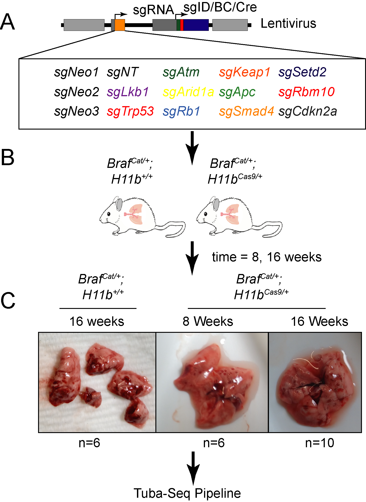
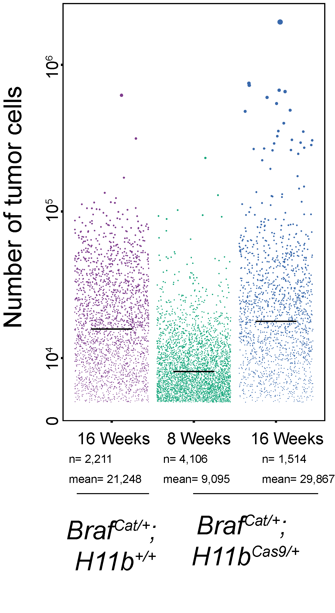
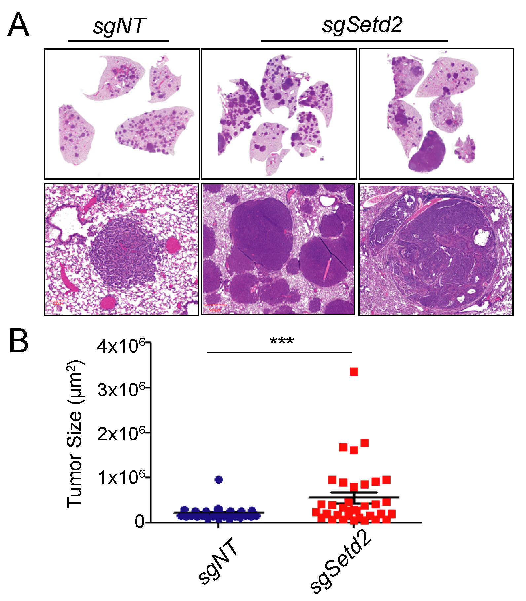
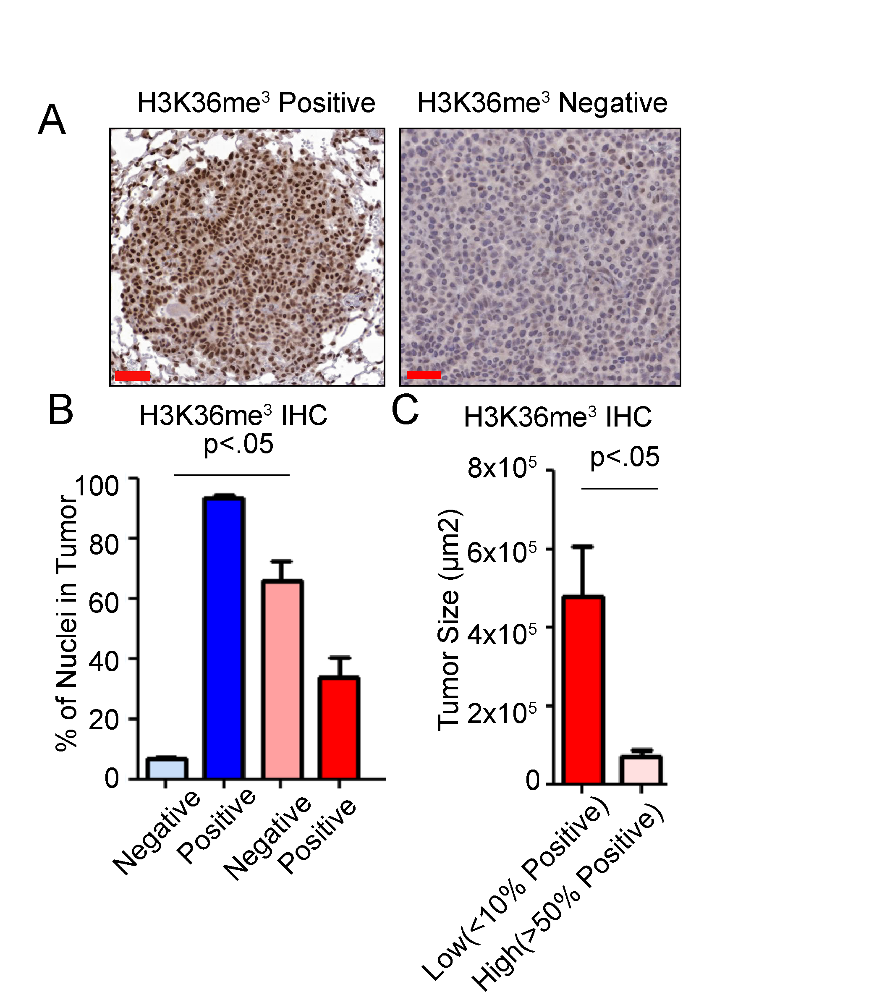
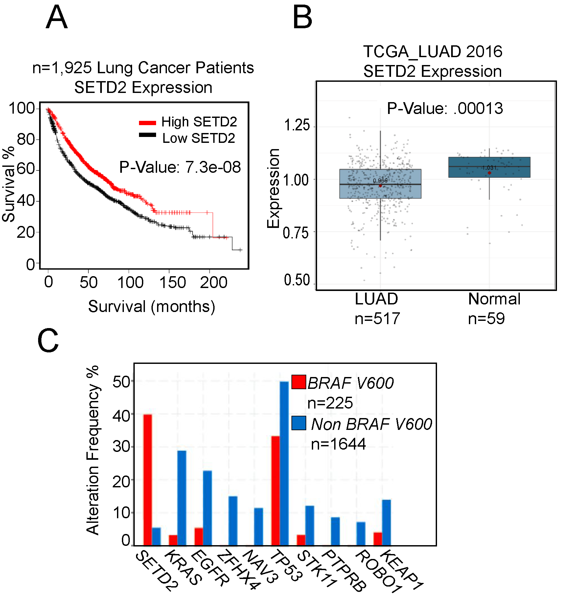

## Chapter Two: Quantitative tumor burden and small library screen using TUBA-SEQ 
{.page_break_before}

# Abstract

# Introduction

Next generation sequencing has allowed for the unbiased identification of genes that are mutated in human cancer [@pmid:25079552; @pmid:25109877; @pmid:24132290]. The wealth of knowledge gained from such large-scale sequencing projects has revealed actionable mutationas that can be targeted with small molecule inhibitors, such as dabrafenib and trametinib. However, Identificaton of possible targets is not enough, as many cancers with similarly mutated oncogenes, such as BRAF^V600E^, respond differentially to BRAF^V600E^-targeed therapy. For example,  mealanoma patients with BRAF^V600E^ mutations respond well to BRAF^V600E^-targeted therapy whereas colorectal cancer patients with BRAF^V600E^ mutations do not respond[@pmid:22448344]. The disconnect between putative driver oncogenes identified in human cancers and response to targeted therapy is a problem that can be solved with rigorous pre-clinical experimentation, such as in GEMMs. 

Genomic sequencing of human tumors has also been crucial insight into how cancers form and what signaling nodes might be important for progressive stages of cancer evolution. For example, pancreatic cancers have a very stereotypical histiological progression that is brought about by known mutational activation. Specifically, mutations in _KRAS_ initiate tumorigenesis and loss of _TP53_ function and _SMAD3_ are associated with cancer progression[@pmid:31395068]. However, this is more difficult to do in lung adenocarcinoma because of the high mutational burden often due to the consumption of cigarettes[@pmid:27811275; @pmid:31996850].

Indeed, in highly mutated cancers such as melanoma and lung cancer, recurrent mutations are not necessarily predictive of biological importance. To better understand the importance of candidate tumor suppressors or oncogenes, researchers exploit tumor cell lines and GEMMs to identify bona-fide genetic drivers of cancer. However, these systems are suboptimal, as they are either not physiologically relevant (tissue culture) or are not scalable to determine the effect of many mutations (GEMMs). Moreover, techniques to measure cooperation of genes to drive lung cancer are qualitative and are not sufficiently quantitative to allow for large-scale studies. typically, lung adenocarcinoma is quantified by lung weight or histological analyses such as tumor burden (Percentage of lung that is tumor), tumor size, and immunohistochemistry (IHC) of tumor markers. Although important and informative, these analyses are not high-throughput and rely on many mice to acheive statistical confidence. Furthermore, there is intrinsic bias when calculating tumor size and tumor burden, as tissue-sectioning results in tumor sections that do not accurately portray true tumor size. Therefore, more advanced techniques are required for large-scale analysis of mouse tumors that are both quantitative and high throughput.

Recently, Monte Winslow and his lab at Stanford University has developed **Tu**mor- **Ba**rcode **Seq**uencing (TUBA-SEQ), a rapid, multiplexed, quantitative assay for analyzing the contribution of tumor-suppressor loss _in vivo_. This technique works by delivering a uniquely barcoded lentiviral endoing Cre recombinase, to activate Cre-mediated oncogenes, and a guide RNA, to inactivate a single tumor suppressor gene. Therefore, each tumor will be driven by the same oncogene, but will have different tumor suppressors inactivated. After a period of time (6-24 weeks) tissue is harvested for whole-lung DNA extraction and targeted DNA-sequencing is performed to quantify relative tumor size to spike-in controls[@pmid:28530655]. Therefore, contribution of a single tumor suppressor can be quantified in single animal. Here, we explore the contribution of 11 tumor suppressor genes and 5 controls in the context of our BRAF ^V600E^- driven lung tumor models.

# Results

To  determine the size of BRAF ^V600E^ tumors and the contribution of 11 tumor suppressor genes (_Trp53, Rb1, Cdkn2a, Apc, Rbm10, Stk11, Setd2, Arid1a, Atm, Keap1, Smad4)_ on BRAF ^V600E^ lung tumorigenesis, we obtained tittered barcoded-lentiviral plasmids that encode Cre-recombinase as well as a sgRNA that inactivates one of eleven tumor suppressors common in lung adenocarcinoma. All genes tested are putative tumor suppressor genes commonly lost in human lung cancer patients. Each lentiviral solution contained ~1000 individually barcoded lentiviruses. We infected both _LSL-Cas9_ and _CAS9_ deficient mice in order to determine the contribution of genetic manipulation and/or deletion of the targeted gene. Mice meant to be analyzed after 8 weeks received a viral titer of 1x10^5 while mice mean to be analyzed after 16 weeks received a viral titer of 1x10^4. After euthanasia, lungs were collected for genomic DNA extraction, and barcode amplification followed by preperation of sequencing libraries.  Before genomic extraction and library preparation, a known quantity of known-barcoded cells was added in order to benchmark sequencing reads to a known cell number.

Gross histologic images of experimental lungs are show an increase in tumor burden with both time (Figure xxx) and CAS9 status (figure xxx). Therefore, based on macroscopic inspection, at least one tumor suppressor appeared to cooperate with BRAF ^V600E^ to increase tumor burden. In order to determine the fitness landscape of any one particular tumor suppressor, we calculated the relative number of tumor cells in a given tumor using the TUBA-SEQ genomics pipeline. After 8 weeks post tumor initiation there no statistically significant contribution of tumor suppressor loss (Figure). SETD2 loss was trending towards statistical significance. However, 16 weeks post initiation revealed both SETD2 loss and APC loss cooperated with BRAF ^V600E^ to form larger tumors (Figure x). APC loss was a suspected hit as we have previously shown that activation of Wnt-beta-catenin signaling promoted BRAF^V600E^ tumorigenesis. As APC loss is predicted to increase the activity of Beta-catenin signaling, this result was unsurprising to us. However, loss of SETD2 was a novel finding in the context of BRAF ^V600E^ lung tumorigenesis.

Given our findings of SETD2 loss increased tumor burden concurrent with BRAF^V600E^ we next validated SETD2 in a new cohort of mice with single-guide RNAs targeting SETD2. Indeed, loss of SETD2 increased tumor burden from 5% to over 30% in some animals. Since SETD2 antibodies are unreliable in both western blots and immunohistochemistry we used H3K36me3 as a surrogate marker for SETD2 activity by immunohistochemistry. Whereas 90% of nuclei in BRAF ^V600E^ only tumors were H3K36me3, more than 60% tumors of mice infected with SETD2 CRISPR virus were negative for H3K36me3. Furthermore, when classified by H3K36me3-positive or -negative, there is even stronger evidence that SETD2 loss leads to larger tumor formation

# Discussion

Oncogenic BRAF^V600E^ is a major driver in lung adenocarcinoma. However, mouse models with activation of BRAF ^V600E^ only lead to benign tumorigenesis[@pmid:26001956; @pmid:17299132]. Although it is well known that activation of WNT and PI3k signaling, as well as lost of _Trp53_ and _Cdkn2a_ genes allow BRAF^V600E^ benign lung tumors to progress to malignant disease, we wanted to systematically test a variety of known tumor suppressors in lung adenocarcinoma. Furthermore, we do not know the size of BRAF^V600E^ adenomas. Prior to TUBA-SEQ, it was very difficult to accurately determine the size of BRAF^V600E^ adenomas. Based on population doublings, as well as cross sections of BRAF ^V600E^ tumors in histological sections, it is estimated that BRAF^V600E^-driven lung adenomas grow about 15-20 populations doublings and reaching a size of 1mm^3^[@pmid:24589553] With TUBA-SEQ, we can more accurately discern the absolute size of BRAF^V600E^ lung adenomas in almost every tumor in all animal subjects. Given the theory that BRAF-^V600E^ induces growth arrest after an initial burst of neoplastic growth, it would be of interest to know if all tumors grow to a predetermined and absolute size, or if there is a spectrum of tumor sizes that are determined by extrinsic factors such as proximity to blood vessels or certain stromal cells.

{#fig:04 .white width="100%"}

{#fig:05 .white width="100%"}

{#fig:06 .white width="100%"}  
  
{#fig:07 .white width="100%"}

{#fig:08 .white width="100%"}

{#fig:09 .white width="100%"}

