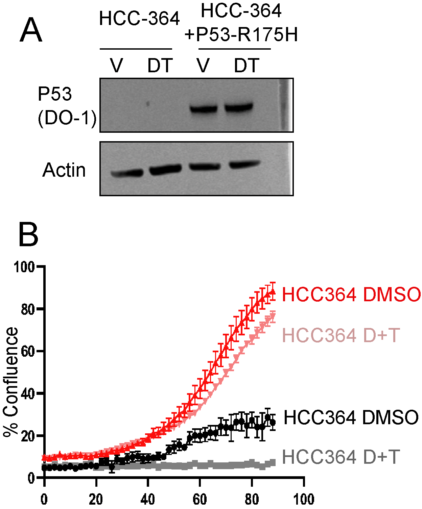
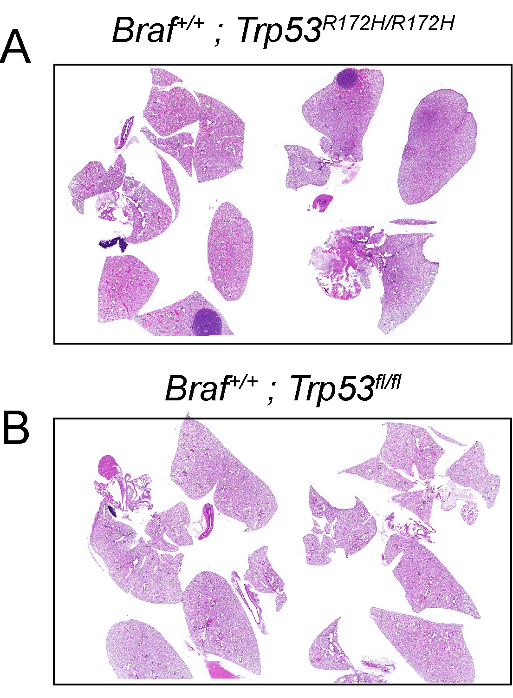

## Chapter Three {.page_break_before}

## Abstract
^TP53^ missense BRAF^V600E^ mutations both frequently occur in lung adenocarcinoma. While genetically engineered mouse models (GEMMs) of lung adenocarcinoma are invaluable for understanding the initiation, progression, and response to therapeutics, little is known about how different hotspot point mutations in p53 affect disease progression and therapeutic responses. To this end, we use GEMMs, tumor-derived cell lines, and human lung cancer cell lines to test how murine homologs of p53 hotspot mutants R172H and R245W compare to p53-deletion. We find that conformation mutation p53^R172H^ drives more aggressive lung adenocarcinomas and dedifferentiation. We also observe p53^R172H^ and p53^R245W^ accumulation in only high-grade tumors that have activated ARF expression. In vitro and in vivo studies demonstrate enhanced resistance to BRAF+MEK blockade with p53^R172H^ and p53^R245W^, a standard treatment regimen for BRAF^V600E^ mutant patients. Mechanistically, mutant-p53 alters the transcriptome of cancer cells and enhances entry into the cell cycle by a yet to be determine mechanism.

## Introduction

Lung adenocarcinoma (LUAD) has remained the deadliest form of cancer since 1987 (Siegel, Miller et al. 2021). It is characterized by alterations in the MAP kinase (MAPK) pathway, including activating mutations in the oncoproteins EGFR, KRAS (G12C, G12D, G12V) or BRAF^V600E^ [@pmid:25079552; @pmid:16705038; @pmid:11751630; @pmid:17299132]. The recognized predominant cell of origin for LUAD, lung alveolar type-2 pneumocyte cells (AT2), are exquisitely responsive to the transformative properties of constitutive activation of the MAPK pathway [@pmid:24586047; @pmid:31951518]. Indeed, genetically engineered mouse models (GEMMs) of mutationally activated EGFR, KRAS, or BRAF form lung tumors that strongly resemble key characteristics of human LUAD. However, tumors formed in all three models (KRAS:G12D, EGFR: Deletion 19 or L858R, or BRAF^V600E^) develop only histologically low- to mid-grade cancer and are growth-arrested [@pmid:11751630; @pmid:16705038; @pmid:17299132]. Prior research has determined that oncogene-induced tumor growth arrest occurs through activation of several tumor suppression mechanisms, most notably, p53-mediated tumor suppression [@pmid:26001956].

Alterations in the _TP53_ tumor suppressor gene are common in all cancer types, including LUAD [@pmid:27328919]. P53 encodes a transcription factor that responds to various cell stresses, such as DNA damage and oncogene activation. In response to stress, p53 is stabilized and induces anti-proliferative and genome-mending effects through trans-activation of a diverse set of P53-target genes [@pmid:33518400; @pmid:11099028]. p53 mutations in cancer frequently occur in the DNA binding domain, where a single amino acid change results in dysfunctional DNA-binding and fails transcriptional activation [@pmid:20182602]. Therefore, mutated p53 defunct in p53 transcriptional regulation results in failed tumor suppression and cancer outgrowth. Furthermore, defective p53 signaling will permit future genomic insults to remain unchecked, thus fostering an environment primed for malignant potential. Since mutant-p53 lacks transcriptional activity through its inability to bind DNA, it cannot induce expression of its negative regulators, ARF, MDM2, and MDMX [@pmid:8265599; @pmid:8319905]. Lack of negative feedback results in mutant-p53 stabilization. Accumulation of mutant p53 has been reported to elicit gain-of-function p53 activity. Thus, any gain-of-function activity in mutant-p53 cannot be studied with p53-genetic deletion. Many research groups have characterized gain-of-function phenotypes of mutant-p53 in cancer. For instance, mice expressing mutant-p53 have altered disease phenotype compared to p53-null models [@pmid:15607980;@pmid:15607981]. Specifically in lung cancer model systems, mutant-p53 has modulated SMAD3, NF$\kappa$B, p63, TGF$\beta$, and others to drive various hallmarks of cancer invasion, chemoresistance, metabolism, and propagation of a stem cell fate [@pmid:34178628; @pmid:11238924; @pmid:19345189]. Although the mechanisms that lead to these altered processes are controversial, it is thought that the main effect is through mutant-p53 binding and sequestering known p53-associated proteins. This often leads to the activation of transcription factors such as NF-Y [@pmid:33839689].

In BRAF^V600E^ GEMMs, when p53 function is abolished by _Trp53_ gene deletion or by _Cdkn2a_ deletion, lung tumors can escape growth arrest and undergo malignant transformation [@pmid:17299132; @pmid:26001956]. Furthermore, p53 pathway dysregulation allows a cell to sample diverse phenotypic landscapes that allow for enhanced cell fitness and tumor outgrowth [@pmid:32707077]. However, BRAF^V600E^ lung tumorigenesis and progression to malignant lung adenocarcinoma have only been studied in the context of p53 genetic deletion, not p53 mutation, which is more frequently seen in human lung cancer. Specifically, p53-R172H and p53-R245W are murine homologs of typical hotspots in human cancer R175H and R245W, respectively.

Here, we characterize the differential impact of p53(null), as well as p53 hotspot mutations p53^R712H^ (R175H in humans) and p53^R245W^ (R248W in humans) on BRAF^V600E^ lung tumorigenesis. We observed significantly differential effects of p53-R172H on BRAF^V600E^-driven lung tumorigenesis that were not observed when p53 is deleted, such as enhanced tumor size and decreased survival. Our findings highlight functional differences in mutant-p53 biology, as well as the importance and the utility of clinically relevant mutant-p53 mouse models.

## Results

**P53-mutant Alleles Differentially Alter BRAF (V600E) Lung Tumorigenesis**

Expression of BRAF^V600E^ in the distal epithelium of the mouse lung elicits clonal tumorigenic outgrowths of alveolar type 2 (AT2) pneumocytes [@pmid:17299132]. Prior work has shown that _Trp53^fl/fl^_ cooperates with BRAF(V600E) to form malignant lung tumors when Cre recombinase is activated [@pmid:17299132; @pmid:26001956]. Therefore, we compared the tumor burden of _Braf^Cat/+^_ mice with either p53 loss (_Trp53^fl/fl^_, p53^R172H^ (_Trp53^R172H/R172H^_), or p53^R245W^ (_Trp53^R245W/R245W^_) after infection with 106 pfu of adenovirus expressing surfactant protein C specific Cre (ad5-Spc-Cre) (Figure @fig:3.1). As expected, mice developed lung cancer, consistent with previous findings (Figure @fig:3.2 B-C). However, there was a striking, highly reproducible increase in the tumor size of tumors harboring _Trp53^R172H/R172H^_ and to a lesser extent _Trp53^R245W/R245W^_, compared to _Trp53^fl/fl^_ (Figure @fig:3.2 A,B). These data led us to hypothesize that p53^R172H^ and p53^R245W^ expression alters tumor progression uniquely from p53 deletion, and these differences may be potentially evident of gain-of-function effects imparted by mutant-53. We next looked at early time points to determine if p53 mutation affects the growth and proliferation of early stage lung tumors. However, we did not find any differences in tumor size between the three different p53 alleles(Figure @fig3.3 A, B).

Since lung cancer patients with mutations in _TP53_ often start only have one mutated _p53_ allele unless the loss of heterozygosity (LOH) occurs. Therefore, we generated mice heterozygous for both _Braf^CAT^_ and either _Trp53^fl^_, _Trp53^R172H^_, or _Trp53^ R245W^_ and observed their survival over time (Figure @fig:3.4 A). We noted that _Trp53^R172H/+^_ mice had diminished median overall survival compared to _Trp53^fl/+^_ mice (183 days and 216 days), with _Trp53^R245W/+^_ mice falling in between the two groups (median survival 212 days) (Figure @fig:3.4 A).

We observed a distinct separation of survival between mice harboring lung tumors that are either _Trp53^fl/+^_, _Trp53^R172H/+^_, and _Trp53^R245W/+^_. This separation is diminished when altered p53 alleles are homozygous (Figure @fig:3.4 B). _Trp53^R172H/R172H^_ mice have a median survival of 120 days, while _Trp53^fl/fl^_ mice have a median survival of 136 days. Importantly, this observed difference in survival is statistically significant (Log-rank test p< 0.001) and is likely to reflect the worse diseased, characterized by enhanced tumor burden and size.

**Mutant-p53 Accumulation is Associated with Dedifferentiation and p19 Induction**
Increased malignancy in lung adenocarcinoma is often associated with altered states of tumor cell identity and dedifferentiation [@pmid:31452510;@pmid:32707077]. Since LUADs often arise from AT2 cells, we surveyed the expression of AT2 cell identifiers, such as NKX2-1, a master regulator of AT2 transcriptional programs, and SPC, a marker of differentiated AT2 cells [@pmid:32707077]. Quantification of over 50 tumors from _Braf^V600E/+^_ mice with either _Trp53^ flfl^_, _Trp53^R172H/R172H^_, and _Trp53^R245W/R245W^_ revealed that _Trp53^R172H/R1722H^_ mice had significantly more tumors that stained negative for NKX2-1 and SPC (Figure @fig:3.5 A, B). This finding strongly indicates that mutant-p53 tumors are dedifferentiated. Since HMGA2 expression is associated with LUAD dedifferentiation and worse patient prognosis, we performed IHC for HMGA2[@pmid:21471965; @pmid:28752530; @pmid:18505920]. We noted an increase in HMGA2-positive tumors in _Trp53^R172H/R172H^_, and _Trp53^R245W/R245W^_ tumors compared to _Trp53^fl/fl^_ (Figure @fig:3.5 A, B). Thus, this data reveals that Trp53R172H/R172H mice exhibit a higher tumor burden and worse overall survival than _Trp53^fl/fl^_. However, the tumors developed in these mice are more likely to exhibit malignant progression and dedifferentiation.

One striking feature of lung tumors in mice, either heterozygous or homozygous for _Trp53 ^R172H^_ or _Trp53^R245W^_ is how few tumors and tumor cells have detectable levels of mutant-p53 protein as measured by Immunohistochemistry. One critical aspect of normal p53 function is self-regulation through transcriptional activation of its negative regulator MDM2 [@pmid:8319905]. Thus, we predicted that homozygous p53 mutant cells would exhibit increased mutant-p53 protein. In our models, we observed that mutant p53 protein accumulation is restricted to malignant cells exhibited by a lack of papillary architecture and nuclear atypia (Figure @fig:3.6 A). Indeed, p53 immunostaining is correlated with increased phosphorylated-ERK1/2 detection (Figure @fig:3.6 B).
Moreover, immunofluorescence of p53 and its positive regulator, p19/ARF, reveal that cells with high p19/ARF are also high in p53 accumulation (Figure @fig:3.6 C). This result suggests that even in homozygous mutant_Trp53_ mice, there is still a barrier to mutant-p53 accumulation. Our data suggest that elevated levels of p19/ARF are necessary for mutant-p53 accumulation, even with homozygous p53 mutations. Collectively, these data indicate that _Trp53^R172H^_ drives more aggressive lung adenocarcinoma formation in BRAF(V600E) driven mouse models of lung cancer.

**P53^R172H^ and P53^R245W^ cell lines are refractory to BRAF/MEK inhibition**
Given that previous research has determined that p53 mutations can confer resistance to both chemotherapies and pathway-targeted therapies [@pmid:7585548;@pmid:22068033], we next questioned whether our p53 alterations would be sufficient to drive therapeutic resistance in BRAF^V600E^-driven genetically engineered mice[@pmid:27283860]. Interstingly, _Trp53^R172H/R172H^_ mice retain a more considerable tumor burden after a week four treatment of MAPK blockade _in vivo_ (Figure @fig:3.7 A).

To further investigate the effects of p53-mutants on _BRAF^V600E^_ driven lung cancers,we derived cell lines from _Braf^CAT/+^_ murine tumors expressing either _Trp53^flfl^_, _Trp53^R172H/R172H^_, or _Trp53^R245W/R245W^_) 14 weeks after infection with ad5-Spc-Cre. Cell lines expressing either _Trp53^R172H/R172H^_ or _Trp53^R245W/R245W^_ were resistant to single-agent dabrafenib (Figure @fig:3.7 B). Of note, _Trp53^R172H/R172H^_ and _Trp53^R245W/R245W^_ cell lines express increased ERK1/2 activity, as evidenced by increased phosphorylated ERK1/2, both with and without MAPK-blockade (Figure @fig:3.7 C). Furthermore, _Trp53^R172H/R172H^_ and _Trp53^R245W/R245W^_ were more resistant to the combination of dabrafenib plus trametinib, than _Trp53^fl/fl^_ cell lines(Figure @fig:3.8 A-C). Not only are resistant cells still proliferative in the face of MAPK-blockade, they are resistant to cell death imparted by MAPK-inhibtion[Figure @fig:3.8 C]. 

Next, we reasoned if mutant-p53 expression is the cause differential cancer phenotypes such as increase proliferation and drug resistance, then eliminating mutant-p53 expression would have a growth inhibitory effect and sensitize cells to MAPK-pathway inhibition. We cloned a short-hairpin RNA plasmid that induces GFP expression and knockdown of mutant-p53 with supplementation of doxycycline(Figure @fig:3.9 A). Despite sucessful p53 knockdown, observed no change in _in vitro_ proliferation or _in vivo_ tumor outgrowth(Figure @fig:3.9 B and C). Therefore, mutant-p53 cells are not addicted to mutant-p53 expression.

To gain relevance to human lung cancer, we infected BRAF(V600E) mutant HCC364 cells with lentivirus expressing human cancer hotspot mutant p53^R175H^. p53^R175H^ expressing cells were more proliferative and refractory than parental HCC364 cells (Figure @fig:3.10 A and B). Collectively, these _in vitro_ and _in vivo_ data suggest that missense mutant p53^R175H^ and its murine homolog p53^R172H^, as well as p53^R245W^ can support cancer cell viability in the face of BRAF+MEK blockade that p53-null mutations cannot achieve.

**P53^R172H^ and P53^R245W^ alter the transcriptome of BRAF(V600E) lung tumor cell lines**
Due to our observations that mutant p53^R172H^ drives more aggressive cancer phenotypes such as increased growth, dedifferentiation, and resistance to FDA-approved therapeutics, we reasoned that this would be reflected in a change in the transcriptional landscape. This is due in part to the transcriptional trans-activation potential by mutant p53. RNA sequencing of cell lines generated from p53-mutant mouse lung tumors does reveal transcriptomic differences between both p53^R172H^ and p53^R245W^ cells compared to p53-null cell lines (Figure @fig:3.11 4 A and B). Interestingly, genes involved in cell cycle regulation and MYC pathway are upregulated in both p53^R172H^ and p53^R2245W^ cell lines (Figure 4 @fig:3.11 B). These results suggest that mutant-p53 affects the transcription of genes involved in pro-growth signaling pathways. We also observed transcriptional differences between _Trp53^R172H/R172H^_ and _Trp53^R245W/R245W^_ cell lines(Figure @fig:3.12 A and B). Thus, we hypothesize that _Trp53^R172H/R172H^_ and _Trp53^R245W/R245W^_ have similarities in their function, but they also have some clear differences.

**PDGFR expression is increased in mutant-p53 cells**
Our _in vitro_ RNA analysis revealed an upregulation of the platelet-derived growth factor recepter(PDGFR) in _Trp53^R172H/R172H^_  cell lines(Figure @fig:3.13 A). Since PDGFR is a known regulator of the MAPK pathway, we sought to validate its expression and determine its important in _Trp53^R172H/R172H^_ and _Trp53^R245W/R245W^_ cell lines. Indeed PDGFRB is more highly expressed and can be activated by recombinant PDGF stimulation(Figure @fig:3.14 B). Although _Trp53^fl/fl^_ cells do not have any detectable levels of PDGFR or Phospohorylated-PDFRB, they still upregulated MAPK-pathway activation in response to ligand stimulation(Figure @fig:3.14 B). Furthermore, expression of PDGFRB is evident in malignant _Trp53^R172H/R172H^_ and _Trp53^R245W/R245W^_ tumors, but not _Trp53^fl/fl^_ tumors(Figure @fig:3.14 C). We next sought to determine the sensitivity to PDGFR-signaling blockade with Imatinib, a known PDGFRB inhibitor. Neither PDGFR stimulation or PDGFR inhibition had any effect on the proliferation of mutant-p53 cell lines(Figure @fig:3.15 A an B). Therefore, PDGFR is a validated differentially expressed gene in _Trp53^R172H/R172H^_ and _Trp53^R245W/R245W^_ cell lines, but is not important for its growth.

## Discussion

While lung adenocarcinomas primarily contain missense mutations in p53, most studies using mouse models of lung adenocarcinoma utilize a p53-null (_Trp53^fl/fl^_) allele instead of alleles encoding hotspot missense mutations [@pmid:23550210]. This is most likely because prior mutant-p53 alleles were null for _Trp53_ prior to Cre-mediated recombination, leaving every cell in the mouse sensitive to leukemias, lymphomas, and sarcomas due to being partially p53-deficient [@pmid:16288016; @pmid:16166291; @pmid:15607980]. Our work has been made possible by newly described "wild-type to mutant" p53 alleles that allow for mice to be fully wild-type for p53 in all cells prior to Cre-mediated recombination[@pmid:30262850]. This strategy is crucial as it allows for temporally extended experiments not confounded by separate malignancies. Here, we utilize &quot; wild-type to mutant&quot;_Trp53^R172H^_ and _Trp53^R245W^_ alleles R245W to determine how they alter tumor progression in a BRAF(V600E) model of lung cancer. We show that p53^R172H^ and p53^R245W^ accelerate lung tumor progression and increase the rate of dedifferentiation beyond the complete loss of p53 expression.

Although point mutations in the _TP53_ gene can poison the natural tumor suppressive mechanisms of p53 protein, not all point mutations are equivalent in executing these functions. Mutations in the DNA-binding domain are most common and potent at ablating normal p53 function. Taking advantage of a conditional BRAF^V600E^ lung tumor model where BRAF^V600E^ expression in AT2 cells drives benign tumor formation, we show that either p53^R172H^ or p53^R245W^ can bypass growth arrest and influence tumor progression and therapeutic sensitivity beyond how p53 loss can. Specifically, P53^R172H^ reduces survival and sensitivity to dabrafenib plus trametinib _in vivo_. Interestingly, a single allele of p53^R172H^ has a more robust tumor-promoting phenotype than P53^R245W^. These findings further support a hierarchy model of p53 missense mutations, where conformation mutants such as p53^R175H^ have a more substantial dominant-negative effect on wild-type p53, while mice with a single _trp53^fl^_ allele can still suppress tumorigenesis with one copy of wild-type but are prone to loss of heterozygosity [@pmid:30262850; @pmid:27585860; @pmid:15607980].

In BRAF-driven lung adenocarcinoma, the repressive role of wild-type p53 is initiated by oncogenic stress brought about by increasing levels of MAPK-pathway activation[@pmid:17299132] . Hyperactivation of the MAPK pathway triggers p19/ARF to block MDM2, leading to p53 accumulation[@pmid:16957739; @pmid:21107428; @pmid:21107427]. Therefore, p53 acts late in lung adenocarcinoma, unlike pancreatic adenocarcinoma, where p53 is triggered early, likely through PDAC-specific increases in p19/ARF through increased PI3K, STAT3, or DMP1 [@pmid:27585860]. Our studies in BRAF(V600E) mutant lung adenocarcinomas reinforce this concept, as mutant-p53 does not accelerate growth in early tumors (supplemental figure). Furthermore, p53 is not detected until later stage tumor development and correlates with p19/ARF expression and increased phosphorylated-ERK1/2 levels. Our studies indicate that mutant-p53 levels are associated with increased expression of p19/ARF. Therefore, any gain-of-function phenotype manifested by mutant-p53 must depend on accumulated p19/ARF. Thus, ablating the ARF tumor suppressor in human cancers with GOF _TP53_ mutants may paradoxically lead to tumor regression.

While most _TP53_ mutations in cancer result in an inability to bind DNA, they are often stable and preserve functional oligomerization and transcriptional transactivation domains[@pmid:24394915]. Thus, mutant-p53 can still interact with and affect the function of cellular processes. Supporting this rationale, we observe altered transcriptomes with both p53^R172H^ and p53^R245W cell lines compared to p53-null. Consistent with previous mutant-p53 GOF studies, we observed enriched genes associated with EMT and cell-cycle entry with p53^R172H^ and p53^R245W^.

Many GOF phenotypes exhibited by mutant-p53 have centered around drug-resistant mechanisms. Previous studies have shown that mutant-p53 can confer resistance to pathway-targeted therapy and chemotherapies. Our studies highlight that p53^R172H^ and p53^R245W^ can confer resistance to BRAF-targeted therapy. Here, we show p53-R172H and p53-R245W cell lines are resistant to BRAF(V600E) inhibition and have less sensitivity to the combination of BRAF+MEK inhibition. In pancreatic cancer models with LSL-p53-R172H expression, mutant-p53 regulates PDGFR-signaling to promote an invasive phenotype sensitive to Imatinib[@pmid:24725405]. Consistent with these findings, our transcriptional analysis and immunoblotting indicate p53-R172H, and p53-R245W cells express PDGF-ligands and exhibit PDGFR-pathway activation.

In summary, we have compared the tumorigenic potential of three _^Trp53^_ alleles (_Trp53^fl/fl^_, _Trp53^R172H^_, and _Trp53^R245W^_) concurrently with _BRAF^V600E^_. _Trp53^R172H^_ and _Trp53^R245W^_ promoted more aggressive lung cancers exhibited by larger tumors and tumor dedifferentiation. However, only _Trp53^R172H^_ was observed to shorten survival compared to _Trp53^fl/fl^_. Moreover, _Trp53^R172H^_ and _Trp53^R245W^_ cell lines were refractory to dabrafenib and trametinib and were more proliferative. _Trp53^R172H^_ and _Trp53^R245W^_ cell lines had altered transcriptomes compared to p53-null cells and were highly enriched in genes involved in cell cycle proliferation. Our work highlights the importance of studying disease-relevant _TP53_ alleles in pre-clinical modeling systems.

{#fig:3.1 .white width="100%"}

{#fig:3.2 .white width="100%"}

{#fig:3.3 .white width="100%"}

{#fig:3.4 .white width="100%"}

{#fig:3.5 .white width="100%"}

{#fig:3.6 .white width="100%"}

{#fig:3.7 .white width="100%"}

{#fig:3.8 .white width="100%"}

{#fig:3.9 .white width="100%"}

{#fig:3.10 .white width="100%"}

{#fig:3.11 .white width="100%"}

{#fig:3.12 .white width="100%"}

{#fig:3.13 .white width="100%"}

{#fig:3.14 .white width="100%"}
