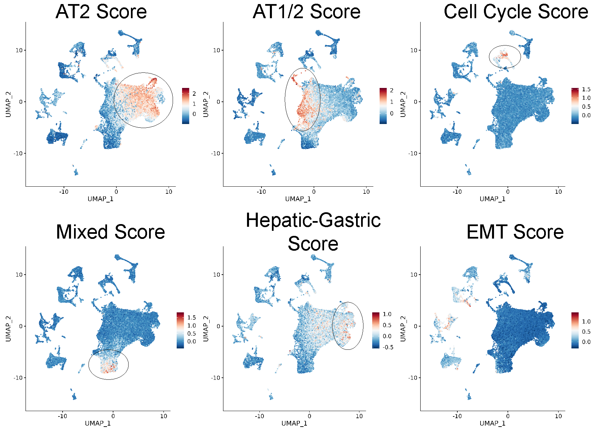

## Chapter Four {.page_break_before}

##Abstract
malignant lung adenocarcinomas tumors are initiated from a single neoplastic cell. Yet, there is substantial cellular heterogenity in a fully malignant tumor. Since human lung adenocarcinomas are heavily mutated, it is diffuclt to know wheter underlying cellular heterogenity is a consequence of the underlying mutational heterogenity. Mouse models of lung adenocarcinoma accurately represent genomic and histological aspects of human lung adenocarcinoma. However, genetically-engineered mouse model tumor heterogenity remains poorly understood. Here, we profile the single cell transcriptomes of genetically-engineered mouse models that are driven by the BRAF^V600E^ oncoprotein with 5 seperate cooperating genetic events ( _Pi3k^H1047R^_, _CdkN2a^fl/fl^_, _Trp53^fl/fl^_, _Trp53^R172H/R162H^_, and _Trp53^R245W/R245W^_). There are stereotypically distinct clusters of cells thorughout all genotypes of BRAF^V600E^-driven tumors. We also identified known tumor cell identities in both human and mouse lung adenocarcinoma. 
  
## Introduction
The mammalian lung is a vast and intricate labyrinth that is responsible that is responsible for gas exchange between air and body through a meshwork of endothelial cells. The lung organ system begins with a single airway that branches in a geometric and stereotypic pattern[@pmid:18463632]. These many thousands of branches lead to the business end of gas exchange, the lung alveoli. The alveoli are comprised of two specialized cell types: Alveolar Type 1 (AT1) cells comprise most of the surface area of the lung and are thin squamous cells that mediate oxygen exchange across cell membranes. Alveolar Type 2 (AT2) cells, however, are cuboidal that secrete surfactant proteins that aide in preventing the delicate alveoli from collapsing. 

Pathology of the alveoli is a steadfast threat to an organism's life due to the importance of gas exchange. Diseases such as lung adenocarcinoma, pulmonary fibrosis, and emphysema are the most common dysfunctions of the distal lung epithelium[@pmid:24499815]. Lung adenocarcinoma is also the most common type of human lung cancers in both men and women. A large body of literature has suggested that lung adenocarcinomas arise in the alveolar and are descendants of AT2 cells [@pmid:32747478; @pmid:11751630]. Therefore, there is great interest in understanding how AT2 cells develop, maintain cell identity, as well as how they renew themselves during aging or in response to injury [@pmid:24739965; @pmid:24879355; @pmid:24879355; @pmid:32669714].

Recent advances in profiling of single-cell transcriptomes during homeostasis conditions and diseases states have greatly improved our understanding of AT2 cell, and lung adenocarcinoma cell biology[@pmid:32707077; @pmid:32707078; @pmid:24739965].Single-cell profiling of human lung cancers have revealed the drastic intra-tumoral heterogeneity that exists in a single tumor[@pmid:22397650; @pmid:27757846]. Since transcriptional heterogeneity can be considered a source of therapeutic resistance, there is great interest in understanding the evolution of lung adenocarcinoma and how it changes with response to pathway targeted therapy[@pmid:32822576].Since GEMMs are an important pre-clinical model for testing out potential therapeutic strategies for lung adenocarcinoma, it is important to understand single-cell heterogeneity in popular GEMM models. 

Although GEMMs are a great way to model human lung adenocarcinomas, there are several drawbacks worth mentioning. Human lung adenocarcinomas typically develop from a single tumor-initiating cell and is a consequence of an accumulation of mutations in certain cell types and a weakened immune system across a lifetime.  In GEMMs, tumorigenesis is often initiated in many cells at once and is the consequence of an engineered mutation. In contrast to human lung adenocarcinomas that have a high mutational burden, murine lung adenocarcinomas do not have a high mutational burden and instead display high copy number variation[@pmid:25363767]. Therefore, we set out to profile the single-cell transcriptomes of various BRAF^V600E^-driven lung cancer GEMMs in order to determine genotype-specific heterogeneity and response to pathway-targeted therapy.

## Results
**ScRNA Sequencing of benign and malignant BRAF^V600E^ mouse lung tumors**
We profiled the single-cell transcriptome of six different BRAF^V600E^ mouse lung tumor models including BRAF^V600E^ on its own, BRAF^V600E^ plus either mutant _Pik3ca^H1047R/+^_,  _Cdkn2a^fl/fl^_, _Trp53^fl/fl^_, _Trp53^R172H/R172H^_, or _Trp53^R245W/R245W^_. We also treated each genotype with dabrafenib (100mg/kg) plus trametinib(2mg/kg) once daily for four days prior to tissue harvesting and 10X genomics library preperation.Importantly, we kept dabrafenib and trametinib throughout all stages of processing to prevent altered transcription in response to drug cessation. Using fluorescently-activated cell sorting (FACS), we purified tumor cells based on  Td-Tomato expression 8 weeks after tumor initiation using adenoviral Spc-Cre. In sum, we were able to identify 71,110 cells that passed standard 10X genomics and Seuratbased quality control and filtering (Figure 4.1).

Although we sought to purify tumor cells based on TdTomato-positivity, we did unintentionally collect and analyze stromal cells, such as immune, mesenchymal, and endothelial cell, which are also present in the murine distal lung epithelium (Figure 4.2). Therefore, we removed these cells based on their expression of _Ptprc_(immune), _Pecam1_ (endothelial), _and Pdgfra_ (mesenchymal) for downstream analysis (Figure 4.3).

Reclustering of only tumor cells(based on their expression of TdTomato and AT2 identity)  revealed significant tumor cell heterogeneity(Figure 4.4). Next we sought to determine cluster specific markers using DESEQ2 analysis (Figure 4.5). strong markers of each cluster include

We next sought to determine the effect of dabrafenib plus trametinib on transcriptional heterogeneity (Figure 4.6). Clearly, there is a MAPK specific gene expression program  that is decreased in most if not all clusters and genotpes (Figre 4.7).

We were also interested in genotype-specific differences. therefore, we performed DESEQ2 between vehicle-treated mice of each genotype (Figure 4.8). 

**table of genotypes/treatment/and cells collected**
Pre-sort
pre-batch correction
batch correction
cell types
tumor cells only
Feature plots of AT2 markers
feature plots of AT1 markers
Feature plots of P53 target genes
heatmap of P53 target genes
heatmap/violin plot of MAPK score

## Discussion

Here, we used scRNA-seq to determine transcriptional heterogenity of BRAF^V600E^ driven lung cancer and how it changes in response to concomminant genetic alterations. We modeled lung adenocarcinoma that mimick human oncogenic transformation where MAPK pathway activation drives tumor formation, and inactivation of the p53 pathway allows for tumor progression[@pmid:27158780]. We also determined how cell state changes in response to MAPK blockade, a common theraputic option for patients with BRAF^V600E^-mutant lung adenocarcinomas.

We determined that there is transcriptional heterogenity and that it is reporducible across genotypes. We also confirmed previousl published cell states in similar models, such as KRAS G12D[@pmid:32707077]. Unfortunely, we did not observe robust dedifferentiation signals such as loss of NKX2-1 and adoption of a gastric cell state. However, we did collect and identify highly-pastic cell states, such as ITGA2+ and CLDN4+ cells. Our failure to collect and analyze pre-metastatic cell states such as EMT-like cells, is likely because we collected cells only after 8-weeks, which is likely not long enough for these cell states to evolve during lung tumorigenesis. Therefore, adoption of highly malignant cell states, although might require certain genomic alterations like p53 loss, is an outcome of tumor evolution. One hypothesis is that p53 loss causes genomic instability and thus copy number gain, but similar studies failed to detect robust changes in copy number variation[@pmid:32707077].

We also failed to detect robust differences between genotypes that are known to cause malignant transformation, such as p53 loss, p53 missense mutation, CDKN2A loss, or mutant PI3K^H1047R^ [@pmid:31452510; @pmid:24019382; @pmid:17299132]. This is likely a result from a combination of factors, such as time of collection and library capture/sequencing depth. One straightforward hypothesis is that we did not allow for full transcriptomic changes to take effect that is imparted by tumor suppressor or oncogene mutation. Therefore, a timecourse analysis that spans early timepoints (4-6 weeks) and late timepoints (>16 weeks) will likely reveal more informative transcriptional heterogeneity. Indeed, our previous studies have indicated that there is no tumor growth advantage at early time points as late as 6 weeks post tumor initiation. One other possibility that could explain our lack of genotype-specific gene expression programs is that we did not capture enough unique transcripts in order to reveal the full extent of tumor heterogeneity. This is likely because there are known limitations to 10X genomic library preperation. Specifically, there is gene-dropout effects where only the most highly expressed genes are captured by the droplet-based technique. Indeed, 10X genomics technologies have been shown not to detect genes with lower expression[@pmid:33662621]. However, 10X genomics allows you to profile more cells than similiar scRNA-seq techniques. Genes with lower expression can be just as important as highly expressed genes for a cell's identity. Actually, transcription factors that determine cell states have been shown to have modest expression[@pmid:33662621; @pmid;30205475].
Therefore, we hypothesis that using plate-based scRNA-seq approaches, such as Smart-Seq2, would allow for more gene capture. Thus, Smart-seq2 will enable us to more precisely determine transcirptional heterogenity and genotype-specific gene expression changes.

Although our analysis was lacking with regards to transcriptional differences between genotypes, we did detect a robust transcriptional change with MAPK blockade(figure4.). Since human lung cancer patients treated with MAPK-pathway inhibitors exhibit a heterogeneity in response, one might hypothesize that each cell responds differently to MAPK-pathway inhibition. In our analysis, we determine that there is generally a homogenous response to MAPK inhibition. One straightforward explanation is that our short term treatment (four days) did not allow for cells to respond to pathway blockade. Perhaps there is an intial response to MAPK-pathway inhibition that is dampened over time that is dependant on transcriptional heterogeneity. 

In conclusion, we used 10X genomics to determine the transcriptional heterogeneity of BRAF^V600E^ lung tumors with a five seperate cooperating alterations and treatments. We did identify transciprtional heterogeneity that is stereotypic and reproducible acorss genotypes. However, we failed to identify robust differences between genotypes. Our works highlights the importance of capturing full transcriptomes across multiple timepoints in order to accurately determine cell states throughout BRAF^V600E^-driven lung tumor evolution. 

talk about the batch effects
talk about the times
similarity to other studies with KRAS
talk about homogenous response to D+T

{#fig:04 .white width="100%"}

{#fig:04 .white width="100%"}

{#fig:04 .white width="100%"}

{#fig:04 .white width="100%"}

{#fig:04 .white width="100%"}

{#fig:04 .white width="100%"}

{#fig:04 .white width="100%"}

