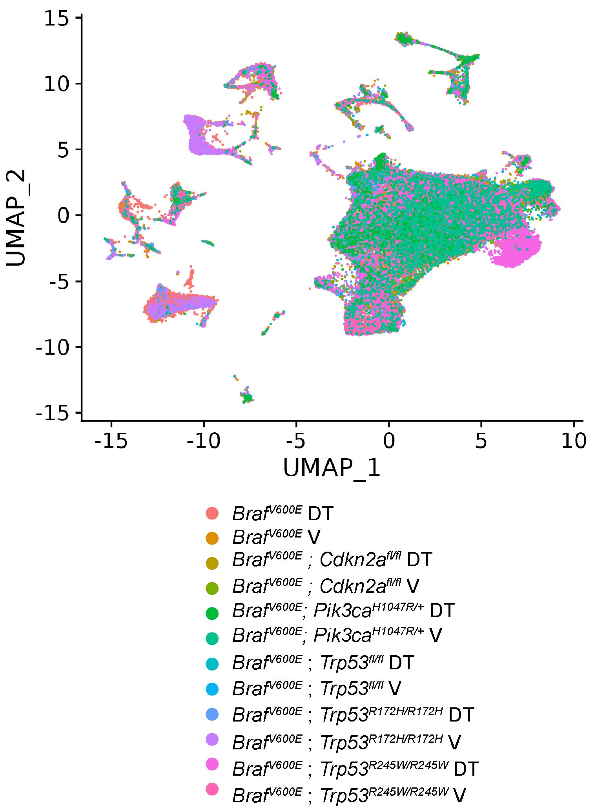

## Chapter Four {.page_break_before}

##Abstract
Malignant lung adenocarcinomas tumors are initiated from a single neoplastic cell. Nevertheless, there is substantial cellular heterogeneity in a fully malignant tumor. Since human lung adenocarcinomas are heavily mutated, it is difficult to know whether underlying cellular heterogeneity is a consequence of the underlying mutational heterogeneity. Mouse models of lung adenocarcinoma accurately represent genomic and histological aspects of human lung adenocarcinoma. However, genetically-engineered mouse model tumor heterogeneity remains poorly understood. Here, we profile the single-cell transcriptomes of genetically-engineered mouse models driven by the BRAF^V600E^ oncoprotein with five separate cooperating genetic events ( _Pi3k^H1047R^_, _CdkN2a^fl/fl^_, _Trp53^fl/fl^_, _Trp53^R172H/R162H^_, and _Trp53^R245W/R245W^_). There are stereotypically distinct clusters of cells throughout all genotypes of BRAF^V600E^-driven tumors. We also identified known tumor cell identities in human and mouse lung adenocarcinoma. 
  
## Introduction
The mammalian lung is a vast and intricate labyrinth responsible for gas exchange between air and body through a meshwork of endothelial cells. The lung organ system begins with a single airway that branches in a geometric and stereotypic pattern[@pmid:18463632]. These thousands of branches lead to the business end of gas exchange, the lung alveoli. The alveoli comprise two specialized cell types: Alveolar Type 1 (AT1) cells comprise most of the lung's surface area and are thin squamous cells that mediate oxygen exchange across cell membranes. However, alveolar Type 2 (AT2) cells are cuboidal that secrete surfactant proteins that aid in preventing the delicate alveoli from collapsing. 

Pathology of the alveoli is a steadfast threat to an organism's life due to the importance of gas exchange. Diseases such as lung adenocarcinoma, pulmonary fibrosis, and emphysema are the most common dysfunctions of the distal lung epithelium[@pmid:24499815]. Lung adenocarcinoma is also the most common type of human lung cancer in men and women. A large body of literature has suggested that lung adenocarcinomas arise in the alveolar and are descendants of AT2 cells [@pmid:32747478; @pmid:11751630]. Therefore, there is great interest in understanding how AT2 cells develop and maintain cell identity and how they renew themselves during aging or in response to injury [@pmid:24739965; @pmid:24879355; @pmid:24879355; @pmid:32669714].

Recent advances in profiling single-cell transcriptomes (scRNA Seq) during homeostasis conditions and disease states have greatly improved our understanding of AT2 cell and lung adenocarcinoma cell biology[@pmid:32707077; @pmid:32707078; @pmid:24739965]. Single-cell profiling of human lung cancers has revealed the extreme intra-tumoral heterogeneity in a single tumor[@pmid:22397650; @pmid:27757846]. Since transcriptional heterogeneity can be considered a source of therapeutic resistance, there is great interest in understanding the evolution of lung adenocarcinoma and how it changes with response to pathway targeted therapy[@pmid:32822576]. Since GEMMs are an important pre-clinical model for testing potential therapeutic strategies for lung adenocarcinoma, it is essential to understand single-cell heterogeneity in popular GEMM models. 

Although GEMMs are a great way to model human lung adenocarcinomas, several drawbacks are worth mentioning. Human lung adenocarcinomas typically develop from a single tumor-initiating cell. They result from an accumulation of mutations in specific cell types and a weakened immune system across a lifetime. In GEMMs, tumorigenesis is often initiated in many cells at once and is the consequence of an engineered mutation. In contrast to human lung adenocarcinomas, which have a high mutational burden, murine lung adenocarcinomas do not have a high mutational burden and instead display high copy number variation[@pmid:25363767]. Therefore, we set out to profile the single-cell transcriptomes of various BRAF^V600E^-driven lung cancer GEMMs to determine genotype-specific heterogeneity and response to pathway-targeted therapy.

##Methods

## Results
We profiled the single-cell transcriptome of six different BRAF^V600E^ mouse lung tumor models, including BRAF^V600E^ on its own, BRAF^V600E^ plus either mutant _Pik3ca^H1047R/+^_,  _Cdkn2a^fl/fl^_, _Trp53^fl/fl^_, _Trp53^R172H/R172H^_, or _Trp53^R245W/R245W^_. We also treated each genotype with dabrafenib (100mg/kg) plus trametinib(2mg/kg) once daily for four days before tissue harvesting and 10X genomics library preparation. Importantly, we kept dabrafenib and trametinib throughout all processing stages to prevent altered transcription in response to drug cessation. Using fluorescently-activated cell sorting (FACS), we purified tumor cells based on  Td-Tomato expression eight weeks after tumor initiation using adenoviral Spc-Cre. We were able to identify 71,110 cells that passed standard 10X genomics and Seuratbased quality control and filtering (Figure 4.1).

Although we sought to purify tumor cells based on TdTomato-positivity, we unintentionally collected and analyzed stromal cells, such as immune, mesenchymal, and endothelial cells, which are also present in the murine distal lung epithelium (Figure 4.2). We next determined tumor cells by previously identified tumor cell transcriptional programs in KRAS(G12D) mouse lung cancer[@pmid:32707077]. In our dataset, we successfully identified AT2-like, AT1/AT2 bipotent progenitor, Cycling, mixed, and Hepatic-Gastric cellular programs (Figure 4.3). We used these programs to purify tumor cells for downstream differential gene expression analysis. Reclustering of tumor cells revealed significant tumor cell heterogeneity(Figure 4.4). Next, we sought to determine cluster-specific markers using DESeq2 analysis (Figure 4.4B). Thus, we have successfully documented the tumor heterogeneity in various models of BRAF^V600E^ lung tumorigenesis. 

We next sought to determine the effect of dabrafenib plus trametinib on transcriptional heterogeneity (Figure 4.5). There is a MAPK specific gene expression program is decreased in response to MAPKi(Figure 4.5A). All genotypes respond similarly to MAPK-pathway inhibition(Figure 4.5B). Therefore, we hypothesize that although transcriptional heterogeneity exists, there is a uniform response to MAPK-blockade.

Since there is great interest in p53-mediated tumor suppression, we wondered if we could detect a p53-gene signature in our data set. Indeed, we detected the reduction of transcripts often associated with p53 transcriptional activation in response to p53-mutation, such as downregulation of _Cdkn1a_, _Zmat3_, and _CCng1_(Figure 4.6A). Furthermore, P53-target gene expression is maintained only in p53 wild-type samples, including _Cdkn2a_ loss (Figure 4.6B). Therefore we have successfully identified a p53-gene signature in _BRAF^V600E^ expressing lung tumors using scRNA sequencing. 

We were also interested in genotype-specific differences. Therefore, we performed DESEQ2 between vehicle-treated mice of each genotype (Figure 4.7). Although we did find differentially expressed genes between genotypes, there appear to be significant batch effects, as samples cluster based on their 10X genomic chip runs. Therefore, more careful analysis is needed to determine subtle genotype-specific gene expression changes. For instance, we could utilize a variety of batch-correcting pipelines to negate batch effects.

## Discussion

Here, we used scRNA-seq to determine transcriptional heterogeneity of BRAF^V600E^ driven lung cancer and how it changes in response to concomitant genetic alterations. We modeled lung adenocarcinoma that mimick human oncogenic transformation where MAPK pathway activation drives tumor formation, and inactivation of the p53 pathway allows for tumor progression[@pmid:27158780]. We also determined how cell state changes in response to MAPK blockade, a standard therapeutic option for patients with BRAF^V600E^-mutant lung adenocarcinomas.

We determined that there is transcriptional heterogeneity and that it is reproducible across genotypes. We also confirmed previously published cell states in similar models, such as KRAS G12D[@pmid:32707077]. Unfortunately, we did not observe robust dedifferentiation signals such as loss of NKX2-1 and a gastric cell state adoption. However, we did collect and identify highly-plastic cell states, such as ITGA2+ and CLDN4+ cells. Our failure to collect and analyze pre-metastatic cell states such as EMT-like cells is likely because we collected cells only after 8-weeks, which is likely, not long enough for these cell states to evolve during lung tumorigenesis. Therefore, although it might require specific genomic alterations like p53 loss, the adoption of highly malignant cell states is an outcome of tumor evolution. One hypothesis is that p53 loss causes genomic instability and thus copy number gain, but similar studies failed to detect robust changes in copy number variation[@pmid:32707077].

We also failed to detect robust differences between genotypes known to cause malignant transformation, such as p53 loss, p53 missense mutation, CDKN2A loss, or mutant PI3K^H1047R^ [@pmid:31452510; @pmid:24019382; @pmid:17299132]. This is likely due to a combination of factors, such as time of collection and library capture/sequencing depth. One straightforward hypothesis is that we did not allow complete transcriptomic changes to take effect imparted by tumor suppressor or oncogene mutation. Therefore, a time-course analysis that spans early time points (4-6 weeks) and late time points (>16 weeks) will likely reveal more informative transcriptional heterogeneity. Indeed, our previous studies have indicated no tumor growth advantage at early time points as late as six weeks post tumor initiation. One other possibility that could explain our lack of genotype-specific gene expression programs is that we did not capture enough unique transcripts to reveal the full extent of tumor heterogeneity. This is likely because there are known limitations to 10X genomic library preparation. Specifically, there are gene-dropout effects where the droplet-based technique captures only the most highly expressed genes. Indeed, 10X genomics technologies have been shown not to detect genes with lower expression[@pmid:33662621]. However, 10X genomics allows for profiling more cells than similar scRNA-seq techniques. Genes with lower expression can be as important as highly expressed genes for a cell's identity. Transcription factors that determine cell states have been shown to have modest expression[@pmid:33662621; @pmid:30205475].
Therefore, we hypothesize that using plate-based scRNA-seq approaches, such as Smart-Seq2, would allow more gene capture. Thus, Smart-seq2 will enable us to determine transcriptional heterogeneity and genotype-specific gene expression changes more precisely.

Although our analysis was lacking regarding transcriptional differences between genotypes, we did detect a robust transcriptional change with MAPK blockade (figure4.5). Since human lung cancer patients treated with MAPK-pathway inhibitors exhibit heterogeneity, one might hypothesize that each cell responds differently to MAPK-pathway inhibition. Our analysis determines that there is generally a homogenous response to MAPK inhibition. One straightforward explanation is that our short-term treatment (four days) did not allow cells to respond to pathway blockade. Perhaps there is an initial response to MAPK-pathway inhibition that is dampened over time dependent on transcriptional heterogeneity. 

In conclusion, we used 10X genomics to determine the transcriptional heterogeneity of BRAF^V600E^ lung tumors with five separate cooperating alterations and treatments. We did identify transcriptional heterogeneity that is stereotypic and reproducible across genotypes. However, we failed to identify robust differences between genotypes. Our work highlights the importance of accurately capturing complete transcriptomes across multiple time points to accurately determine cell states throughout BRAF^V600E^-driven lung tumor evolution. 

##Methods
**Animal Husbandry** All mice were housed in an environmentally controlled room, and all animal care and experimental procedures were approved by (and in accordance with) the Institutional Animal Care and Use Committee Office of the Huntsman Cancer Institute at the University of Utah. Genetically engineered mouse breeding and genotyping was conducted as previously described [@pmid:31452510]. The _BRAF^CAT^_, _Trp53^fl/fl^_, _Cdkn2a^fl/fl^_, and _Pik3ca^H1047R/+^_  mice were previously described [@pmid:11694875; @pmid:31452510; @pmid:17299132; @pmid:26001956]. All viruses were administered in a Biosafety Level 2+ room, as is regulated by the Institutional Biosafety Committee Guidelines. Adeno-SPC-CRE virus (University of Iowa) was delivered through nasal instillation. The _Trp53^wmR172H^_ and _Trp53^wmR245W^_ mice and respective genotyping protocols were gifted by Gigi Lozano and her laboratory and previously published [@pmid:30262850; @pmid:33839689].

**Single Cell RNA-Seq analysis** Mice were initiated as described previusly using ad5-Spc-Cre. Four days prior to tissue harvesting, mice were either treated with corn oil control or corn oil with dabrafenib (150mg/kg) and trametenib(2mg/kg) once daily and again two hours prior to tissue harvest. single cell suspensions were made using enzymatic digestion, as previously detailed in cell line generation. Single-cell suspensions were then sorted with the BD ARIA II flow cytometer. 10X genomics library prep and sequencing was performed by HCI high throughput genomics core. Seurat objects where then created for downstream differential gene expression analysis and visualization with ggplots2.

**Immunoblotting**Cells destined for western blot were scraped in ice cold PBS then centrifuged to pellet cells. After supernatant aspiration, cells were lysed with RIPA buffer supplemented with a protease/phosphatase inhibitor cocktail (Halt). Cell lysate protein concentration was determined with BCA assay. 40 microgram/lane was mixed with 4X SDS buffer and 10X sample buffer. Samples were run through a 4-12% Bis-tris gel at 200V for approximately 75 minutes then transferred to a PVDF membrane using the iBlot2 transfer apparatus. Membranes were then incubated in Odyssey blocking buffer for 30 minutes before being incubated overnight with primary antibody. Membranes were then washed 3X with TBS-T and incubated in secondary antibody for 2 hours before being washed 3X and imaged on the Licor Odyssey clX.

**RNA Sequencing**Cells lines were routinely cultured for approximately 10 passages before RNA purification using Qiagen Mini kit from one million cells. Libraries were generated with Illumina TruSeq Stranded mRNA Library Prep with UDI kit and sequenced on a Nova-Seq targeting 25 million reads per sample. fastq files were processed on Galazy.org using FastQC, HISAT2, MultiQC, FeatureCounts, and DESeq2.

**Immunohistochemistry and Immunofluoresence**Immunohistochemistry was performed as previously described, with the rabbit primary antibody against P53, SPC, phospho-ERK1/2, NKX2-1, HMGA2, p19/ARF [@pmid:28089889; @pmid:31452510]. 

{#fig:04 .white width="100%"}

{#fig:04 .white width="100%"}

{#fig:04 .white width="100%"}

{#fig:04 .white width="100%"}

{#fig:04 .white width="100%"}

{#fig:04 .white width="100%"}

{#fig:04 .white width="100%"}

