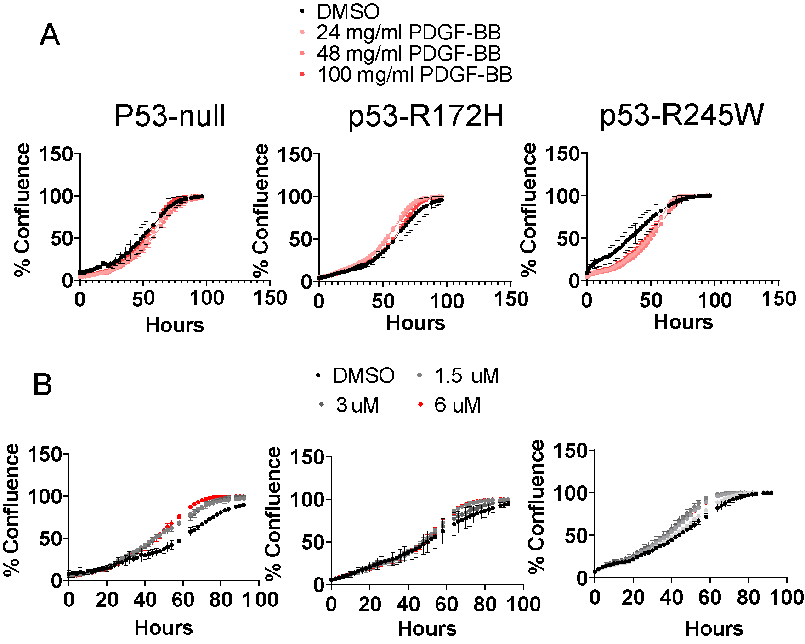
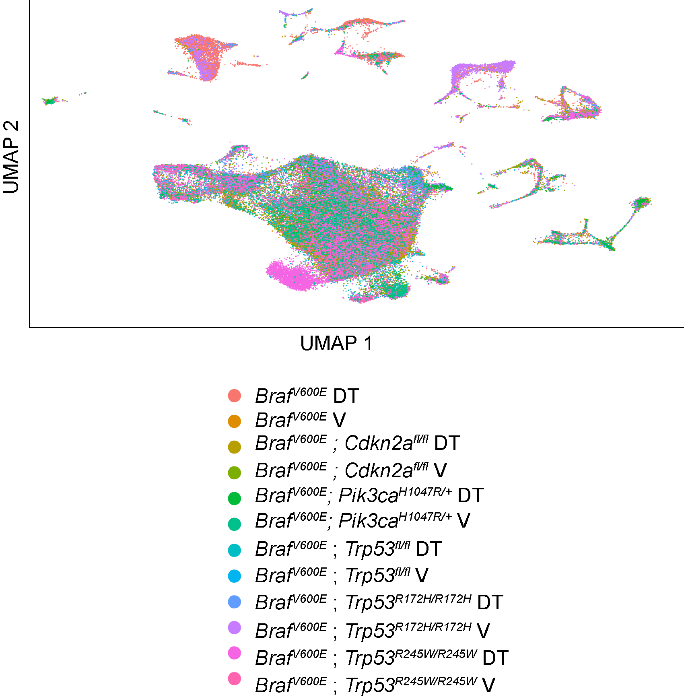
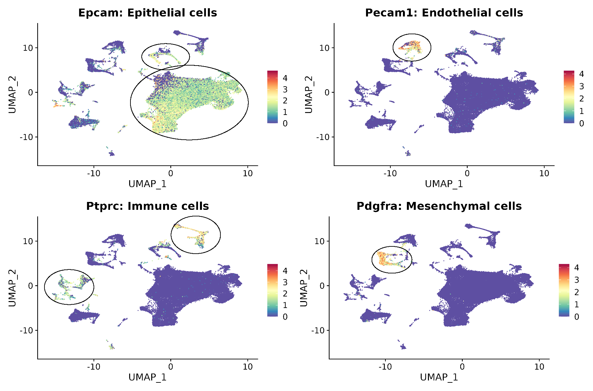
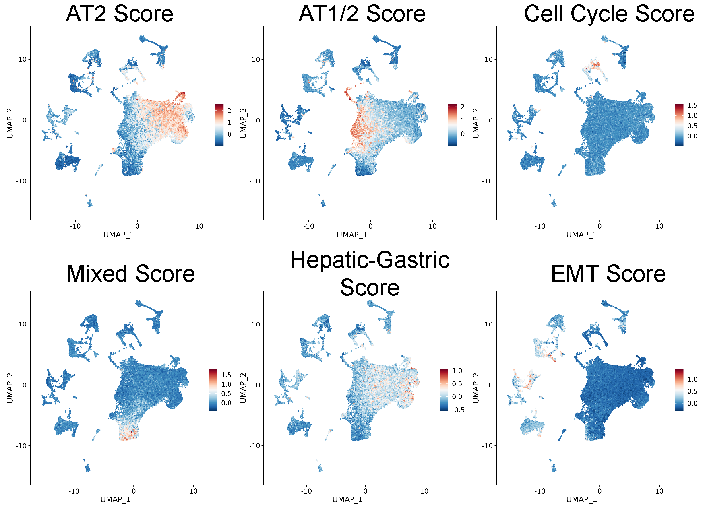
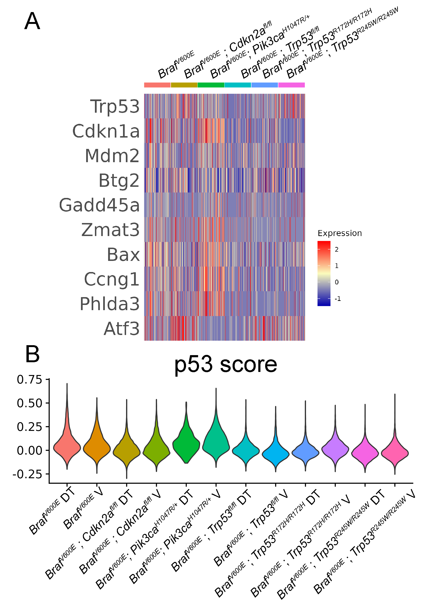

---
title: Dissertation
keywords:
- markdown
- publishing
- manubot
lang: en-US
date-meta: '2022-04-08'
author-meta:
- Michael
header-includes: |-
  <!--
  Manubot generated metadata rendered from header-includes-template.html.
  Suggest improvements at https://github.com/manubot/manubot/blob/main/manubot/process/header-includes-template.html
  -->
  <meta name="dc.format" content="text/html" />
  <meta name="dc.title" content="Dissertation" />
  <meta name="citation_title" content="Dissertation" />
  <meta property="og:title" content="Dissertation" />
  <meta property="twitter:title" content="Dissertation" />
  <meta name="dc.date" content="2022-04-08" />
  <meta name="citation_publication_date" content="2022-04-08" />
  <meta name="dc.language" content="en-US" />
  <meta name="citation_language" content="en-US" />
  <meta name="dc.relation.ispartof" content="Manubot" />
  <meta name="dc.publisher" content="Manubot" />
  <meta name="citation_journal_title" content="Manubot" />
  <meta name="citation_technical_report_institution" content="Manubot" />
  <meta name="citation_author" content="Michael" />
  <meta name="citation_author_institution" content="Department of Something, University of Whatever" />
  <meta name="citation_author_orcid" content="XXXX-XXXX-XXXX-XXXX" />
  <meta name="twitter:creator" content="@johndoe" />
  <link rel="canonical" href="https://scherzerthesis.github.io/thesis/" />
  <meta property="og:url" content="https://scherzerthesis.github.io/thesis/" />
  <meta property="twitter:url" content="https://scherzerthesis.github.io/thesis/" />
  <meta name="citation_fulltext_html_url" content="https://scherzerthesis.github.io/thesis/" />
  <meta name="citation_pdf_url" content="https://scherzerthesis.github.io/thesis/manuscript.pdf" />
  <link rel="alternate" type="application/pdf" href="https://scherzerthesis.github.io/thesis/manuscript.pdf" />
  <link rel="alternate" type="text/html" href="https://scherzerthesis.github.io/thesis/v/bd0e4c0d29a553d0a2e15f89b42a89cd700418db/" />
  <meta name="manubot_html_url_versioned" content="https://scherzerthesis.github.io/thesis/v/bd0e4c0d29a553d0a2e15f89b42a89cd700418db/" />
  <meta name="manubot_pdf_url_versioned" content="https://scherzerthesis.github.io/thesis/v/bd0e4c0d29a553d0a2e15f89b42a89cd700418db/manuscript.pdf" />
  <meta property="og:type" content="article" />
  <meta property="twitter:card" content="summary_large_image" />
  <link rel="icon" type="image/png" sizes="192x192" href="https://manubot.org/favicon-192x192.png" />
  <link rel="mask-icon" href="https://manubot.org/safari-pinned-tab.svg" color="#ad1457" />
  <meta name="theme-color" content="#ad1457" />
  <!-- end Manubot generated metadata -->
bibliography:
- content/manual-references.json
manubot-output-bibliography: output/references.json
manubot-output-citekeys: output/citations.tsv
manubot-requests-cache-path: ci/cache/requests-cache
manubot-clear-requests-cache: false
...

<small><em>
This manuscript
([permalink](https://scherzerthesis.github.io/thesis/v/bd0e4c0d29a553d0a2e15f89b42a89cd700418db/))
was automatically generated
from [scherzerthesis/thesis@bd0e4c0](https://github.com/scherzerthesis/thesis/tree/bd0e4c0d29a553d0a2e15f89b42a89cd700418db)
on April 8, 2022.
</em></small>

## Authors

+ **Michael** 
    {.inline_icon width=16 height=16}
    [XXXX-XXXX-XXXX-XXXX](https://orcid.org/XXXX-XXXX-XXXX-XXXX)
    · {.inline_icon width=16 height=16}
    [johndoe](https://github.com/johndoe)
    · {.inline_icon width=16 height=16}
    [johndoe](https://twitter.com/johndoe) 
  <small>
     Department of Something, University of Whatever
     · Funded by Grant XXXXXXXX
  </small>

## Chapter One: Introduction {.page_break_before}

**Abstract**
Lung cancer remains a threat to human health throughout the world. Due to the accumulation of mutations from tobacco or otherwise, lung cancers have a vast mutational spectrum that affects many genes. These characteristics make lung cancer a challenge in understanding how the disease forms. Furthermore, mutational tumor heterogeneity is linked to drug resistance and a poor prognosis for patients. Interestingly, MAPK pathway activation appears to be a prerequisite for lung adenocarcinoma formation. In chapter 1, using genetically engineered mouse models of BRAF^V600E^ lung tumorigenesis, we analyzed the contribution of commonly mutated genes to tumor progression. It was found that, while BRAF^V600E^ drives benign tumor formation, loss of SETD2 function drives tumor progression to larger tumors. Thus, we identified SETD2 as a common alteration in BRAF^V600E^ lung cancer and is a bone fide tumor suppressor.

  Genetic sequencing of human lung adenocarcinomas has also revealed the widespread inactivation of p53 as a common alteration in late-stage lung adenocarcinoma. Normal p53 function restricts tumor plasticity, and thus losing p53 function enables tumor cells to adopt more malignant cell identities. However, not all p53 mutations are created equal. In chapter 2, we characterized the effect of three p53 mutant alleles (P53^fl/fl^, P53^R172H^, and p53^R245W^) on BRAF^V600E^ lung tumorigenesis. It was found that p53^R172H^ and p53^R245W^ induce more widespread tumor dedifferentiation, thus leading to worst tumor outcomes compared to p53-loss. Cell lines derived from the tumors allowed for the dissection of signaling pathway dynamics, which led us to observe higher MAPK pathway activation in p53^R172H^ and p53^R245W^ cell lines. We also found that p53^R172H^ and p53^R245W^ cell lines were more refractory to MAPK pathway inhibition with small molecule inhibitors. These altered phenotypes seen in p53^R172H^ and p53^R245W^ are likely a reflection of their altered transcriptomic profiles. 
  
  Although genetically-engineered mouse models are foundational in understanding how lung adenocarcinomas develop, progress, and metastasize, little is known about the transcriptional heterogeneity of genetically-engineered mice. In Chapter 3, we profiled the single-cell transcriptomes of BRAF^V600E^ lung tumors. We identified distinct clusters of tumor cell types and determined the transcriptional response to MAPK pathway-targeted therapy.
  
 By quantifying the tumor-suppressive landscape and the heterogeneous transcriptional landscape of BRAF^V600E^ cells, our work has contributed valuable knowledge to lung adenocarcinoma biology.
  

**NSCLC** Lung cancer is a global hazard to human health. The historical consumption of cigarette smoke has caused lung cancer to be the most common and deadly form of cancer. Fortunately, smoking rates have decreased in the past 30 years, with lung cancer rates also declining. However, even if cigarette consumption is eradicated, lung cancer would still significantly affect human health. Indeed, approximately 25% of all lung cancer cases arise in never smokers [@pmid:23714547]. Secondary causes of lung cancer include Radon exposure, high-heat cooking, family history, and air pollution [@pmid:27174888]. An individual's risk of lung cancer also increases with age due to decreases in the efficiency of tumor-suppressive mechanisms such as tumor immunity and apoptosis[@pmid:22974775].

Lung cancer can be broadly classified into two major histological categories based on how the malignant cells look under a microscope: Non-small Cell Lung Cancer (NSCLC) and Small Cell Lung Cancer (SCLC). Within NSCLC, tumors are further characterized based on histological structures, anatomical location, cell-of-origin, and genetic drivers[@pmid:18815398]. For example, lung adenocarcinoma is the most common subtype and is characterized by glandular and papillary structures, while squamous cell lung carcinoma is characterized by keratin-pearls[@pmid:15059877]. Moreover, adenocarcinomas arise from alveolar-type-2 (AT2) cells in the distal lung and alveoli and are typified by genomic alterations throughout the MAPK pathway, such as EGFR, KRAS, BRAF, PI3K [@pmid:32747478; @pmid:11751630]. On the other hand, squamous cells carcinomas likely arise from basal cells and typically harbor SOX2 gene amplification [@pmid:27308419; @pmid:30332632].

The 5-year survival rate for patients with lung cancer was 25% in 2020 but varied depending on the stage of disease at the time of diagnosis [@doi:10.3322/caac.21654]. Like other solid cancers, lung cancers are most deadly after primary tumors have metastasized to other organ systems like the liver, kidney, bone, or nervous system [@pmid:5130083]. Lung cancer patients with no local or distant metastasis typically have a 5-year survival percentage of approximately 40% compared to approximately 5% with distant metastasis[@pmid:27535389; @pmid:27740970]. Ultimately, the cause of death of many lung cancer patients includes primary lung tumor burden, infection, pulmonary embolism or hemorrhage, or complications of metastatic dissemination[@pmid:23194048]. Although patient survival has improved due to improved targeted and immune therapies, the still poor prognosis reflects a need to understand better the molecular mechanisms underlying lung adenocarcinoma initiation, progression, maintenance, and response to targeted- or immune therapy.

The current standard of care for Lung adenocarcinoma patients is often a combination of several conventional chemotherapeutics, including Cisplatin, Carboplatin, Paclitaxel, or Pemetrexed[@pmid:32548736]. Fortunately, patients who have been identified to have EGFR, ALK, ROS, TRK, or BRAF genetic alternations are often offered pathway-targeted therapies[@pmid:27283860; @pmid:24651011]. As of late, many patients receive immunotherapy first, followed by pathway-targeted therapy after progression on immunotherapy. Furthermore, in the last seven years, exciting therapeutic options for _KRAS_ mutant lung cancer have been developed and tested, such as a combination of MEK-inhibition and autophagy-inhibition and direct inhibitors of _KRAS_ G12c and _KRAS_ G12D [@pmid:30833748; @pmid:35267628; @pmid:35167298]

**MAPK signaling** standard activation from the top of the MAPK pathway begins with extracellular ligands (EGF, NGF) binding to Receptor-Tyrosine Kinases (RTKs), leading to loading of RAS with GTP, which activates RAS. Many RAS mutations lead to either more efficient loading of GTP or less efficient GTP hydrolysis, which both serve to activate RAS. GTP-loaded RAS recruits and activates RAF kinases (ARAF, BRAF, CRAF) which then phosphorylates and activates MEK1/2 kinases, which then phosphorylates and activates ERK1/2. Ultimately, this leads to the activation of a suite of cellular processes required for proliferation, differentiation, migration, and cell survival. Therefore, activating mutation in this pathway, from RTKs to kinases, keeps the pathway in a constitutively active state. For example, the most common mutation in _BRAF_ is V600E. This valine to glutamic acid substitution is located in the kinase domain and mimics phosphorylation, allowing BRAF(V600E) to become independent of upstream regulations like RAS. This active state drives many of the cancer hallmarks required for tumor formation. It is important to note that oncogenic activation of the MAPK pathway differs from normal ligand-mediated pathway activation. For example, mitogens, such as EGF only transiently activate the pathway even with constant ligand stimulation. Various biological processes integrate this immediate and intense spike in pathway activation in the cell, resulting in specific target genes' transcription. In contrast, oncogenic signaling thru mutational activation of BRAF(V600E) results in constant kinase signaling that is integrated differently than normal pathway stimulation. Thus, an oncogene-specific transcriptional program is activated.

The importance of this pathway is reflected in the strong anti-tumor responses that are seen when small molecule inhibitors are used to target various molecules involved in the MAPK pathway. For example, Dabrafenib and Trametinib, inhibitors of BRAF and MEK kinases, respectfully, are used in patients that harbor BRAF(V600E) melanomas and lung cancers[@pmid:34455067; @pmid:25399551]. Although there is strong preclinical and clinical evidence that BRAF+MEK blockade can lead to tumor regression, not all patients respond to treatment[@pmid:35033867]. Therefore, multiple pathways need to be targeted to see a complete response, such as PI3Kor autophagy [@pmid:25472943; @pmid:32933997; @pmid:30833748].

Great effort has elucidated the proto-oncogenes that drive cancer formation when mutated, such as _MYC_, _RAS_, _PI3K_, and others. Nevertheless, we still do not fully understand the mechanistic details that determine how genes cooperate to drive cancer.

**Genetically engineered mouse models** Genetically-Engineered mouse models (GEMMs) of human cancer have allowed for the reproducible analysis of cancer biology driven by specific mutations frequently found in cancer patients. These models are helpful in understanding the molecular mechanisms that drive tumor formation and testing tumor responses to targeted or immune therapies. Early mouse models were not engineered but instead selected inbred mouse strains that were natural hosts of tumor transplantation[@pmid:692142]. However, these models suffer from long latencies, incomplete penetrance, and are often not genetically similar to human cancers. Therefore, carcinogen-induced models such as UV, Urethane, radiation, cigarette consumption, or MNU treatment models were developed to resemble carcinogen-induced human cancers[@pmid:7987394; @pmid:25363767]. After techniques were developed to genetically manipulate embryonic stem cells came the ability to engineer mice with specific mutations that could drive tumor formation. Since genes involved in cancer are also crucial for normal mouse development, conditional gene manipulation was developed to allow for temporal control.

The most commonly used conditional gene expression system relies on inducible transcription factors, such as the tetracycline-dependent regulatory system, where the treatment of mice with doxycycline toggles gene transcription levels of transgenes. More recently, Cre-lox recombination strategies have been utilized to get more cell-type-specific control. In this system, genes of interest are constructed to contain LoxP-sites that flank a particular genetic element. Upon delivery of Cre-recombinase, the DNA sequence in between LoxP sites is excised. With this approach, one can knock out a gene by engineering LoxP sites around critical exons or induce gene transcription by flanking a strong stop signal such as a polyadenylation sequence upstream of a gene-of-interest sequence such as KRAS(G12D)[@pmid:11751630].

Genetically engineered mouse models of human cancer are important preclinical models because they resemble the physiological environment of tumor growth in which tumors arise as progeny from a single initiating cell. These tumors can approximate the genetic alterations, transcriptional landscape, histology, and responsive disposition or lack, therefore, seen in human cancers(cite). However, these models often take months to develop tumors, and compound genetic alterations take time to develop. Later in this thesis, we will utilize TUBA-SEQ to both quantify tumor burden and cooperation of BRAF(V600E) with other common alterations in lung cancer.

Due to the robust connection between lung adenocarcinomas and mutational activation of genes involved in the MAPK-pathway, such as _EGFR_, _KRAS_, and _BRAF_,  many labs have generated genetically-engineered mouse models (GEMMs) that harbor conditionally-activated cancer-specific mutant alleles of either  EGFR (L858R), KRAS (G12D), or BRAF(V600E).

Our lab has previously developed a conditional mouse model of BRAF (V600E) human lung cancers[@pmid:17299132; @pmid:26001956; @pmid:31452510]. In the _Braf(CAT)_ model, normal BRAF is expressed from a conditional allele prior to Cre-mediated recombination. LoxP sites flank human _BRAF_ cDNA encoding normal _BRAF_ exons 15-18. Downstream of the LoxP sites is the mutant exon 15 that encodes the murine equivalent of the T1799A mutation that gives rise to the BRAF (V600E) oncoprotein. Downstream of the mutant exon, there is a P2A element and a CAAX-tagged _TdTomato_. Therefore, after Cre-mediated recombination, the BRAF (V600E) oncoprotein and fluorophore TdTomato are expressed at normal levels[@pmid:31452510].

**BRAF (V600E) Tumorigenesis and Cooperating Events for Progression**  Mutational activation of the MAPK pathway forms lung tumors in mice. Specifically, expression of BRAF (V600E) in the Surfactant-Protein C expression cells (alveolar type 2 pneumocytes) elicits benign tumor formation that fails to progress to lung adenocarcinoma. It is hypothesized that the cell cycle arrest is dependent on the tumor suppressors P53 and CDKN2A. Loss of either P53 or CDKN2A allows tumors to progress to malignant and deadly lung adenocarcinoma. Also, activating WNT signaling and PI3K signaling also allows BRAF (V600E) adenomas to progress to adenocarcinoma [@pmid:31452510; @pmid:26567140; @pmid:24589553]. These observations are in concordance with the &quot;multiple-hit&quot; hypothesis that states that cancers do not arise from single mutagenic events but are the consequence of sequential assaults on the genome that activate more than one oncogenic pathway. These multiple genetic hits allow cells to adopt traits to form cancer, which Bob Weinberg and Douglas Hanahan coined as the &quot;Hallmarks of Cancer&quot; [@pmid:21376230; @pmid:35022204]. The traits include suppression of apoptosis, active proliferation, altered metabolism, changes in cell identity, and forming blood vessels to supply tumor cells with adequate resources for growth[@pmid:35022204]. BRAF(V600E) expression alone is sufficient to activate many of the hallmarks of cancer, but additional pathways need to be activated or suppressed to develop into malignant tumors. Great effort has elucidated the proto-oncogenes that drive cancer formation when mutated, such as _MYC_, _RAS_, _PI3K_, and others. Yet we still do not fully understand the mechanistic details that determine how genes cooperate to override tumor suppressive mechanisms and drive cancer progression.

**Talk here about the prevalence of mutations in the egfr-ras-RAF-mek-erk pathway**

**Identification of this pathway as central to luad tumorigenesis**

**Development of gemms to study BRAF^V600E^**

**Proliferation arrest by this model**

**How does p53 loss lead to sustained wnt-signalling? Do dominant-negative recapitulate?**

**P53- mediated tumor suppression**
Cancers pose an evolutionary challenge for organisms regardless of their life span. Therefore, suppression of the outgrowth of neoplastic cells is built into many organisms. One such mechanism is the engagement of the p53 pathway. At the time of writing this dissertation, there are approximately 105,000 manuscripts on PUBMED that mention P53. P53 is well studied because of its prominent role in tumor suppression and because it is the most frequently altered gene in human cancer.

The p53 protein was initially discovered as a protein that bound large T antigene of the SV40 virus in infected cells [@pmid:222475].P53 is a transcriptional factor with a DNA-binding domain that has a DNA-binding domain recognizes explicitly two decameric half-sites. P53 also contains two N-terminal transactivation domains and a C-terminal oligomerization domain critical for P53-target gene activation[@pmid:16575405]. Central to the ability of P53 to induce transcriptional activation is tetramerization. Thus, if one or more P53 protein in the complex is compromised in transactivation or DNA binding, transcriptional activity is compromised. Therefore, if one copy of P53 is mutated, the organism's ability to suppress tumor formation is compromised.

The importance of p53 is best demonstrated in people and in mice that have just one mutated copy of P53. Humans with the familial- inherited Li-Fraumeni syndrome, in which they have one or more mutations in p53, are almost certain to develop cancer early on and throughout their life[@pmid:3409256]. Similarly, mice lacking two function P53 genes are prone to leukemias and lymphomas and have a shortened lifespan due to cancer incidence[@pmid:1552940]. On the other hand, organisms such as the African and Asian elephants, which have an abnormally low level of cancer incidence, have been shown to have higher multiple copies of _TP53_ in their genomes[@pmid:26447779]. 

The most well-known cellular functions of P53 include its ability to induce cell-cycle arrest in response to DNA damage[@pmid:8242752]. Many stress signals, including oncogene activation, have been shown to stimulate a reversible or irreversible cell cycle arrest[@pmid:9765202; @pmid:34812139]. However, the strength of P53 induced cell cycle arrest or apoptosis is likely cell type- and cellular stress-specific and is an active area of p53 research.

Once a cell encounters a stressor such as DNA damage or oncogene activation, P53 is stabilized and accumulates in the nucleus to activate a suite of target genes that can lead to several cellular phenotypes, such as cell-cycle arrest or apoptosis.

P53 was initially thought to be an oncogene as P53 is accumulated in lung cancer, which is not common in normal tissues[@pmid:1969059; @pmid:1694291]. Moreover, ectopic expression of a P53 cDNA was found to aid in transforming primary cells induced by RAS. However, early studies erroneously used mutated P53 instead of wild-type, leading to the misclassification of P53 as an oncogene. We now know P53 suppresses cell growth and transformation[@pmid:19776744].

Oftentimes, P53 is mutated in the DNA-binding domain at sites commonly referred to as &quot;hotspots&quot; due to their extraordinary frequency. These hotspot mutations poison the ability of p53 to bind DNA, therefore, blocking its function. Interestingly, since one mutated P53 can disrupt the entire P53 tetramer complex, a single mutation can exert dominant-negative effects by inhibiting the normal tumor-suppressive functions of P53. Although one mutant P53 allele is enough to compromise transcriptional activity, there is still selective pressure to lose the other wild-type copy. Loss of hemizygosity implies there is still residual tumor suppression in the presence of a wild-type P53 allele[@pmid:27585860].

Early on in P53 studies, there were reports of specific P53 mutations having a &quot;gain-of-function&quot; (GOF) effect. For example, Li-Fraumeni patients with specific missense mutations in P53 would develop tumors earlier than Li-Fraumeni patients with loss-of-function (LOF) mutations [@pmid:18511570]. Furthermore, experimental cell biology studies would express mutant-p53 in P53^null^ cells and demonstrate enhanced tumorigenic potential [@pmid:32404993]. Further evidence for GOF mutant-P53 in mice indicated that missense mutant P53 induced different cancer types and enhanced metastasis than LOF P53 [@pmid:15607980]. Furthermore, many groups have shown that mutant-p53 can alter signal transduction affecting chemoresistance and metabolism.

The cellular mechanisms that GOF P53 is involved in are also well-characterized but context-dependent. For example, in Pancreatic cancers driven by KRAS(G12D), Mutant P3 interacts with CREB to induce FOXA1 transcription, which enhances Beta-Catenin signaling to augment liver metastasis [@pmid:33839689].

## Chapter Two: Quantitative tumor burden and small library screen using TUBA-SEQ 
{.page_break_before}

##Abstract
Large-scale sequencing of cancers has revealed that lung adenocarcinomas have a high mutation rate. Although it is clear that the evolution of lung adenocarcinoma is centered around mutational activation of the EGFR-RAS-RAF-MEK-ERK pathway, little is known about secondary mutations that drive disease progression. Since lung cancers are riddled with mutations, it is challenging to glean which mutations support cancer growth and which are merely bystanders. Therefore, pre-clinical mouse models that are syngenetic are essential to determining the oncogenicity of a particular gene. Here, we use Tuba-Sequencing combined with CRISPR/Cas9 gene editing to simultaneously determine the contribution of the loss of one of eleven tumor suppressor genes in BRAF^V600E^ mouse lung tumorigenesis. We show that loss of either _Apc_ or _Setd2_ leads to enhanced tumor growth. We validated SETD2 loss as a cooperating mutation with single-guide RNAs. Functionality, SETD2 is a histone lysine methyltransferase that marks active gene bodies by depositing me^3^ marks on H3K36. In BRAF^V600E^ lung tumors,  _Setd2_ loss decreases H3K36me^3^ and H3K36me^3^ was correlated with larger tumors. _SETD2_ RNA is expressed less in human lung cancers than in normal lungs and can indicate worse overall survival. Moreover, _SETD2_ loss is common in human _BRAF^V600E^_ lung adenocarcinomas. Together, our results highlight the potential importance of _SETD2_ in the progression of BRAF^V600E^ lung adenocarcinoma.

# Introduction

Next-generation sequencing has allowed for the unbiased identification of mutated genes in human cancer [@pmid:25079552; @pmid:25109877; @pmid:24132290].
The wealth of knowledge gained from such large-scale sequencing projects has revealed actionable mutations that can be targeted with small molecule inhibitors, such as dabrafenib and trametinib.
However, identifying possible targets is not enough, as many cancers with similarly mutated oncogenes, such as BRAF^V600E^, respond differentially to BRAF^V600E^-targeted therapy.
For example,  melanoma patients with BRAF^V600E^ mutations respond well to BRAF^V600E^-targeted therapy, whereas colorectal cancer patients with BRAF^V600E^ mutations do not respond[@pmid:22448344].
The disconnect between putative driver oncogenes identified in human cancers and response to targeted therapy is a problem that can be solved with rigorous pre-clinical experimentation, such as in GEMMs. 

Genomic sequencing of human tumors has also been a crucial insight into how cancers form and what signaling nodes might be necessary for progressive stages of cancer evolution.
For example, pancreatic cancers have a stereotypical histological progression brought about by known mutational activation.
Specifically, mutations in _KRAS_ initiate tumorigenesis, and loss of _TP53_ function and _SMAD3_ are associated with cancer progression[@pmid:31395068].
However, this is more difficult to do in lung adenocarcinoma because of the high mutational burden often due to the consumption of cigarettes[@pmid:27811275; @pmid:31996850].

Indeed, in highly mutated cancers such as melanoma and lung cancer, recurrent mutations are not necessarily predictive of biological importance.
To better understand the importance of candidate tumor suppressors or oncogenes, researchers exploit tumor cell lines and GEMMs to identify bona-fide genetic drivers of cancer.
However, these systems are suboptimal, as they are either not physiologically relevant (tissue culture) or are not scalable to determine the effect of many mutations (GEMMs).
Moreover, techniques to measure the cooperation of genes to drive lung cancer are qualitative and are not sufficiently quantitative to allow for large-scale studies.
Typically, lung adenocarcinoma is quantified by lung weight or histological analyses such as tumor burden (Percentage of the lung that is tumor), tumor size, and immunohistochemistry (IHC) of tumor markers.
Although essential and informative, these analyses are not high-throughput and rely on many mice to achieve statistical confidence. Furthermore, there is intrinsic bias when calculating tumor size and tumor burden, as tissue-sectioning results in tumor sections that do not accurately portray actual tumor size. Therefore, more advanced techniques are required for large-scale analysis of mouse tumors that are both quantitative and high throughput.

Recently, Monte Winslow and his lab at Stanford University have developed **Tu**mor- **Ba**rcode **Seq**uencing (Tuba-Seq), a rapid, multiplexed, quantitative assay for analyzing the contribution of tumor-suppressor loss _in vivo_.
This technique delivers a uniquely barcoded lentiviral encoding Cre recombinase to activate Cre-mediated oncogenes and a guide RNA to inactivate a single tumor suppressor gene.
Therefore, each tumor will be driven by the same oncogene but with different tumor suppressors inactivated.
After some time (6-24 weeks), tissue is harvested for whole-lung DNA extraction, and targeted DNA-sequencing is performed to quantify relative tumor size to spike-in controls[@pmid:28530655].
Therefore, the contribution of a single tumor suppressor can be quantified in a single animal. 

BRAF^V600E^ has previously been shown to be a potent driver of lung tumorigenesis[@pmid:17299132].
However, tumors fail to progress past adenoma-like tumors.
Given the theory that BRAF-^V600E^ induces growth arrest after an initial burst of neoplastic growth, it would be of interest to know if all tumors grow to a predetermined and absolute size or if there is a spectrum of tumor sizes that are determined by extrinsic factors such as proximity to blood vessels or specific stromal cells.
Therefore, we used Tuba-Seq combined with CRISPR/CAS9 genome editing to explore the contribution of 11 tumor suppressor genes and five controls in our BRAF ^V600E^- driven lung tumor models.

# Results
Adenoviral vectors and lentiviral vectors introduced in the lungs of GEMMs offer temporal control and can be titrated to achieve an optimal level of tumor numerosity. 
However, only lentiviral vectors can be used to barcode tumors because they integrate into the genome while adenoviruses do not[@pmid:19561589; @pmid:28530655].
With CRISPR/CAS9 gene editing, lentiviruses have been used to analyze many genetic interactions of oncogenic _Kras_ driven lung adenocarcinoma[@pmid:29233960;@pmid:28530655].
To enable simultaneous activation of BRAF^V600E^ and loss of tumor suppressor genes, we bred _Braf^CAT^_; _H11b^LSL-CAS9/+^_ mice. 
To determine the size of BRAF ^V600E^ tumors and the contribution of 11 tumor suppressor genes (_Trp53, Rb1, Cdkn2a, Apc, Rbm10, Stk11, Setd2, Arid1a, Atm, Keap1, Smad4)_ on BRAF ^V600E^ lung tumorigenesis, we obtained tittered barcoded-lentiviral plasmids that encode Cre-recombinase as well as a sgRNA that inactivates one of eleven tumor suppressors common in lung adenocarcinoma(Figure 2.1).
All genes tested are putative tumor suppressor genes commonly lost in human lung cancer patients. Each lentiviral solution contained ~1000 individually barcoded lentiviruses.
We infected both _LSL-Cas9_ and _CAS9_ deficient mice in order to determine the contribution of genetic manipulation on tumor size (Figure 2.1).
Mice meant to be analyzed after eight weeks received a viral titer of 1x10^5, while mice meant to be analyzed after 16 weeks received a viral titer of 1x10^4.
Gross, histologic images of experimental lungs show an increase in tumor burden with both time (Figure xxx) and CAS9 status (Figure 2.1). 
Therefore, based on macroscopic inspection, at least one tumor suppressor appeared to cooperate with BRAF ^V600E^ to increase tumor burden.
After euthanasia, lungs were collected for genomic DNA extraction and barcode amplification, followed by the preparation of sequencing libraries.
Before genomic extraction and library preparation, a known quantity of known-barcoded cells was added to benchmark sequencing reads to a known cell number.

We determined the mean size of a BRAF^V600E^ driven tumor to be 21,248 thousand cells (Figure 2.2). 
Interestingly, there is a widespread distribution of tumor sizes, with the most giant BRAF^V600E^ tumor to be ~300,000 cells, along with many small tumors (Figure).

In order to determine the fitness landscape of any one particular tumor suppressor, we calculated the relative number of tumor cells in a given tumor using the Tuba-Seq genomics pipeline. In CAS9 deficient mice, there was no statiscically significant cooperation with any single-guide RNAs (Figure 2.3A).
After eight weeks post tumor initiation, APC loss provided a growth advantage(Figure 2.3 B). 
However, 16 weeks post-initiation revealed that both SETD2 loss and APC loss cooperated with BRAF ^V600E^ to form larger tumors (Figure 2.3 C). 
APC loss was a suspected hit as we have previously shown that activation of Wnt-beta-catenin signaling promoted BRAF^V600E^ tumorigenesis. 
As APC loss is predicted to increase Beta-catenin signaling activity, this result was unsurprising to us. 
However, loss of SETD2 was a novel finding in the context of BRAF ^V600E^ lung tumorigenesis.

Given our findings of SETD2 loss increased tumor burden concurrent with BRAF^V600E^, we next validated SETD2 in a new cohort of mice with single-guide RNAs targeting SETD2 (Figure 2.4). 
Indeed, loss of SETD2 increased tumor size based on gross histological analysis(Figure 2.4A). Addiionally, tumor size increased from in reponse to CRISPR/Cas9-mediated gene editing of _Setd2_(Figure 2.4B). 
Since SETD2 antibodies are unreliable in both western blots and immunohistochemistry, we used H3K36me3 as a surrogate marker for SETD2 activity by immunohistochemistry(Figure 2.5A). 
Whereas 90% of nuclei in BRAF ^V600E^ only tumors were H3K36me3, more than 60% of tumors of mice infected with SETD2 CRISPR virus were negative for H3K36me3(Figure 2.5B).
Furthermore, when classified by H3K36me3-positive or -negative, there is even more substantial evidence that SETD2 loss leads to larger tumor formation(Figure 2.5C). Specifically, tumors that have lost H3H36me^3^, were 5-times larger than tumors that have retained H3K36me^3^. Therefore, we conclude that _Setd2_ loss drives growth of BRAF^V600E^-driven lung tumors.

Clearly, there is a strong selective advantage given to tumors that have lost _Setd2_ function. We next wondered if human lung cancer patients have altered _SETD2_ levels. Indeed, Low _SETD2_ levels correlate with poor overall survival and _SETD2_ is expressed less in lung tumors compared to normal lung tissue(Figure 2.6A,B). To further demonstrate the relationship between BRAF^V600E^ and _SETD2_ loss, we mined patient data avaiable from Project Genie[@pmid:28572459]. Interestingly, we found an association between _SETD2_ genomic alterations and _^BRAF^V600^_ mutational activation(Figure 2.6C). Specifically, of the 220 _BRAF^V600^_ mutations (include V600E and V600K), 40% had concurrent alterations in _SETD2_. These observations indicate _SETD2_ loss is a common feature of _BRAF^V600^_-driven human lung adenocarcinomas and predicts poor overall survival in non-small cell lung cancer.

# Discussion
The mutational landscape of lung adenocarcinoma is complex due to the lifelong bombardment of DNA by carcinogens ingested into the distal lung epithelium[23770567].
While understanding which altered genes play causal roles in tumor formation and progression is required for personalized medicine, the noisy mutation profiles in lung adenocarcinoma make it hard to do so.
However, there is a central role for the MAPK pathway during the initiation and progression of lung adenocarcinoma [@pmid:28228261].
Oncogenic BRAF^V600E^ is a significant driver of lung adenocarcinoma.
However, mouse models with activation of BRAF ^V600E^ only lead to benign tumorigenesis[@pmid:26001956; @pmid:17299132].
Although it is known that activation of WNT and PI3k signaling and loss of _Trp53_ and _Cdkn2a_ genes allow BRAF^V600E^ benign lung tumors to progress to malignant disease, it is a time-consuming and laborious process to effects individual tumor suppressors, in GEMMs.
Therefore, we sought to systematically test a variety of known tumor suppressors in lung adenocarcinoma.
Furthermore, until now, we did not know the absolute number of cells in a BRAF^V600E^ adenoma, only its area, which is confounded by tissue sectioning and stromal cell contamination.
Prior to Tuba-Seq, it was challenging to accurately determine the size of BRAF^V600E^ adenomas.
Based on population doublings and cross-sections of BRAF ^V600E^ tumors in histological sections, it is estimated that BRAF^V600E^-driven lung adenomas grow about 15-20 populations doublings and reach a size of 1mm^3^[@pmid:24589553]. 
With Tuba-Seq, we accurately discerned the absolute size of all BRAF^V600E^ lung adenomas, regardless of size.
Interestingly, our results have revealed that BRAF^V600E^-driven tumors widely differ in absolute tumor cell number. Our results support the hypothesis that each tumor-initiating cell has unique barriers to tumor outgrowth. 
This heterogeneous response to BRAF^V600E^ activation likely reflects intrinsic differences between individual cell states. 
Indeed, tumorigenic potential can vary significantly due to different cell types (AT2 vs. Club cell vs. AT1) or be influenced by subtle differences within a cell type, such as proximity to supporting stromal cells such as fibroblast or immune cells. 
Since we used a ubiquitous promoter to drive BRAF^V600E^ and CAS9 expression, not all sequence likely reads come from adenomas or tumors but from average cell turnover during tissue homeostasis. 
Therefore, in our quantification and analysis, we focused on tumors greater than 5,000 cells. 

We combined Tuba-Seq with CRISPR/CAS9 gene editing of eleven putative tumor suppressor genes with four inert control sgRNAs. We identified APC and SETD2 loss as a cooperating genetic event that allows BRAF^V600E^ tumors to grow larger. 
Therefore, APC and SETD2 are bona fide tumor suppressors in lung adenocarcinoma. 
APC loss is known to activate the Wnt-signaling pathway and is a well-established tumor suppressor in colon cancer[@pmid:1528264].
Furthermore, our lab has previously published a requirement for WNT-signaling for the progression of BRAF^V600E^ lung tumors[@pmid:24589553].
Specifically, inhibition of WNT signaling by a Porcupine inhibitor prevents tumor onset, while constitutive activation of the pathway drives tumor progression to high grade. 
Therefore, it is not surprising that APC loss cooperates with BRAF^V600E^ to induce tumor growth.

We have also identified _SETD2_ loss as a potent tumor suppressor(Figure 2).
_SETD2_ is mutated in other solid malignancies on cBioPortal, such as Kidney and bladder cancers[@pmid:22588877]. 
SETD2 is a histone methyltransferase that deposits trimethylation marks on H3K36[@pmid:33023640]. 
Chromatin modifiers use H3K36me^3^ to mark actively transcribed genes[@pmid:18157086]. 
Mining of TCGA mRNA expression and survival analysis further revealed that _SETD2_ mRNA is lower in lung adenocarcinoma and is associated with poorer overall survival(Figure 2). 
Interestingly, _SETD2_ alterations are also significantly associated with BRAF^V600E^ mutations (Figure 2).
The unique association of _BRAF^V600E^_ mutation and _SETD2_ loss may reflect an interesting synergistic effect between MAPK signaling and loss of chromatin regulation. 
One hypothesis is that SETD2 loss drives spurious transcriptional activation.  
Similarly, recent work by Monte Winslow and David Felder's labs have identified SETD2 loss as a cooperating event in KRAS-G12D lung tumorigenesis[@pmid:28202515]. 
However, the mechanism by which _SETD2_ loss drives tumor progression in either BRAF^V600E^ or KRAS-G12D remains elusive. 

Although we have identified novel tumor suppressors in BRAF^V600E^ lung tumorigenesis using Tuba-Seq, we have failed to confirm previously identified tumor suppressors _CdkN2a_ and _Trp53_ as cooperating events.
One hypothesis is that the sgRNAs targeting _Trp53_ and _Cdkn2a_ are inefficient. However, previous Tuba-Seq experiments did confirm _Trp53_ editing and even demonstrated tumorigenic cooperation with KRAS-G12D[@pmid:29610476].
Another hypothesis is that the effect size of _trp53_ loss is so tiny that many mice and tumors are needed to detect robust cooperation. 
Indeed, p53 loss is not that to suddenly make tumors immediately proliferate. 
Instead, p53 loss merely allows for tumor cells to sample various transcriptional programs that can be co-opted for increased fitness in the face of stress.
Along similar lines, perhaps 16-weeks is too little time to allow for _Trp53_ or _Cdkn2a_ deficient tumors to proliferate. 
Likely, it is a combination of small effect size, inefficient gene editing, and insufficient time that prevented us from identifying _Trp53_ as a tumor suppressor in BRAF6V600E^ driven lung tumorigenesis using Tuba-Seq combined with CRISPR/CAS9.  

Since GEMMs lack the mutational burden exhibited by human lung adenocarcinomas, they are good models to study gene-gene interactions in tumorigenesis. 
Our data provide further insight into the essential biological mechanisms for BRAF^V600E^ lung tumorigenesis.
Additional studies of SETD2's role in lung adenocarcinoma will further reveal how it alters the evolution of lung adenocarcinomas. 
Furthermore, given its striking association with _BRAF^V600E^_ mutations, it will be essential to know how _SETD2_ alters the response to BRAF^V600E^-targeted therapy. 
A complete understanding of the consequences and outcomes of genetic cooperation between BRAF^V600E^ and tumor suppressors or oncogenes will help clinicians better understand tumor evolution and paths to drug resistance. 

##Methods

**Animal Husbandry** All mice were housed in an environmentally controlled room, and all animal care and experimental procedures were approved by (and in accordance with) the Institutional Animal Care and Use Committee Office of the Huntsman Cancer Institute at the University of Utah. Genetically engineered mouse breeding and genotyping was conducted as previously described [@pmid:31452510]. The _BRAF^CAT^_ and  mice were previously described [@pmid:11694875; @pmid:31452510; @pmid:17299132; @pmid:26001956]. _H11b^LSL-Cas9^_ mice were previously described[@pmid:26178787] All viruses were administered in a Biosafety Level 2+ room, as is regulated by the Institutional Biosafety Committee Guidelines. Lentivirus (Stanford University) was delivered through intratracheal intubation.

**Tuba-Seq** _Braf^CAT/+^_ and _H11b^LSL-CAS9/+^_ mice have been described[@pmid:31452510; @pmid:26178787] and maintained on a mixed background. approximetley equal numbers ofmale and female mice were used in the study. lung tumors were initiated by intratracheal intubation of lentiviral Cre vectors as previously described[@pmid:19561589]. Barcoded lentiviral vectors were supplied by Monte Winslow as previously described[@pmid:29233960]. Briefly, Lentiviral vectors that contain an eight nucleotide sequence that defines the CRISPR-targeted followed by a 15 nucleotide sequence that is unique only to each initiated tumor. Lentivirus was generated in HEK 293T cells in DMEM supplemented with 10% FBS by standard lentiiral generation and titered as previously described[@pmid:29233960]. Genomic DNA was isolated from bulk lung tissue after weighing. Briefly, benchmark control cell lines were spiked-in to enable calculation of the absolute number of tumor cells from the number of barcode reads. After tissue homogenization and 12-hour proteinase-K digestion, genomic DNA isolation was extracted using standard Phenol-Chloroform and precipitated by ethanol. Suquencing libraries were prepared by PCR amlifying the sgRNA-BC sequencing in eight reactions in parallel with Q5 master mix and purified with AMPure beads and quantified with the Qubit instrument. Computational analysis was performed in house by the Monte Winslow laboratory.

**Histology and Quantification of lung tumor burden**
Lungs were perfused with neutral-buffered formalin, removed, and kept in neutral-buffered formalin for 16-24 hours and then stored in 70% ethanol prior to embedding. 5 micrometer sections were cut using the HCI histology core. sections were then stained with hematoxylin and eosin (H&E). Stained slides were scanned using the 3D-histech Panoramic MIDI slide scanner. Tumor size was quantifie using 3D Histech QuantCenter. Immunohistochemistry for H3K26me^3^ was performed as previously described at a concentration of 1:1000 with rabbit mAb #4909 from Cell Signaling Technologies. [@pmid:28089889; @pmid:31452510]. 

**Human lung cancer data** cBio Portal and Project Genie were used to calculate co-ocurring mutations with _BRAF^V600^_ mutations. KMplotter was used for survival analysis and TNMplot was used to calculate _SETD2_ expression in tumor tissue vesus normal lung tissue[@pmid:34309564; @pmid:33807717].

{#fig:04 .white width="100%"}

{#fig:05 .white width="100%"}

{#fig:06 .white width="100%"}  
  
{#fig:07 .white width="100%"}

![**Figure 2.5. H3K36me^3^ is lost in larger tumors in _Set2d_-edited lung tumors.**(A) Representative images of H3K36me3 (surrogate for _setd2_ loss) depicting either "high" or "low" staining indicative of protein expression. (B) Quantification of H3K36me^3^ positive tumors in either _sgSetd2_ or _sgNT1_ targeted mice. *= _p-value<.05_ for negative tumors. (C) Quantification of tumor size paired with H3K36me^3^ negative tumors. Tumor size and H3K36me^3^ positivty were simuletaneously measured using QuantCenter and binned in either "low" or "High" and then average tumor size was determined for each group. *= _p-value<.05_.](images/tuba5.png){#fig:08 .white width="100%"}

![**Figure 2.6. _SETD2_ loss is common in human cancers, an indicator of poor prognosis and frequently occurs with _BRAF^V600E^_ mutations.**(A) Survival analysis with "KMplotter"" indicates a trend towards poorer overall survival with low _SETD2_ mRNA in TGCA Lung adenocarcinoma dataset. (B) _SETD2_ mRNA is attenuated in Lung adenocarcinoma compared to normal lung tissue (C) _SETD2_ mutations significantly co-occur with BRAF^V600E^ mutations and are present in 40% of _BRAF^V600E^) mutant Lung Adenocarcinoma.](images/tuba6.png){#fig:09 .white width="100%"}

## Chapter Three {.page_break_before}

## Abstract
^TP53^ missense BRAF^V600E^ mutations both frequently occur in lung adenocarcinoma. While genetically engineered mouse models (GEMMs) of lung adenocarcinoma are invaluable for understanding the initiation, progression, and response to therapeutics, little is known about how different hotspot point mutations in p53 affect disease progression and therapeutic responses. To this end, we use GEMMs, tumor-derived cell lines, and human lung cancer cell lines to test how murine homologs of p53 hotspot mutants R172H and R245W compare to p53-deletion. We find that conformation mutation p53^R172H^ drives more aggressive lung adenocarcinomas and dedifferentiation. We also observe p53^R172H^ and p53^R245W^ accumulation in only high-grade tumors that have activated ARF expression. In vitro and in vivo studies demonstrate enhanced resistance to BRAF+MEK blockade with p53^R172H^ and p53^R245W^, a standard treatment regimen for BRAF^V600E^ mutant patients. Mechanistically, mutant-p53 alters the transcriptome of cancer cells and enhances entry into the cell cycle by a yet to be determine mechanism.

## Introduction

Lung adenocarcinoma (LUAD) has remained the deadliest form of cancer since 1987 (Siegel, Miller et al. 2021). It is characterized by alterations in the MAP kinase (MAPK) pathway, including activating mutations in the oncoproteins EGFR, KRAS (G12C, G12D, G12V) or BRAF^V600E^ [@pmid:25079552; @pmid:16705038; @pmid:11751630; @pmid:17299132]. The recognized predominant cell of origin for LUAD, lung alveolar type-2 pneumocyte cells (AT2), are exquisitely responsive to the transformative properties of constitutive activation of the MAPK pathway [@pmid:24586047; @pmid:31951518]. Indeed, genetically engineered mouse models (GEMMs) of mutationally activated EGFR, KRAS, or BRAF form lung tumors that strongly resemble key characteristics of human LUAD. However, tumors formed in all three models (KRAS:G12D, EGFR: Deletion 19 or L858R, or BRAF^V600E^) develop only histologically low- to mid-grade cancer and are growth-arrested [@pmid:11751630; @pmid:16705038; @pmid:17299132]. Prior research has determined that oncogene-induced tumor growth arrest occurs through activation of several tumor suppression mechanisms, most notably, p53-mediated tumor suppression [@pmid:26001956].

Alterations in the _TP53_ tumor suppressor gene are common in all cancer types, including LUAD [@pmid:27328919]. P53 encodes a transcription factor that responds to various cell stresses, such as DNA damage and oncogene activation. In response to stress, p53 is stabilized and induces anti-proliferative and genome-mending effects through trans-activation of a diverse set of P53-target genes [@pmid:33518400; @pmid:11099028]. p53 mutations in cancer frequently occur in the DNA binding domain, where a single amino acid change results in dysfunctional DNA-binding and fails transcriptional activation [@pmid:20182602]. Therefore, mutated p53 defunct in p53 transcriptional regulation results in failed tumor suppression and cancer outgrowth. Furthermore, defective p53 signaling will permit future genomic insults to remain unchecked, thus fostering an environment primed for malignant potential. Since mutant-p53 lacks transcriptional activity through its inability to bind DNA, it cannot induce expression of its negative regulators, ARF, MDM2, and MDMX [@pmid:8265599; @pmid:8319905]. Lack of negative feedback results in mutant-p53 stabilization. Accumulation of mutant p53 has been reported to elicit gain-of-function p53 activity. Thus, any gain-of-function activity in mutant-p53 cannot be studied with p53-genetic deletion. Many research groups have characterized gain-of-function phenotypes of mutant-p53 in cancer. For instance, mice expressing mutant-p53 have altered disease phenotype compared to p53-null models [@pmid:15607980;@pmid:15607981]. Specifically in lung cancer model systems, mutant-p53 has modulated SMAD3, NF$\kappa$B, p63, TGF$\beta$, and others to drive various hallmarks of cancer invasion, chemoresistance, metabolism, and propagation of a stem cell fate [@pmid:34178628; @pmid:11238924; @pmid:19345189]. Although the mechanisms that lead to these altered processes are controversial, it is thought that the main effect is through mutant-p53 binding and sequestering known p53-associated proteins. This often leads to the activation of transcription factors such as NF-Y [@pmid:33839689].

In BRAF^V600E^ GEMMs, when p53 function is abolished by _Trp53_ gene deletion or by _Cdkn2a_ deletion, lung tumors can escape growth arrest and undergo malignant transformation [@pmid:17299132; @pmid:26001956]. Furthermore, p53 pathway dysregulation allows a cell to sample diverse phenotypic landscapes that allow for enhanced cell fitness and tumor outgrowth [@pmid:32707077]. However, BRAF^V600E^ lung tumorigenesis and progression to malignant lung adenocarcinoma have only been studied in the context of p53 genetic deletion, not p53 mutation, which is more frequently seen in human lung cancer. Specifically, p53-R172H and p53-R245W are murine homologs of typical hotspots in human cancer R175H and R245W, respectively.

Here, we characterize the differential impact of p53(null), as well as p53 hotspot mutations p53^R712H^ (R175H in humans) and p53^R245W^ (R248W in humans) on BRAF^V600E^ lung tumorigenesis. We observed significantly differential effects of p53-R172H on BRAF^V600E^-driven lung tumorigenesis that were not observed when p53 is deleted, such as enhanced tumor size and decreased survival. Our findings highlight functional differences in mutant-p53 biology, as well as the importance and the utility of clinically relevant mutant-p53 mouse models.

## Results

**P53-mutant Alleles Differentially Alter BRAF (V600E) Lung Tumorigenesis**

Expression of BRAF^V600E^ in the distal epithelium of the mouse lung elicits clonal tumorigenic outgrowths of alveolar type 2 (AT2) pneumocytes [@pmid:17299132]. Prior work has shown that _Trp53^fl/fl^_ cooperates with BRAF(V600E) to form malignant lung tumors when Cre recombinase is activated [@pmid:17299132; @pmid:26001956]. Therefore, we compared the tumor burden of _Braf^Cat/+^_ mice with either p53 loss (_Trp53^fl/fl^_, p53^R172H^ (_Trp53^R172H/R172H^_), or p53^R245W^ (_Trp53^R245W/R245W^_) after infection with 106 pfu of adenovirus expressing surfactant protein C specific Cre (ad5-Spc-Cre) (Figure 3.1). As expected, mice developed lung cancer, consistent with previous findings (Figure 3.2B-C). However, there was a striking, highly reproducible increase in the tumor size of tumors harboring _Trp53^R172H/R172H^_ and to a lesser extent _Trp53^R245W/R245W^_, compared to _Trp53^fl/fl^_ (Figure 3.2A and B). These data led us to hypothesize that p53^R172H^ and p53^R245W^ expression alters tumor progression uniquely from p53 deletion, and these differences may be potentially evident of gain-of-function effects imparted by mutant-53. We next looked at early time points to determine if p53 mutation affects the growth and proliferation of early stage lung tumors. However, we did not find any differences in tumor size between the three different p53 alleles(Figure 3.3A and B).

Since lung cancer patients with mutations in _TP53_ often start only have one mutated _p53_ allele unless the loss of heterozygosity (LOH) occurs. Therefore, we generated mice heterozygous for both _Braf^CAT^_ and either _Trp53^fl^_, _Trp53^R172H^_, or _Trp53^ R245W^_ and observed their survival over time (Figure 3.4A). We noted that _Trp53^R172H/+^_ mice had diminished median overall survival compared to _Trp53^fl/+^_ mice (183 days and 216 days), with _Trp53^R245W/+^_ mice falling in between the two groups (median survival 212 days) (Figure 3.4A).

We observed a distinct separation of survival between mice harboring lung tumors that are either _Trp53^fl/+^_, _Trp53^R172H/+^_, and _Trp53^R245W/+^_. This separation is diminished when altered p53 alleles are homozygous (Figure 3.4B). _Trp53^R172H/R172H^_ mice have a median survival of 120 days, while _Trp53^fl/fl^_ mice have a median survival of 136 days. Importantly, this observed difference in survival is statistically significant (Log-rank test p< 0.001) and is likely to reflect the worse diseased, characterized by enhanced tumor burden and size.

**Mutant-p53 Accumulation is Associated with Dedifferentiation and p19 Induction**
Increased malignancy in lung adenocarcinoma is often associated with altered states of tumor cell identity and dedifferentiation [@pmid:31452510;@pmid:32707077]. Since LUADs often arise from AT2 cells, we surveyed the expression of AT2 cell identifiers, such as NKX2-1, a master regulator of AT2 transcriptional programs, and SPC, a marker of differentiated AT2 cells [@pmid:32707077]. Quantification of over 50 tumors from _Braf^V600E/+^_ mice with either _Trp53^ flfl^_, _Trp53^R172H/R172H^_, and _Trp53^R245W/R245W^_ revealed that _Trp53^R172H/R1722H^_ mice had significantly more tumors that stained negative for NKX2-1 and SPC (Figure 3.5 A and B). This finding strongly indicates that mutant-p53 tumors are dedifferentiated. Since HMGA2 expression is associated with LUAD dedifferentiation and worse patient prognosis, we performed IHC for HMGA2[@pmid:21471965; @pmid:28752530; @pmid:18505920]. We noted an increase in HMGA2-positive tumors in _Trp53^R172H/R172H^_, and _Trp53^R245W/R245W^_ tumors compared to _Trp53^fl/fl^_ (Figure 3.5A and B). Thus, this data reveals that Trp53R172H/R172H mice exhibit a higher tumor burden and worse overall survival than _Trp53^fl/fl^_. However, the tumors developed in these mice are more likely to exhibit malignant progression and dedifferentiation.

One striking feature of lung tumors in mice, either heterozygous or homozygous for _Trp53 ^R172H^_ or _Trp53^R245W^_ is how few tumors and tumor cells have detectable levels of mutant-p53 protein as measured by Immunohistochemistry. One critical aspect of normal p53 function is self-regulation through transcriptional activation of its negative regulator MDM2 [@pmid:8319905]. Thus, we predicted that homozygous p53 mutant cells would exhibit increased mutant-p53 protein. In our models, we observed that mutant p53 protein accumulation is restricted to malignant cells exhibited by a lack of papillary architecture and nuclear atypia (Figure 3.6A). Indeed, p53 immunostaining is correlated with increased phosphorylated-ERK1/2 detection (Figure 3.6B).
Moreover, immunofluorescence of p53 and its positive regulator, p19/ARF, reveal that cells with high p19/ARF are also high in p53 accumulation (Figure 3.6C). This result suggests that even in homozygous mutant_Trp53_ mice, there is still a barrier to mutant-p53 accumulation. Our data suggest that elevated levels of p19/ARF are necessary for mutant-p53 accumulation, even with homozygous p53 mutations. Collectively, these data indicate that _Trp53^R172H^_ drives more aggressive lung adenocarcinoma formation in BRAF(V600E) driven mouse models of lung cancer.

**P53^R172H^ and P53^R245W^ cell lines are refractory to BRAF/MEK inhibition**
Given that previous research has determined that p53 mutations can confer resistance to both chemotherapies and pathway-targeted therapies [@pmid:7585548;@pmid:22068033], we next questioned whether our p53 alterations would be sufficient to drive therapeutic resistance in BRAF^V600E^-driven genetically engineered mice[@pmid:27283860]. Interstingly, _Trp53^R172H/R172H^_ mice retain a more considerable tumor burden after a week four treatment of MAPK blockade _in vivo_ (Figure 3.7A).

To further investigate the effects of p53-mutants on _BRAF^V600E^_ driven lung cancers,we derived cell lines from _Braf^CAT/+^_ murine tumors expressing either _Trp53^flfl^_, _Trp53^R172H/R172H^_, or _Trp53^R245W/R245W^_) 14 weeks after infection with ad5-Spc-Cre. Cell lines expressing either _Trp53^R172H/R172H^_ or _Trp53^R245W/R245W^_ were resistant to single-agent dabrafenib (Figure 3.7B). Of note, _Trp53^R172H/R172H^_ and _Trp53^R245W/R245W^_ cell lines express increased ERK1/2 activity, as evidenced by increased phosphorylated ERK1/2, both with and without MAPK-blockade (Figure 3.7C). Furthermore, _Trp53^R172H/R172H^_ and _Trp53^R245W/R245W^_ were more resistant to the combination of dabrafenib plus trametinib, than _Trp53^fl/fl^_ cell lines(Figure 3.8A-C). Not only are resistant cells still proliferative in the face of MAPK-blockade, they are resistant to cell death imparted by MAPK-inhibtion(Figure 3.8C). 

Next, we reasoned if mutant-p53 expression is the cause differential cancer phenotypes such as increase proliferation and drug resistance, then eliminating mutant-p53 expression would have a growth inhibitory effect and sensitize cells to MAPK-pathway inhibition. We cloned a short-hairpin RNA plasmid that induces GFP expression and knockdown of mutant-p53 with supplementation of doxycycline(Figure 3.9A). Despite sucessful p53 knockdown, observed no change in _in vitro_ proliferation or _in vivo_ tumor outgrowth(Figure 3.9B and C). Therefore, mutant-p53 cells are not addicted to mutant-p53 expression.

To gain relevance to human lung cancer, we infected BRAF(V600E) mutant HCC364 cells with lentivirus expressing human cancer hotspot mutant p53^R175H^. p53^R175H^ expressing cells were more proliferative and refractory than parental HCC364 cells (Figure 3.10A and B). Collectively, these _in vitro_ and _in vivo_ data suggest that missense mutant p53^R175H^ and its murine homolog p53^R172H^, as well as p53^R245W^ can support cancer cell viability in the face of BRAF+MEK blockade that p53-null mutations cannot achieve.

**P53^R172H^ and P53^R245W^ alter the transcriptome of BRAF(V600E) lung tumor cell lines**
Due to our observations that mutant p53^R172H^ drives more aggressive cancer phenotypes such as increased growth, dedifferentiation, and resistance to FDA-approved therapeutics, we reasoned that this would be reflected in a change in the transcriptional landscape. This is due in part to the transcriptional trans-activation potential by mutant p53. RNA sequencing of cell lines generated from p53-mutant mouse lung tumors does reveal transcriptomic differences between both p53^R172H^ and p53^R245W^ cells compared to p53-null cell lines (Figure 3.11A and B). Interestingly, genes involved in cell cycle regulation and MYC pathway are upregulated in both p53^R172H^ and p53^R2245W^ cell lines (Figure 3.11B). These results suggest that mutant-p53 affects the transcription of genes involved in pro-growth signaling pathways. We also observed transcriptional differences between _Trp53^R172H/R172H^_ and _Trp53^R245W/R245W^_ cell lines(Figure @3.12A and B). Thus, we hypothesize that _Trp53^R172H/R172H^_ and _Trp53^R245W/R245W^_ have similarities in their function, but they also have some clear differences.

**PDGFR expression is increased in mutant-p53 cells**
Our _in vitro_ RNA analysis revealed an upregulation of the platelet-derived growth factor recepter(PDGFR) in _Trp53^R172H/R172H^_  cell lines(Figure 3.13A). Since PDGFR is a known regulator of the MAPK pathway, we sought to validate its expression and determine its important in _Trp53^R172H/R172H^_ and _Trp53^R245W/R245W^_ cell lines. Indeed PDGFRB is more highly expressed and can be activated by recombinant PDGF stimulation(Figure 3.14B). Although _Trp53^fl/fl^_ cells do not have any detectable levels of PDGFR or Phospohorylated-PDFRB, they still upregulated MAPK-pathway activation in response to ligand stimulation(Figure 3.14B). Furthermore, expression of PDGFRB is evident in malignant _Trp53^R172H/R172H^_ and _Trp53^R245W/R245W^_ tumors, but not _Trp53^fl/fl^_ tumors(Figure 3.14C). We next sought to determine the sensitivity to PDGFR-signaling blockade with Imatinib, a known PDGFRB inhibitor. Neither PDGFR stimulation or PDGFR inhibition had any effect on the proliferation of mutant-p53 cell lines(Figure 3.15A and B). Therefore, PDGFR is a validated differentially expressed gene in _Trp53^R172H/R172H^_ and _Trp53^R245W/R245W^_ cell lines, but is not important for its growth.

## Discussion

While lung adenocarcinomas primarily contain missense mutations in p53, most studies using mouse models of lung adenocarcinoma utilize a p53-null (_Trp53^fl/fl^_) allele instead of alleles encoding hotspot missense mutations [@pmid:23550210]. This is most likely because prior mutant-p53 alleles were null for _Trp53_ prior to Cre-mediated recombination, leaving every cell in the mouse sensitive to leukemias, lymphomas, and sarcomas due to being partially p53-deficient [@pmid:16288016; @pmid:16166291; @pmid:15607980]. Our work has been made possible by newly described "wild-type to mutant" p53 alleles that allow for mice to be fully wild-type for p53 in all cells prior to Cre-mediated recombination[@pmid:30262850]. This strategy is crucial as it allows for temporally extended experiments not confounded by separate malignancies. Here, we utilize &quot; wild-type to mutant&quot;_Trp53^R172H^_ and _Trp53^R245W^_ alleles R245W to determine how they alter tumor progression in a BRAF(V600E) model of lung cancer. We show that p53^R172H^ and p53^R245W^ accelerate lung tumor progression and increase the rate of dedifferentiation beyond the complete loss of p53 expression.

Although point mutations in the _TP53_ gene can poison the natural tumor suppressive mechanisms of p53 protein, not all point mutations are equivalent in executing these functions. Mutations in the DNA-binding domain are most common and potent at ablating normal p53 function. Taking advantage of a conditional BRAF^V600E^ lung tumor model where BRAF^V600E^ expression in AT2 cells drives benign tumor formation, we show that either p53^R172H^ or p53^R245W^ can bypass growth arrest and influence tumor progression and therapeutic sensitivity beyond how p53 loss can. Specifically, P53^R172H^ reduces survival and sensitivity to dabrafenib plus trametinib _in vivo_. Interestingly, a single allele of p53^R172H^ has a more robust tumor-promoting phenotype than P53^R245W^. These findings further support a hierarchy model of p53 missense mutations, where conformation mutants such as p53^R175H^ have a more substantial dominant-negative effect on wild-type p53, while mice with a single _trp53^fl^_ allele can still suppress tumorigenesis with one copy of wild-type but are prone to loss of heterozygosity [@pmid:30262850; @pmid:27585860; @pmid:15607980].

In BRAF-driven lung adenocarcinoma, the repressive role of wild-type p53 is initiated by oncogenic stress brought about by increasing levels of MAPK-pathway activation[@pmid:17299132] . Hyperactivation of the MAPK pathway triggers p19/ARF to block MDM2, leading to p53 accumulation[@pmid:16957739; @pmid:21107428; @pmid:21107427]. Therefore, p53 acts late in lung adenocarcinoma, unlike pancreatic adenocarcinoma, where p53 is triggered early, likely through PDAC-specific increases in p19/ARF through increased PI3K, STAT3, or DMP1 [@pmid:27585860]. Our studies in BRAF(V600E) mutant lung adenocarcinomas reinforce this concept, as mutant-p53 does not accelerate growth in early tumors. Furthermore, p53 is not detected until later stage tumor development and correlates with p19/ARF expression and increased phosphorylated-ERK1/2 levels. Our studies indicate that mutant-p53 levels are associated with increased expression of p19/ARF. Therefore, any gain-of-function phenotype manifested by mutant-p53 must depend on accumulated p19/ARF. Thus, ablating the ARF tumor suppressor in human cancers with GOF _TP53_ mutants may paradoxically lead to tumor regression.

While most _TP53_ mutations in cancer result in an inability to bind DNA, they are often stable and preserve functional oligomerization and transcriptional transactivation domains[@pmid:24394915]. Thus, mutant-p53 can still interact with and affect the function of cellular processes. Supporting this rationale, we observe altered transcriptomes with both p53^R172H^ and p53^R245W cell lines compared to p53-null. Consistent with previous mutant-p53 GOF studies, we observed enriched genes associated with EMT and cell-cycle entry with p53^R172H^ and p53^R245W^.

Many GOF phenotypes exhibited by mutant-p53 have centered around drug-resistant mechanisms. Previous studies have shown that mutant-p53 can confer resistance to pathway-targeted therapy and chemotherapies. Our studies highlight that p53^R172H^ and p53^R245W^ can confer resistance to BRAF-targeted therapy. Here, we show p53-R172H and p53-R245W cell lines are resistant to BRAF(V600E) inhibition and have less sensitivity to the combination of BRAF+MEK inhibition. In pancreatic cancer models with LSL-p53-R172H expression, mutant-p53 regulates PDGFR-signaling to promote an invasive phenotype sensitive to Imatinib[@pmid:24725405]. Consistent with these findings, our transcriptional analysis and immunoblotting indicate p53-R172H, and p53-R245W cells express PDGF-ligands and exhibit PDGFR-pathway activation.

In summary, we have compared the tumorigenic potential of three _^Trp53^_ alleles (_Trp53^fl/fl^_, _Trp53^R172H^_, and _Trp53^R245W^_) concurrently with _BRAF^V600E^_. _Trp53^R172H^_ and _Trp53^R245W^_ promoted more aggressive lung cancers exhibited by larger tumors and tumor dedifferentiation. However, only _Trp53^R172H^_ was observed to shorten survival compared to _Trp53^fl/fl^_. Moreover, _Trp53^R172H^_ and _Trp53^R245W^_ cell lines were refractory to dabrafenib and trametinib and were more proliferative. _Trp53^R172H^_ and _Trp53^R245W^_ cell lines had altered transcriptomes compared to p53-null cells and were highly enriched in genes involved in cell cycle proliferation. Our work highlights the importance of studying disease-relevant _TP53_ alleles in pre-clinical modeling systems.

##Methods

**Animal Husbandry** All mice were housed in an environmentally controlled room, and all animal care and experimental procedures were approved by (and in accordance with) the Institutional Animal Care and Use Committee Office of the Huntsman Cancer Institute at the University of Utah. Genetically engineered mouse breeding and genotyping was conducted as previously described [@pmid:31452510]. The BRAF^CAT^ and _Trp53^fl/fl^_ mice were previously described [@pmid:11694875; @pmid:31452510; @pmid:17299132; @pmid:26001956]. All viruses were administered in a Biosafety Level 2+ room, as is regulated by the Institutional Biosafety Committee Guidelines. Adeno-SPC-CRE virus (University of Iowa) was delivered through nasal instillation. The _Trp53^wmR172H^_ and _Trp53^wmR245W^_ mice and respective genotyping protocols were gifted by Gigi Lozano and her laboratory and previously published [@pmid:30262850; @pmid:33839689].

**Cell Line Generation**Tumor bearing mice were euthanized and lungs dissected. Lungs were then minced and incubated in digestive enzymes Collagenase I, dispase, elastase,  for 30 minutes at 37 degrees. Single-cell suspensions were then resuspended in complete DMEM medium and filtered through a 100 micron filter and centrifuged at 300 x g for 5 minutes. Single-cell suspensions were then incubated in red blood cell lysis buffer for 5 minutes at room temperature, then resuspended in complete RPMI and placed in a tissue culture incubator. Cells were then passaged once a week with differential trypsinization to purify tumors cells from viable stromal cells. p53 status and BRAF^V600E^ status (tdTomato+) were assessed by western blot and flow cytometry.

**Tissue Culture**Murine tumor derived cell lines and HCC-3564 cells were routinely cultured in DMEM supplemented with 10% heat-inactivated FBS and 1% penicillin/streptomycin. Cells were routinely tested for mycoplasma.

**Slide Imaging and Quantification**Hematoxylin and eosin (H&E) and IHC stained slides 1 were scanned automatically by the 3D Histech Pannoramic MIDI scanner (Thermo Fisher). Slides were imaged and analyzed using Caseviewer Software or QuantCenter analytical center provided on the 3D Histech Slide Scanner at the indicated magnification. Tumor burden was manually calculated on each lung lobe and total tumor area was compared to total lung area. Tumor diameters were measured using QuantCenter software from 3D Histech.

**Immunoblotting**Cells destined for western blot were scraped in ice cold PBS then centrifuged to pellet cells. After supernatant aspiration, cells were lysed with RIPA buffer supplemented with a protease/phosphatase inhibitor cocktail (Halt). Cell lysate protein concentration was determined with BCA assay. 40 microgram/lane was mixed with 4X SDS buffer and 10X sample buffer. Samples were run through a 4-12% Bis-tris gel at 200V for approximately 75 minutes then transferred to a PVDF membrane using the iBlot2 transfer apparatus. Membranes were then incubated in Odyssey blocking buffer for 30 minutes before being incubated overnight with primary antibody. Membranes were then washed 3X with TBS-T and incubated in secondary antibody for 2 hours before being washed 3X and imaged on the Licor Odyssey clX.

**RNA Sequencing**Cells lines were routinely cultured for approximately 10 passages before RNA purification using Qiagen Mini kit from one million cells. Libraries were generated with Illumina TruSeq Stranded mRNA Library Prep with UDI kit and sequenced on a Nova-Seq targeting 25 million reads per sample. fastq files were processed on Galazy.org using FastQC, HISAT2, MultiQC, FeatureCounts, and DESeq2.

{#fig:3.1 .white width="100%"}

{#fig:3.2 .white width="100%"}

{#fig:3.3 .white width="100%"}

{#fig:3.4 .white width="100%"}

{#fig:3.5 .white width="100%"}

{#fig:3.6 .white width="100%"}

{#fig:3.7 .white width="100%"}

{#fig:3.8 .white width="100%"}

{#fig:3.9 .white width="100%"}

{#fig:3.10 .white width="100%"}

{#fig:3.11 .white width="100%"}

{#fig:3.12 .white width="100%"}

{#fig:3.13 .white width="100%"}

{#fig:3.14 .white width="100%"}

## Chapter Four {.page_break_before}

##Abstract
Malignant lung adenocarcinomas tumors are initiated from a single neoplastic cell. Nevertheless, there is substantial cellular heterogeneity in a fully malignant tumor. Since human lung adenocarcinomas are heavily mutated, it is difficult to know whether underlying cellular heterogeneity is a consequence of the underlying mutational heterogeneity. Mouse models of lung adenocarcinoma accurately represent genomic and histological aspects of human lung adenocarcinoma. However, genetically-engineered mouse model tumor heterogeneity remains poorly understood. Here, we profile the single-cell transcriptomes of genetically-engineered mouse models driven by the BRAF^V600E^ oncoprotein with five separate cooperating genetic events ( _Pi3k^H1047R^_, _CdkN2a^fl/fl^_, _Trp53^fl/fl^_, _Trp53^R172H/R162H^_, and _Trp53^R245W/R245W^_). There are stereotypically distinct clusters of cells throughout all genotypes of BRAF^V600E^-driven tumors. We also identified known tumor cell identities in human and mouse lung adenocarcinoma. 
  
## Introduction
The mammalian lung is a vast and intricate labyrinth responsible for gas exchange between air and body through a meshwork of endothelial cells. The lung organ system begins with a single airway that branches in a geometric and stereotypic pattern[@pmid:18463632]. These thousands of branches lead to the business end of gas exchange, the lung alveoli. The alveoli comprise two specialized cell types: Alveolar Type 1 (AT1) cells comprise most of the lung's surface area and are thin squamous cells that mediate oxygen exchange across cell membranes. However, alveolar Type 2 (AT2) cells are cuboidal that secrete surfactant proteins that aid in preventing the delicate alveoli from collapsing. 

Pathology of the alveoli is a steadfast threat to an organism's life due to the importance of gas exchange. Diseases such as lung adenocarcinoma, pulmonary fibrosis, and emphysema are the most common dysfunctions of the distal lung epithelium[@pmid:24499815]. Lung adenocarcinoma is also the most common type of human lung cancer in men and women. A large body of literature has suggested that lung adenocarcinomas arise in the alveolar and are descendants of AT2 cells [@pmid:32747478; @pmid:11751630]. Therefore, there is great interest in understanding how AT2 cells develop and maintain cell identity and how they renew themselves during aging or in response to injury [@pmid:24739965; @pmid:24879355; @pmid:24879355; @pmid:32669714].

Recent advances in profiling single-cell transcriptomes (scRNA Seq) during homeostasis conditions and disease states have greatly improved our understanding of AT2 cell and lung adenocarcinoma cell biology[@pmid:32707077; @pmid:32707078; @pmid:24739965]. Single-cell profiling of human lung cancers has revealed the extreme intra-tumoral heterogeneity in a single tumor[@pmid:22397650; @pmid:27757846]. Since transcriptional heterogeneity can be considered a source of therapeutic resistance, there is great interest in understanding the evolution of lung adenocarcinoma and how it changes with response to pathway targeted therapy[@pmid:32822576]. Since GEMMs are an important pre-clinical model for testing potential therapeutic strategies for lung adenocarcinoma, it is essential to understand single-cell heterogeneity in popular GEMM models. 

Although GEMMs are a great way to model human lung adenocarcinomas, several drawbacks are worth mentioning. Human lung adenocarcinomas typically develop from a single tumor-initiating cell. They result from an accumulation of mutations in specific cell types and a weakened immune system across a lifetime. In GEMMs, tumorigenesis is often initiated in many cells at once and is the consequence of an engineered mutation. In contrast to human lung adenocarcinomas, which have a high mutational burden, murine lung adenocarcinomas do not have a high mutational burden and instead display high copy number variation[@pmid:25363767]. Therefore, we set out to profile the single-cell transcriptomes of various BRAF^V600E^-driven lung cancer GEMMs to determine genotype-specific heterogeneity and response to pathway-targeted therapy.

##Methods

## Results
We profiled the single-cell transcriptome of six different BRAF^V600E^ mouse lung tumor models, including BRAF^V600E^ on its own, BRAF^V600E^ plus either mutant _Pik3ca^H1047R/+^_,  _Cdkn2a^fl/fl^_, _Trp53^fl/fl^_, _Trp53^R172H/R172H^_, or _Trp53^R245W/R245W^_. We also treated each genotype with dabrafenib (100mg/kg) plus trametinib(2mg/kg) once daily for four days before tissue harvesting and 10X genomics library preparation. Importantly, we kept dabrafenib and trametinib throughout all processing stages to prevent altered transcription in response to drug cessation. Using fluorescently-activated cell sorting (FACS), we purified tumor cells based on  Td-Tomato expression eight weeks after tumor initiation using adenoviral Spc-Cre. We were able to identify 71,110 cells that passed standard 10X genomics and Seuratbased quality control and filtering (Figure 4.1).

Although we sought to purify tumor cells based on TdTomato-positivity, we unintentionally collected and analyzed stromal cells, such as immune, mesenchymal, and endothelial cells, which are also present in the murine distal lung epithelium (Figure 4.2). We next determined tumor cells by previously identified tumor cell transcriptional programs in KRAS(G12D) mouse lung cancer[@pmid:32707077]. In our dataset, we successfully identified AT2-like, AT1/AT2 bipotent progenitor, Cycling, mixed, and Hepatic-Gastric cellular programs (Figure 4.3). We used these programs to purify tumor cells for downstream differential gene expression analysis. Reclustering of tumor cells revealed significant tumor cell heterogeneity(Figure 4.4). Next, we sought to determine cluster-specific markers using DESeq2 analysis (Figure 4.4B). Thus, we have successfully documented the tumor heterogeneity in various models of BRAF^V600E^ lung tumorigenesis. 

We next sought to determine the effect of dabrafenib plus trametinib on transcriptional heterogeneity (Figure 4.5). There is a MAPK specific gene expression program is decreased in response to MAPKi(Figure 4.5A). All genotypes respond similarly to MAPK-pathway inhibition(Figure 4.5B). Therefore, we hypothesize that although transcriptional heterogeneity exists, there is a uniform response to MAPK-blockade.

Since there is great interest in p53-mediated tumor suppression, we wondered if we could detect a p53-gene signature in our data set. Indeed, we detected the reduction of transcripts often associated with p53 transcriptional activation in response to p53-mutation, such as downregulation of _Cdkn1a_, _Zmat3_, and _CCng1_(Figure 4.6A). Furthermore, P53-target gene expression is maintained only in p53 wild-type samples, including _Cdkn2a_ loss (Figure 4.6B). Therefore we have successfully identified a p53-gene signature in _BRAF^V600E^ expressing lung tumors using scRNA sequencing. 

We were also interested in genotype-specific differences. Therefore, we performed DESEQ2 between vehicle-treated mice of each genotype (Figure 4.7). Although we did find differentially expressed genes between genotypes, there appear to be significant batch effects, as samples cluster based on their 10X genomic chip runs. Therefore, more careful analysis is needed to determine subtle genotype-specific gene expression changes. For instance, we could utilize a variety of batch-correcting pipelines to negate batch effects.

## Discussion

Here, we used scRNA-seq to determine transcriptional heterogeneity of BRAF^V600E^ driven lung cancer and how it changes in response to concomitant genetic alterations. We modeled lung adenocarcinoma that mimick human oncogenic transformation where MAPK pathway activation drives tumor formation, and inactivation of the p53 pathway allows for tumor progression[@pmid:27158780]. We also determined how cell state changes in response to MAPK blockade, a standard therapeutic option for patients with BRAF^V600E^-mutant lung adenocarcinomas.

We determined that there is transcriptional heterogeneity and that it is reproducible across genotypes. We also confirmed previously published cell states in similar models, such as KRAS G12D[@pmid:32707077]. Unfortunately, we did not observe robust dedifferentiation signals such as loss of NKX2-1 and a gastric cell state adoption. However, we did collect and identify highly-plastic cell states, such as ITGA2+ and CLDN4+ cells. Our failure to collect and analyze pre-metastatic cell states such as EMT-like cells is likely because we collected cells only after 8-weeks, which is likely, not long enough for these cell states to evolve during lung tumorigenesis. Therefore, although it might require specific genomic alterations like p53 loss, the adoption of highly malignant cell states is an outcome of tumor evolution. One hypothesis is that p53 loss causes genomic instability and thus copy number gain, but similar studies failed to detect robust changes in copy number variation[@pmid:32707077].

We also failed to detect robust differences between genotypes known to cause malignant transformation, such as p53 loss, p53 missense mutation, CDKN2A loss, or mutant PI3K^H1047R^ [@pmid:31452510; @pmid:24019382; @pmid:17299132]. This is likely due to a combination of factors, such as time of collection and library capture/sequencing depth. One straightforward hypothesis is that we did not allow complete transcriptomic changes to take effect imparted by tumor suppressor or oncogene mutation. Therefore, a time-course analysis that spans early time points (4-6 weeks) and late time points (>16 weeks) will likely reveal more informative transcriptional heterogeneity. Indeed, our previous studies have indicated no tumor growth advantage at early time points as late as six weeks post tumor initiation. One other possibility that could explain our lack of genotype-specific gene expression programs is that we did not capture enough unique transcripts to reveal the full extent of tumor heterogeneity. This is likely because there are known limitations to 10X genomic library preparation. Specifically, there are gene-dropout effects where the droplet-based technique captures only the most highly expressed genes. Indeed, 10X genomics technologies have been shown not to detect genes with lower expression[@pmid:33662621]. However, 10X genomics allows for profiling more cells than similar scRNA-seq techniques. Genes with lower expression can be as important as highly expressed genes for a cell's identity. Transcription factors that determine cell states have been shown to have modest expression[@pmid:33662621; @pmid:30205475].
Therefore, we hypothesize that using plate-based scRNA-seq approaches, such as Smart-Seq2, would allow more gene capture. Thus, Smart-seq2 will enable us to determine transcriptional heterogeneity and genotype-specific gene expression changes more precisely.

Although our analysis was lacking regarding transcriptional differences between genotypes, we did detect a robust transcriptional change with MAPK blockade (figure4.5). Since human lung cancer patients treated with MAPK-pathway inhibitors exhibit heterogeneity, one might hypothesize that each cell responds differently to MAPK-pathway inhibition. Our analysis determines that there is generally a homogenous response to MAPK inhibition. One straightforward explanation is that our short-term treatment (four days) did not allow cells to respond to pathway blockade. Perhaps there is an initial response to MAPK-pathway inhibition that is dampened over time dependent on transcriptional heterogeneity. 

In conclusion, we used 10X genomics to determine the transcriptional heterogeneity of BRAF^V600E^ lung tumors with five separate cooperating alterations and treatments. We did identify transcriptional heterogeneity that is stereotypic and reproducible across genotypes. However, we failed to identify robust differences between genotypes. Our work highlights the importance of accurately capturing complete transcriptomes across multiple time points to accurately determine cell states throughout BRAF^V600E^-driven lung tumor evolution. 

##Methods
**Animal Husbandry** All mice were housed in an environmentally controlled room, and all animal care and experimental procedures were approved by (and in accordance with) the Institutional Animal Care and Use Committee Office of the Huntsman Cancer Institute at the University of Utah. Genetically engineered mouse breeding and genotyping was conducted as previously described [@pmid:31452510]. The _BRAF^CAT^_, _Trp53^fl/fl^_, _Cdkn2a^fl/fl^_, and _Pik3ca^H1047R/+^_  mice were previously described [@pmid:11694875; @pmid:31452510; @pmid:17299132; @pmid:26001956]. All viruses were administered in a Biosafety Level 2+ room, as is regulated by the Institutional Biosafety Committee Guidelines. Adeno-SPC-CRE virus (University of Iowa) was delivered through nasal instillation. The _Trp53^wmR172H^_ and _Trp53^wmR245W^_ mice and respective genotyping protocols were gifted by Gigi Lozano and her laboratory and previously published [@pmid:30262850; @pmid:33839689].

**Single Cell RNA-Seq analysis** Mice were initiated as described previusly using ad5-Spc-Cre. Four days prior to tissue harvesting, mice were either treated with corn oil control or corn oil with dabrafenib (150mg/kg) and trametenib(2mg/kg) once daily and again two hours prior to tissue harvest. single cell suspensions were made using enzymatic digestion, as previously detailed in cell line generation. Single-cell suspensions were then sorted with the BD ARIA II flow cytometer. 10X genomics library prep and sequencing was performed by HCI high throughput genomics core. Seurat objects where then created for downstream differential gene expression analysis and visualization with ggplots2.

**Immunoblotting**Cells destined for western blot were scraped in ice cold PBS then centrifuged to pellet cells. After supernatant aspiration, cells were lysed with RIPA buffer supplemented with a protease/phosphatase inhibitor cocktail (Halt). Cell lysate protein concentration was determined with BCA assay. 40 microgram/lane was mixed with 4X SDS buffer and 10X sample buffer. Samples were run through a 4-12% Bis-tris gel at 200V for approximately 75 minutes then transferred to a PVDF membrane using the iBlot2 transfer apparatus. Membranes were then incubated in Odyssey blocking buffer for 30 minutes before being incubated overnight with primary antibody. Membranes were then washed 3X with TBS-T and incubated in secondary antibody for 2 hours before being washed 3X and imaged on the Licor Odyssey clX.

**RNA Sequencing**Cells lines were routinely cultured for approximately 10 passages before RNA purification using Qiagen Mini kit from one million cells. Libraries were generated with Illumina TruSeq Stranded mRNA Library Prep with UDI kit and sequenced on a Nova-Seq targeting 25 million reads per sample. fastq files were processed on Galazy.org using FastQC, HISAT2, MultiQC, FeatureCounts, and DESeq2.

**Immunohistochemistry and Immunofluoresence**Immunohistochemistry was performed as previously described, with the rabbit primary antibody against P53, SPC, phospho-ERK1/2, NKX2-1, HMGA2, p19/ARF [@pmid:28089889; @pmid:31452510]. 

{#fig:04 .white width="100%"}

{#fig:04 .white width="100%"}

{#fig:04 .white width="100%"}

{#fig:04 .white width="100%"}

{#fig:04 .white width="100%"}

{#fig:04 .white width="100%"}

{#fig:04 .white width="100%"}

## Chapter Six: Future Perspectives {.page_break_before}

This work's general purpose was to understand better how BRAF^V600E^ tumors form and progress to lung adenocarcinoma. Our strategy was (1) to determine additional tumor suppressor genes in BRAF^V600E^ lung tumorigenesis, (2) to evaluate the effects of different mutant-p53 alleles, and (3)  to profile the tumor cell heterogeneity using scRNA-seq. To achieve these goals, we heavily relied on genetically engineered mouse models of B_BRAF^V600E^ lung tumors to characterize and compare the contribution of candidate-based tumor suppressors. This chapter will examine the exciting possibilities that arose due to our work.

Every year in the United States, approximately 4000 patients succumb to _BRAF_-mutant lung cancer. Unlike melanoma or thyroid cancer, _BRAF^V600E^_ is not the most common _BRAF_ alteration. Less potent MAPK activating mutations such as _BRAF^G469A_ are more common[@omid:30770389; @pmid:31533235]. It is likely that less potent MAPK activators serve as support signaling molecules for oncogenes like _KRAS(G12D)_, which fine-tune pathway activation. However, little is known about how vital non-V600E _BRAF_ mutations are in the evolution of lung adenocarcinoma. Therefore, preclinical models such as genetically engineered mice will be vital to determine the role of non-_BRAF^V600E^_ mutations in lung adenocarcinoma. Previous work from our lab has established that _BRAF^V600E^_ plays a substantial role in the early formation of lung benign lung tumors but fails to form lung adenocarcinoma. Rather, benign to malignant lung cancer progression depends on additional genetic alterations[@pmid:24019382]. 

The mechanisms by which the mutationally activated MAPK-pathway promotes lung tumorigenesis remain incompletely understood. However, recent work suggests that the levels of MAPK-pathway activation correlate with tumor initiation and progression[@pmid:21107428; @pmid:28228261]. Therefore, there must be secondary events after mutational activation of KRAS or BRAF that alter the tone of the MAPK pathway. Recent work has highlighted potential mechanisms tumor cells adapt to increase pathway activation. Amplification of the KRAS locus occurs during early murine tumorigenesis initiated by KRAS-G12D[@pmid:21807965]. During late tumorigenesis, MAPK-pathway hyperactivation can occur through loss of DUSP6 regulation by NKX2-1[@pmid:34689179]. However, NKX2-1 loss is also known to affect tumor cell identity and is associated with dedifferentiation[@pmid:33821796; @pmid:30332632]; @pmid:23523371]. For increased MAPK pathway activation to drive tumor progression, p53 function needs to be inhibited. Therefore, there are two main barriers to tumor progression in lung adenocarcinoma: (1) MAPK pathway activation and (2) subversion of p53-mediated tumor suppression. 

We initially hypothesized that the barrier to tumor progression was the initiation of oncogene-induced senescence. Previous studies have linked oncogenic MAPK signaling to p53-mediated tumor supression[@pmid:9271435; @pmid:9765202]. One hypothesis is that MAPK pathway activation crescendos during tumorigenesis until p19/ARF expression is induced, which triggers p53 activation and tumor suppressor. However, it is unclear if p53 needs to be silenced, as work from our lab and others have provided evidence that WNT signaling is also a barrier[@pmid:24589553; @pmid:28489818]. Whether increased WNT-signaling can overcome p53-induction remains to be understood. However, it is clear that p53 suppression and MAPK activation are both frequent events in human cancers and cooperate to form malignant lung adenocarcinoma in mice. Therefore, more research is needed to determine the precise mechanisms governing p53 tumor suppression and tumor progression.

The diversity of p53 mutations in human cancers is unlike other tumor suppressor genes. Whereas mutations in tumor suppressors APC, RB, and BRCA1, are inactivated thru aberrant stop-codons or gene deletion events, mutations in p53 are often missense mutations in the DNA-binding domain[@pmid:27503997]. Although mutational inactivation of p53 is important for _BRAF^V600E^_ driven lung tumor progression, common p53 alterations have not been tested for cooperating with BRAF^V600E^. Instead, null alleles of p53 have been studied. This is undoubtedly due to the poor design of hotspot mutants of p53, such as p53-R175H, p53-R273H, and p53-R248W. These alleles of mutant p53 are designed to be null for p53 prior to recombination, and mice harboring these alleles are prone to developing cancers that have nothing to do with MAPK activation in the lung epithelium. Therefore, we utilized the recently generation wild-type-to-mutant p53 alleles _TRp53^R172H^_ and _Trp53^R245W^_ (_Tp53^R175H^_ and _Tp53^R248W^_ in humans)[@pmid:30262850]. Part of this work has been dedicated to characterizing the effect of _Trp53^fl/fl^_, _Trp53^R172H^_, and _Trp53^R245W^_ on _Braf^V600E^_ lung tumorigenesis. Strong evidence and careful characterization of mutant-p53 alleles have determined that not all p53-mutations are created equal. We have shown that p53^R172H^ and p53^245W^ differentially alter BRAF^V600E^ tumor progression. The mechanism by which p53-missense mutants abrogate tumor suppression is two-fold. Mutant-p53 inactivates wild-type p53 through acting as a dominant-negative[@pmid:15060172]. More controversial is the ability of mutant-p53 to exert gain-of-function effects. Our studies failed to determine a molecular explanation as to why P53^R172H^ and P53^R245W^ are more potent drivers of cancer growth and drug resistance. However, we did determine that cell lines derived from mouse lung tumors have altered transcriptional profiles. Recently, evidence has emerged suggesting aneuploidy is a common event in mutant-p53 cells[@pmid:34465782]. Specifically, copy number alterations were more common in mutant-p53 cells than in p53-null cells in an isogenic study[@pmid:34465782]. Therefore, the phenotypic diversity underlying many p53 gain-of-function studies could reflect inherent genomic instability imparted by p53-mutations. This idea could help explain our data, as loss of mutant-p53 had no apparent phenotype in mutant-p53 cells. Therefore, it is of great interest to determine the copy number variation in our various p53-mutant models.

This dissertation support previous studies that found gain-of-function effects imparted by mutant-p53[@pmid:27836911]. However, the field of mutant-p53 gain-of-function is still murky with controversy. In the future, it is essential to resolve our understanding of mutant-p53 proteins and how they influence the properties of cancer cells. We believe the diversity of mutant-p53 mechanisms can be explained by complex interactions between tumor types and each mutant-p53. Therefore, careful analysis of each p53-mutant in each cancer type might be required. Therefore, we propose to combine Tuba-Seq with CRISPR/CAS9-mediated homology-directed repair to determine the fitness landscape of every p53 mutation possible, similar to what has been performed with _Kras_ in lung cancer and more recently in colorectal cancer [@pmid:32792368; @pmid:33608386]. This will allow for the unbiased quantification of the growth advantage imparted by individual p53-mutants in a single animal.

Our studies also shed insight into p53 stability in BRAF^V600E^ lung cancer. We have observed that mutant-p53 accumulation correlates with p19/ARF, consistent with previously published research[@pmid:21107427; @pmid:21107428]. Therefore, p19/ARF may play a dichotomous role in tumor development. In the context of wild-type p53, p19/ARF might play a tumor-suppressive role in response to overactive MAPK signaling. In mutant-p53 expressing tumors, p19/ARF can stabilize mutant-p53, potentiating cancer progression. In order to fully understand p53 tumor suppression and mutant-p53 dominant-negative effects, we propose to study p19/ARF-specific deletion in the context of wild-type and mutant p53 in BRAF^V600E^ tumorigenesis. Since the _CDKN2A_ locus encodes p19/ARF, it is difficult to determine the effect of p19-specific roles in genetically-engineered mice. However, one could still test the role of p19/ARF in mutant-p53 stabilization _in vivo_ and _in vitro_ using p19/ARF specific RNA-interference such as siRNAs or short-hairpin RNAs.

**Pathway Targeted Therapy**

Resistance is inevitable to pathway-targeted therapy. Drug resistance is a consequence of complex tumor heterogeneity that drives tumor evolution. Interestingly, it has been suggested that the baseline mutation rate of tumor cells is high enough that in a sufficiently large tumor, all possible single nucleotide variants have likely occured[@pmid:8962135; @pmid:31778175.]  Furthermore, the more prolonged the therapy, the more likely that resistant cells can propagate and fuel tumor growth after an initial tumor regression. In terms of MAPK-pathway inhibition in melanoma and lung cancer, many resistance mechanisms have been identified[@pmid:32822576; @pmid:23524406]. Not surprisingly, many resistance mechanisms involved reactivation of the MAPK by mutational activation of upstream or downstream regulators[@pmid:24550319; @pmid:23524406; @pmid:24957944]. Our work has provided evidence that p53-mutations can alter responses to pathway-targeted therapy.
Our data indicate that _Trp53_-mutant cell lines have greater basal MAPK pathway activation. Moreover, the MAPK pathway is still active in response to MAPK targeted therapy. Therefore, we hypothesize that mutant-p53 can alter MAPK pathway activity to drive therapeutic resistance. However, we have yet to determine a mechanism to explain how mutant-p53 alters MAPK signaling. Thus, understanding the molecular mechanisms governing mutant-p53 cell biology and biochemistry is warranted.
  
  Currently, p53 mutational status is not a contraindicator of MAPK targeted therapy in _BRAF^V600E^_ mutant lung cancer[@pmid:30631578]. Patients are often stratified into wild-type or mutant p53 during diagnosis. However, Our data suggest that there are substantial differences between p53-mutants regarding tumor progression and therapeutic resistance. There are complex gene-gene interactions at play that affect therapeutic resistance. Therefore, careful analysis of cooperating genomic events' contribution to pathway-targeted therapy needs to be tested in preclinical models.

Since reactivation of the MAPK is a common mechanism of dabrafenib plus trametinib resistance,  further vertical inhibition of the pathway is considered an attractive therapeutic strategy. Previous research has shown that triple combination (BRAFi+MEKi+ERKi) imposes a more substantial threshold for pathway reactivation and subsequent resistance[@pmid:28714990]. Although more effective at tumor regression and evasion of resistance, vertical inhibition undoubtedly causes severe side effects that can not be tolerated. Therefore, more combination strategies are likely required. Fortunately, exciting therapeutic strategies are emerging from our lab that appears to be efficacious in MAPK-driven tumors, such as the combination of MAPK-pathway inhibitors and autophagy inhibition[@pmid:34298710; @pmid:30833748; @pmid:32933997].

In parallel to my efforts to characterize three p53-mutations in BRAF^V600E^ lung cancer, we determined the contribution of a broad range of tumor suppressor proteins to tumor progression. Our work has highlighted the role SETD2 plays in suppressing lung tumorigenesis. However, we currently do not understand the mechanism behind SETD2 tumor suppression. One hypothesis is that SETD2 prevents spurious gene transcription. Thus when SETD2 function is lost, tumor cells adopt multiple cell states due to altered gene expression. The more cell states a tumor cell can access increases the odds of adopting pro-growth characteristics best for the tumor environment. In order to test this hypothesis, we can profile the transcriptomes of single cells that have intact SETD2 and SETD2 deficient tumor cells. Importantly, we must consider alternative transcriptional start sites and alternative splicing. Since p53 dysregulation is at the heart of tumor progression, we would like to know if SETD2 affects p53-stability and target-gene expression. Alternatively, SETD2 loss might circumvent p53 activation through some undescribed mechanism. 

Overall, lung adenocarcinoma is a disease that is characterized by a high mutational burden that results in mutational activation of the MAPK pathway and tumorigenesis. Large-scale genomic studies have provided great insight into the molecular underpinning of lung adenocarcinoma. However, due to the complex interactions between gene products, the future of personalized medicine still relies on rigorous testing in preclinical models like genetically-engineered mice. These efforts of this work will aid in the ultimate understanding of cooperating genetic events in lung adenocarcinoma. Ultimately, this dissertation has helped answer several questions regarding BRAF^V600E^ tumorigenesis and cooperating events for tumor progression. Additionally, this work has also generated new questions that need to be answered to fully understand how BRAF^V600E^ and p53 mutations cooperate to form deadly lung cancers.

## References {.page_break_before}

<!-- Explicitly insert bibliography here -->

