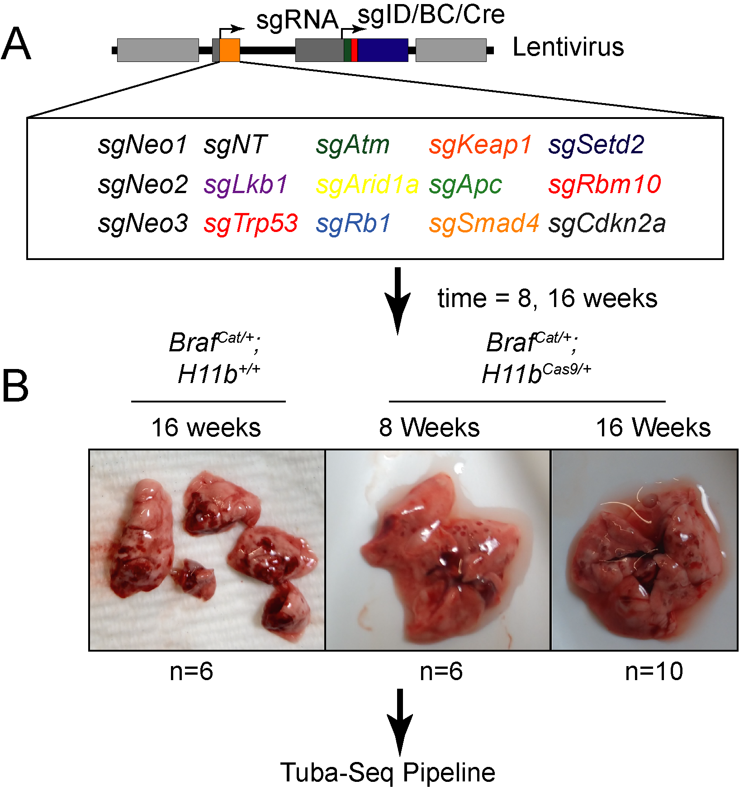
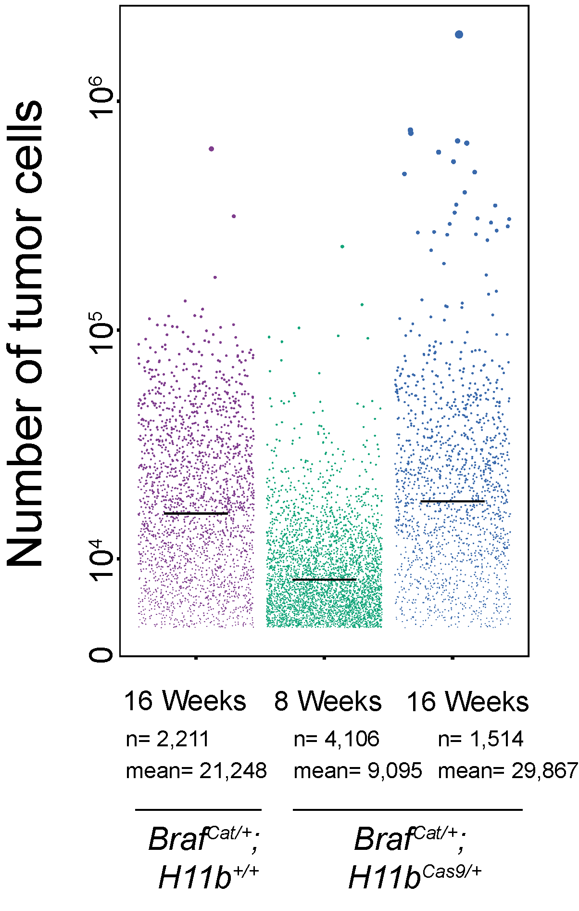
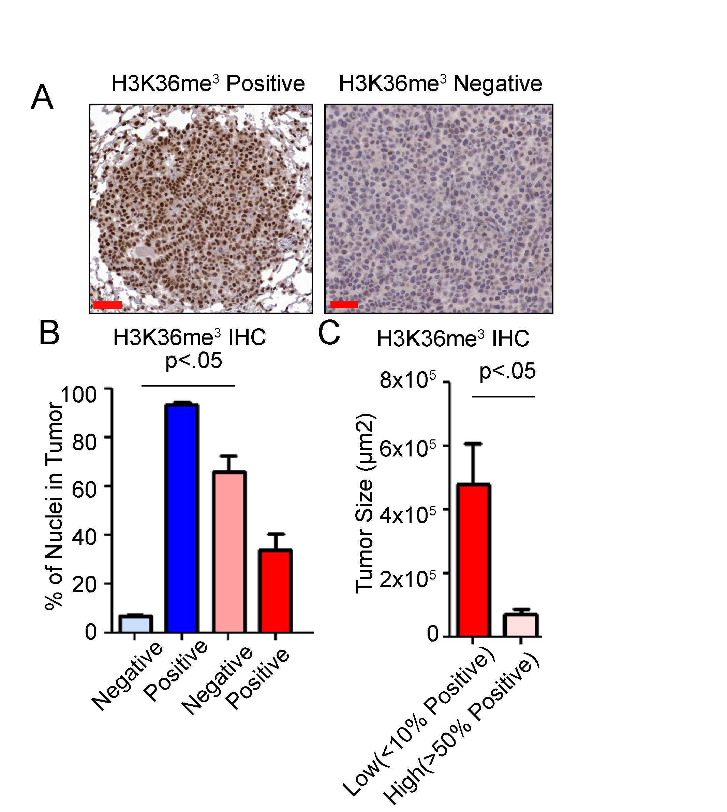
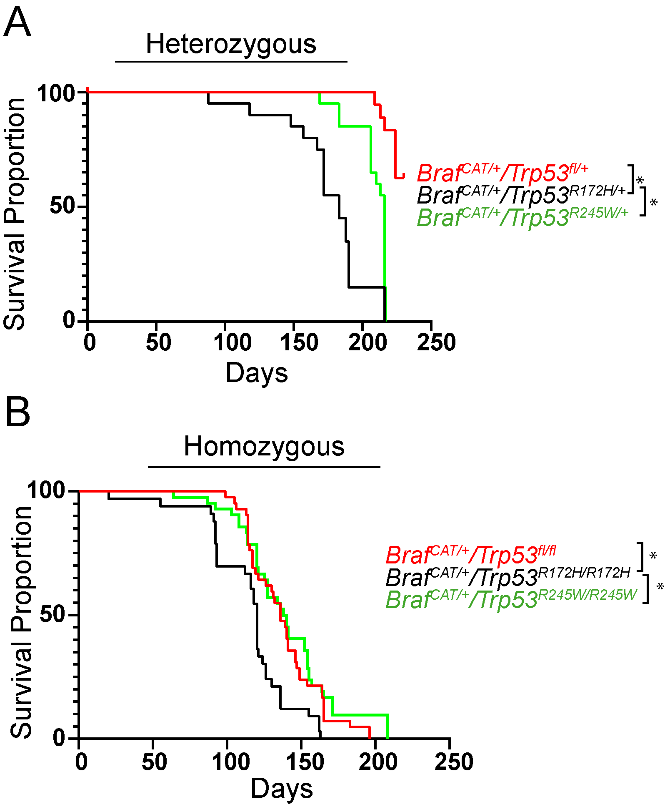
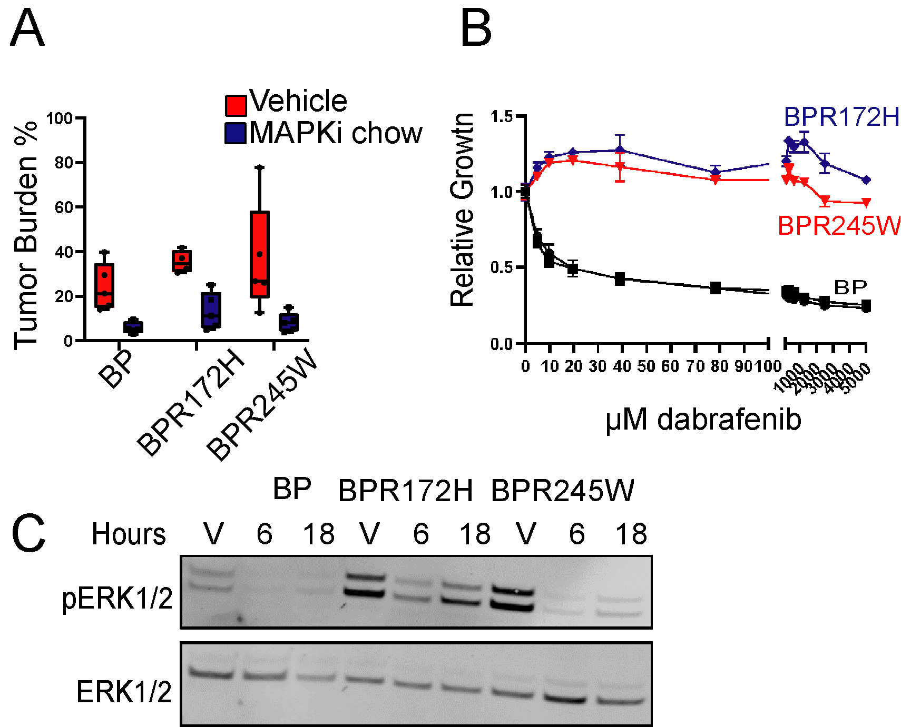
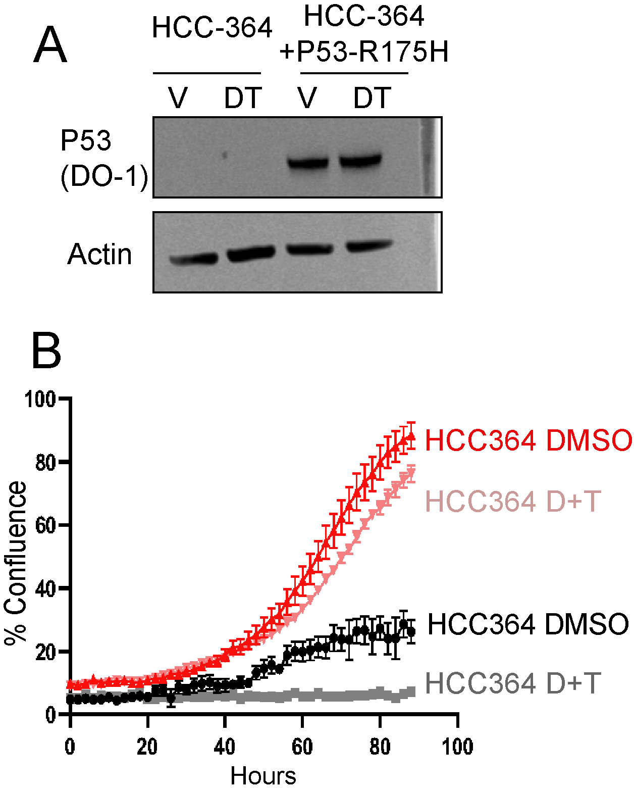

---
title: Dissertation
keywords:
- markdown
- publishing
- manubot
lang: en-US
date-meta: '2022-03-28'
author-meta:
- Michael
header-includes: |-
  <!--
  Manubot generated metadata rendered from header-includes-template.html.
  Suggest improvements at https://github.com/manubot/manubot/blob/main/manubot/process/header-includes-template.html
  -->
  <meta name="dc.format" content="text/html" />
  <meta name="dc.title" content="Dissertation" />
  <meta name="citation_title" content="Dissertation" />
  <meta property="og:title" content="Dissertation" />
  <meta property="twitter:title" content="Dissertation" />
  <meta name="dc.date" content="2022-03-28" />
  <meta name="citation_publication_date" content="2022-03-28" />
  <meta name="dc.language" content="en-US" />
  <meta name="citation_language" content="en-US" />
  <meta name="dc.relation.ispartof" content="Manubot" />
  <meta name="dc.publisher" content="Manubot" />
  <meta name="citation_journal_title" content="Manubot" />
  <meta name="citation_technical_report_institution" content="Manubot" />
  <meta name="citation_author" content="Michael" />
  <meta name="citation_author_institution" content="Department of Something, University of Whatever" />
  <meta name="citation_author_orcid" content="XXXX-XXXX-XXXX-XXXX" />
  <meta name="twitter:creator" content="@johndoe" />
  <link rel="canonical" href="https://scherzerthesis.github.io/thesis/" />
  <meta property="og:url" content="https://scherzerthesis.github.io/thesis/" />
  <meta property="twitter:url" content="https://scherzerthesis.github.io/thesis/" />
  <meta name="citation_fulltext_html_url" content="https://scherzerthesis.github.io/thesis/" />
  <meta name="citation_pdf_url" content="https://scherzerthesis.github.io/thesis/manuscript.pdf" />
  <link rel="alternate" type="application/pdf" href="https://scherzerthesis.github.io/thesis/manuscript.pdf" />
  <link rel="alternate" type="text/html" href="https://scherzerthesis.github.io/thesis/v/6ce46beb9b9bdd026566d5964739adcd80c051cb/" />
  <meta name="manubot_html_url_versioned" content="https://scherzerthesis.github.io/thesis/v/6ce46beb9b9bdd026566d5964739adcd80c051cb/" />
  <meta name="manubot_pdf_url_versioned" content="https://scherzerthesis.github.io/thesis/v/6ce46beb9b9bdd026566d5964739adcd80c051cb/manuscript.pdf" />
  <meta property="og:type" content="article" />
  <meta property="twitter:card" content="summary_large_image" />
  <link rel="icon" type="image/png" sizes="192x192" href="https://manubot.org/favicon-192x192.png" />
  <link rel="mask-icon" href="https://manubot.org/safari-pinned-tab.svg" color="#ad1457" />
  <meta name="theme-color" content="#ad1457" />
  <!-- end Manubot generated metadata -->
bibliography:
- content/manual-references.json
manubot-output-bibliography: output/references.json
manubot-output-citekeys: output/citations.tsv
manubot-requests-cache-path: ci/cache/requests-cache
manubot-clear-requests-cache: false
...

<small><em>
This manuscript
([permalink](https://scherzerthesis.github.io/thesis/v/6ce46beb9b9bdd026566d5964739adcd80c051cb/))
was automatically generated
from [scherzerthesis/thesis@6ce46be](https://github.com/scherzerthesis/thesis/tree/6ce46beb9b9bdd026566d5964739adcd80c051cb)
on March 28, 2022.
</em></small>

## Authors

+ **Michael** 
    {.inline_icon width=16 height=16}
    [XXXX-XXXX-XXXX-XXXX](https://orcid.org/XXXX-XXXX-XXXX-XXXX)
    · {.inline_icon width=16 height=16}
    [johndoe](https://github.com/johndoe)
    · {.inline_icon width=16 height=16}
    [johndoe](https://twitter.com/johndoe) 
  <small>
     Department of Something, University of Whatever
     · Funded by Grant XXXXXXXX
  </small>

## Chapter One: Introduction {.page_break_before}

**NSCLC** Lung cancer is a global hazard on human health. The historic consumption of cigarette smoke has caused lung cancer to be the most common and deadly form of cancer. Fortunately, smoking-rates have decreased in the past 30 years with lung cancer rates also on the decline. However, even if cigarette consumption were eradicated, lung cancer would still significantly affect human health. Indeedm it is estimated that approximately 25% of all lung cancer cases arise in never smokers [@pmid:23714547]. Secondary causes of lung cancer include Radon exposure, high-heat cooking, family history, air pollution [@pmid:27174888]. An individual's risk of lung cancer also increases with age due to  decreases in the efficiency of tumor supressive mechanisms such as tumor immunity and apoptosis[@pmid:22974775].

Lung cancer can be broadly classified into two major histological categories that are named based on how the malignant cells look under a microscope: Non-small Cell Lung Cancer (NSCLC) and Small Cell Lung Cancer (SCLC). Within NSCLC, tumors are further characterized based on histological structures, anatomical location, cell-of-origin, as well as genetic drivers[@pmid:18815398]. For example, lung adenocarcinoma is the most common subtype and is characterized by glandular and papillary structures while squamous cell lung carcinoma is characterized by keratin-pearls[@pmid:15059877]. Moreover, adenocarcinomas arise from alveolar-type-2 (AT2) cells in the distal lung and alveoli and are typified by genomic alterations throughout the MAPK pathway, such as EGFR, KRAS, BRAF, PI3K [@pmid:32747478; @pmid:11751630]. On the other hand, squamous cells carcinomas likely arise from basal cells and typically harbor SOX2 gene amplification [@pmid:27308419; @pmid:30332632].

The 5-year survival rate for patients with lung cancer was 25% in 2020 but varies depending on stage of disease at time of diagnosis [@doi:10.3322/caac.21654].Like other solid cancers, lung cancers are most deadly after primary tumors have metastaized to other organ systems like the liver, kidney, bone, or nervous system [@pmid:5130083]. Lung cancer patients with no local or distant metastasis typically have a 5-year survival percentage of approximately 40% compared to approximately 5% with distant metastasis[@pmid:27535389; 27740970]. Ultimately, the cause of death of many lung cancer patients include primary lung tumor burden, infection, pulmonary embolism or hemorrhage, or complications of metastatic dissemination[@pmid:23194048]. Although patient survival has improved  due to improved targeted and immune therapies, the still poor prognosis reflects a need to better understand the molecular mechanisms underlying lung adenocarcinoma initiation, progression, maintenance and response to targeted- or immune-therapy.

The current standard of care for Lung adenocarcinoma patients are often a combination of several conventional chemotherapeutics including Cisplatin, Carboplatin, Paclitaxel, or Pemetrexed[@pmid:32548736]. Fortunately for patients who have been identified to have EGFR, ALK, ROS, TRK, or BRAF (V600E) genetic alternations are often offered pathway-targeted therapies[@pmid:27283860; @pmid:24651011]. As of late, many patients receive immunotherapy first, followed by pathway-targeted therapy after progression on immunotherapy. Furthermore, in the last seven years, exciting therapeutic options for _KRAS_ mutant lung cancer have been developed and tested, such as a combination of MEK-inhibition and autophagy-inhibtion, and direct inhibitors of _KRAS_ G12c and _KRAS_ G12D [@pmid:30833748; @pmid:35267628; @pmid:35167298]

**MAPK signaling** standard activation from the top of he MAPK pathway begins with extracellular ligands (EGF, NGF, etc.) binding to Receptor-Tyrosine Kinases (RTKs). This leads to an loading of RAS with GTP, which activates RAS. Many RAS mutations lead to either more efficient loading of GTP or less effciency GTP hydrolysis which both serve to activate RAS.  GTP-loaded RAS recruits and activates RAF kinases (ARAF, BRAF, CRAF) which then phosphorylates and activates MEK1/2 kinases which then phosphorylates and activates ERK1/2. This ultimately leads to the activation of a suite of cellular processes that are required for proliferation, differentiation, migration, and cell survival. Therefore, activating mutation in this pathway, from RTKs to kinases, serve to keep the pathway in a constitutively active state. For example, the most common mutation in _BRAF_ is V600E. This valine to glutamic acid substitution is located in the kinase domain and mimics phosphorylation, allowing BRAF(V600E) to become independet of upstream regulations like RAS. This active state drives many of the hallmarks of cancer that is required for tumor formation. It is important to note that oncogenic activation of the MAPK pathway differs from normal ligand-mediated pathway activation. For example, mitogens, such as EGF, only transiently activate the pathway even with constant ligand stimulation. This immediate and strong spike in pathway activation is integrated by various biological processes in the cell that results in transcription of certain target genes. In contrast, oncogenic signaling thru mutational activation of BRAF(V600E) results in constant kinase signaling that is integrated differently than normal pathway stimulation. Thus, an oncogene-specific transcriptional program is activated.

The importance of this pathway is reflected in the strong anti-tumor responses that are seen when small molecule inhibitors are used to target various molecules involved in the MAPK pathway. For example, Dabrafenib and Trametinib, inhibitors of BRAF and MEK kinases, respectfully, are used in patients that harbor BRAF(V600E) melanomas and lung cancers[@pmid:34455067; @pmid:25399551]. Although there is strong pre-clinical and clinical evidence that BRAF+MEK blockade can lead to tumor regression, not all patients respond to treatment[@pmid:35033867]. Therefore, to see a complete response, multiple pathways need to be targeted, such as PI3K or autophagy [@pmid:25472943; @pmid:32933997; @pmid:30833748].

Great effort has elucidated the proto-oncogenes that drive cancer formation when mutated, such as _MYC_, _RAS_, _PI3K_, and others. Yet we still do not fully understand the mechanistic details that determine how genes cooperate to drive cancer.

**Genetically-engineered mouse models** Genetically-Engineered mouse models (GEMMs) of human cancer have allowed for the reproducible analysis of cancer biology driven by specific mutations frequently found in cancer patients. These models are helpful in understanding the molecular mechanisms that drive tumor formation and testing tumor responses to targeted or immune therapies. Early mouse models were not engineered but instead selected inbred mouse strains that were natural hosts of tumor transplantation[@pmid:692142]. However, these models suffer from long latencies, incomplete pentrance, and often not relevant to human cancers. Therefore, carcinogen-induced models such as UV, Urethane, radiation, cigarette consumption, or MNU treatment models were developed to ressemble carinogene-induced human cancers[@pmid:7987394; @pmid:25363767].After techniques were developed to genetically manipulate embryonic stem-cells came the ability to engineer mice with specific mutations that could drive tumor formation. Since genes involved in cancer are also important for normal mouse development, conditional gene manipulation was developed to allow for temporal control.

The most commonly used conditional gene expression system relies on inducible transcription factors, such as tetracycline-dependent regulatory system, where the treatment of mice with doxycycline toggles gene transcriptial levels of transgenes. More recently, Cre-Lox recombination strategies have been utilized to get more cell type specific control. In this system, genes of interested are constructed to contain LoxP-sites that flank a particular genetic element and upon delivery of Cre-recombinase the DNA sequence in between LoxP sites are excised. With this approach, one can knockout a gene by engineering LoxP sites around critical exons, or one could induce gene transcription by flanking a strong stop signal such as a polyadenylation sequence upstream of a gene-of-interest sequence such as KRAS(G12D)[@pmid:11751630].

Genetically engineered mouse models of human cancer are important preclinical models, because they resemble the physiological environment of tumor growth in which tumors arise as progeny from a single initiating cell. These tumors can approximate the genetic alterations, transcriptional landscape, histology, and responsive disposition or lack therefore, seen in human cancers(cite). However, these model often take months to develop tumors and compound genetic alterations take time to develop. Later in this thesis, we will utilize TUBA-SEQ to both quantify tumor burden and cooperation of BRAF(V600E) with other common alterations in lung cancer.

Due to the robust connection between lung adenocarcinomas and mutational activation of genes involved in the MAPK-pathway, such as _EGFR_, _KRAS_, and _BRAF_,  many labs have generated genetically-engineered mouse models (GEMMs) that harbor conditionally-activated  cancer specific mutant alleles of either  EGFR (L858R), KRAS (G12D), or BRAF(V600E).

Our lab has previously developed a conditional mouse model of BRAF (V600E) human lung cancers[@pmid:17299132; @pmid:26001956; @pmid:31452510]. In the _Braf(CAT)_ model, normal BRAF is expressed from a conditional allele prior to Cre-mediated recombination . LoxP sites flank human _BRAF_ cDNA encoding normal _BRAF_ exons 15-18. Downstream of the LoxP sites is the mutant exon 15 that encodes the murine equivalent of the T1799A mutation that gives rise to the BRAF (V600E) onco-protein. Downstream of the mutant exon there is a P2A element and a CAAX-tagged _TdTomato_. Therefore, after Cre-mediated recombination, the BRAF (V600E) oncoprotein and fluorophore TdTomato is expressed at normal levels[@pmid:31452510].

**BRAF (V600E) Tumorigenesis and Cooperating Events for Progression**  Mutational activation of the MAPK pathway forms lung tumors in mice. specifically, expression of BRAF (V600E) in the Surfactant-Protein C expression cells (alveolar type 2 pneumocytes) elicits benign tumor formation that fails to progress to lung adenocarcinoma. It is hypothesized that the cell cycle arrest is dependent on the tumor suppressors P53 and CDKN2A. Loss of either P53 or CDKN2A allows tumors to progress to malignant and deadly lung adenocarcinoma. Also, activation of WNT signaling and PI3K signaling similarly allows BRAF (V600E) adenomas to progress to adenocarcinoma [@pmid:31452510; @pmid:26567140; @pmid:24589553]. These observations are in concordance to the &quot;multiple-hit&quot; hypothesis that states that cancers do not arise from single mutagenic events, but are the consequence of sequential assaults on the genome that activate more than one oncogenic pathway. These multiple genetic hits allow cells to adopt traits to form cancer, which is coined by Bob Weinberg and Douglas Hanahan as the &quot;Hallmarks of Cancer&quot; [@pmid:21376230; @pmid:35022204]. The traits include suppression of apoptosis, active proliferation, altered metabolism, changes in cell identity, and forming blood-vessels to supply tumor cells with adequate resources for growth[@pmid:35022204]. BRAF(V600E) expression alone is sufficient to activate many of the hallmarks of cancer but additional pathways need to be activated, or suppresed, to develop to malignant tumors. Great effort has elucidated the proto-oncogenes that drive cancer formation when mutated, such as _MYC_, _RAS_, _PI3K_, and others. Yet we still do not fully understand the mechanistic details that determine how genes cooperate to overide tumor suppressive mechanisms and drive cancer progression.

**Talk here about the prevalence of mutations in the egfr-ras-raf-mek-erk pathway**

**Identification of this pathway as central to luad tumorigenesis**

**Development of gemms to study BRAF^V600E^**

**Proliferation arrest by this model**

**How does p53 loss lead to sustained wnt-signalling? Do dominant negative recapitulate?**

**P53- mediated tumor suppression**
Cancers pose an evoltionary challenge for organisms regardless of their life span.  Therefore, supression of the outgrowth of neoplastic cells is built into many organisms. One such mechanism is the engagment of the p53 pathway. At the time of writing this dissertation, there are approximately 105,000 manuscripts on PUBMED that mention P53. P53 is so well studied because of both its apparent role in tumor suppression, but also because it is the most frequently altered gene in human cancer.

The p53 protein was originally discovered as a protein that bound large T antigene of the SV40 virus in infected cells [@pmid:222475].P53 is a transcriptional factor that has a DNA-binding domain that specifically recognizes two decameric half-sites. P53 also contains two N-terminal transactivation domains and a C-terminal oligomerization domain that are critical for P53-target gene activation[@pmid:16575405]. Central to the ability of P53 to induce transcriptional activation is tetramerization. Thus, if one or more P53 proteins in the complex is compromised in transactivation or DNA binding, transcriptional activity is compromised. Therefore, if one copy of P53 is mutated, the organism's ability to suppress tumor formation is compromised.

The importance of p53 is best demonstrated in people, and in mice, that have just one mutated copy of P53. In humans with the familial- inherited Li-Fraumeni syndrome, in which they have one or more mutations in p53 are almost certain to develop cancer early on and throughout their life[@pmid:3409256]. Similarly, mice lacking two function P53 genes are prone to leukemias and lymphomas and have a shortened lifespan due to cancer incidence[@pmid:1552940]. On the other hand, organisms such as the african and asian elephants, which have an abnormally low level of cancer incidence, have been shown to higher multiple copies of _TP53_ in their genomes[@pmid:26447779]. 

The most well-known cellular functions of P53 include its ability to induce cell-cycle arrest in response to DNA damage[@pmid:8242752]. Many stress signals, including oncogene activation has been shown to stimulate a reversible or irreversible cell cycle arrest[@pmid:9765202; @pmid:34812139]. However, the strength of P53 induced cell cycle arrest or apoptosis is likely cell type- and cellular stress- specific and is a active area of p53 research.

Once a cell encounters a stressor such as DNA damage or oncogene activation, P53 is stabilized and accumulates in the nucleus to activate a suite of target genes that can lead to a number of cellular phenotypes, such as cell-cycle arrest or apoptosis.

P53 was originally thought to be an oncogene as P53 is accumulated in lung cancer, which is not common in normal tissues[@pmid:1969059; @pmid:1694291]. Moreover, ectopic expression of a P53 cDNA was found to aide in the transformation of primary cells induced by RAS. However, early studies erroneously used mutated P53 instead of wild-type leading to the misclassification of P53 as an oncogene. We now know P53 suppresses cell growth and transformation[@pmid:19776744].

Often times, P53 is mutated in the DNA-binding domain at sites commonly referred to as &quot;hotspots&quot; due to there extraordinary frequency. These hotspot mutations poison the ability of p53 to bind DNA therefore blocking its function. Interestingly, since one mutated P53 can disrupt the entire P53 tetramer complex, a single mutation can exert dominant-negative effects by inhibiting the normal tumor suppressive functions of P53. Although one mutant P53 allele is enough to compromised transcriptional activity, there is still selective pressure to lose the other wild -type copy. Loss of hemizygosity implies there is still residual tumor suppression in the presence of a wild-type P53 allele[@pmid:27585860].

Early on in P53 studies, there were reports of certain P53 mutations having a &quot;gain-of-function&quot; (GOF) effect. For example, Li-Fraumeni patients with certain missense mutations in P53 would develop tumors earlier than Li-Fraumeni patients with loss-of-function (LOF) mutations [@pmid:18511570]. Furthermore, there were experimental cell biology studies that would express mutant-p53 in P53-null cells and demonstrate enhanced tumorigenic potential [@pmid:32404993]. Further evidence for GOF mutant-P53 in mice indicated that missense mutant P53 induced different cancer types and enhanced metastasis than LOF P53 [@pmid:15607980]. Furthermore, many groups have shown mutant-p53 can alter signal transduction affecting chemoresistance and altering metabolism.

The cellular mechanisms that GOF P53 are involved in are also well-characterized but context-dependent. For example, in Pancreatic cancers driven by KRAS(G12D) Mutant P3 interacts with CREB to induce FOXA1 transcription which enhances Beta-Catenin signaling to augment liver metastasis [@pmid:33839689].

## Chapter Two: Quantitative tumor burden and small library screen using TUBA-SEQ 
{.page_break_before}

# Abstract

# Introduction

Next generation sequencing has allowed for the unbiased identification of genes that are mutated in human cancer [@pmid:25079552; @pmid:25109877; @pmid:24132290]. The wealth of knowledge gained from such large-scale sequencing projects has revealed actionable mutationas that can be targeted with small molecule inhibitors, such as dabrafenib and trametinib. However, Identificaton of possible targets is not enough, as many cancers with similarly mutated oncogenes, such as BRAF^V600E^, respond differentially to BRAF^V600E^-targeed therapy. For example,  mealanoma patients with BRAF^V600E^ mutations respond well to BRAF^V600E^-targeted therapy whereas colorectal cancer patients with BRAF^V600E^ mutations do not respond[@pmid:22448344]. The disconnect between putative driver oncogenes identified in human cancers and response to targeted therapy is a problem that can be solved with rigorous pre-clinical experimentation, such as in GEMMs. 

Genomic sequencing of human tumors has also been crucial insight into how cancers form and what signaling nodes might be important for progressive stages of cancer evolution. For example, pancreatic cancers have a very stereotypical histiological progression that is brought about by known mutational activation. Specifically, mutations in _KRAS_ initiate tumorigenesis and loss of _TP53_ function and _SMAD3_ are associated with cancer progression[@pmid:31395068]. However, this is more difficult to do in lung adenocarcinoma because of the high mutational burden often due to the consumption of cigarettes[@pmid:27811275; @pmid:31996850].

Indeed, in highly mutated cancers such as melanoma and lung cancer, recurrent mutations are not necessarily predictive of biological importance. To better understand the importance of candidate tumor suppressors or oncogenes, researchers exploit tumor cell lines and GEMMs to identify bona-fide genetic drivers of cancer. However, these systems are suboptimal, as they are either not physiologically relevant (tissue culture) or are not scalable to determine the effect of many mutations (GEMMs). Moreover, techniques to measure cooperation of genes to drive lung cancer are qualitative and are not sufficiently quantitative to allow for large-scale studies. typically, lung adenocarcinoma is quantified by lung weight or histological analyses such as tumor burden (Percentage of lung that is tumor), tumor size, and immunohistochemistry (IHC) of tumor markers. Although important and informative, these analyses are not high-throughput and rely on many mice to acheive statistical confidence. Furthermore, there is intrinsic bias when calculating tumor size and tumor burden, as tissue-sectioning results in tumor sections that do not accurately portray true tumor size. Therefore, more advanced techniques are required for large-scale analysis of mouse tumors that are both quantitative and high throughput.

Recently, Monte Winslow and his lab at Stanford University has developed **Tu**mor- **Ba**rcode **Seq**uencing (TUBA-SEQ), a rapid, multiplexed, quantitative assay for analyzing the contribution of tumor-suppressor loss _in vivo_. This technique works by delivering a uniquely barcoded lentiviral endoing Cre recombinase, to activate Cre-mediated oncogenes, and a guide RNA, to inactivate a single tumor suppressor gene. Therefore, each tumor will be driven by the same oncogene, but will have different tumor suppressors inactivated. After a period of time (6-24 weeks) tissue is harvested for whole-lung DNA extraction and targeted DNA-sequencing is performed to quantify relative tumor size to spike-in controls[@pmid:28530655]. Therefore, contribution of a single tumor suppressor can be quantified in single animal. Here, we explore the contribution of 11 tumor suppressor genes and 5 controls in the context of our BRAF ^V600E^- driven lung tumor models.

# Results
Adenoviral vectors and lentiviral vectors introduced in the lungs of GEMMs offer temporal control and can be titrated to acheive an optimal level of tumor numerosity. However, only lentiviral vectors can be used to barcode tumors because they integrate into the genome while adenoviruses do not[@pmid:19561589; @pmid:28530655]. Together with CRISPR/CAS9 gene editing, lentiviruses have been used to analyzed many genetic interactions of oncogenic _Kras_ driven lung adenocarcinoma[@pmid:29233960;@pmid:28530655]. To enable simultaneous actvation of BRAF^V600E^ and loss of tumor supressor genes, we bred _Braf^CAT^_; _H11b^LSL-CAS9/+^_ mice. 
To  determine the size of BRAF ^V600E^ tumors and the contribution of 11 tumor suppressor genes (_Trp53, Rb1, Cdkn2a, Apc, Rbm10, Stk11, Setd2, Arid1a, Atm, Keap1, Smad4)_ on BRAF ^V600E^ lung tumorigenesis, we obtained tittered barcoded-lentiviral plasmids that encode Cre-recombinase as well as a sgRNA that inactivates one of eleven tumor suppressors common in lung adenocarcinoma. All genes tested are putative tumor suppressor genes commonly lost in human lung cancer patients. Each lentiviral solution contained ~1000 individually barcoded lentiviruses. We infected both _LSL-Cas9_ and _CAS9_ deficient mice in order to determine the contribution of genetic manipulation and/or deletion of the targeted gene. Mice meant to be analyzed after 8 weeks received a viral titer of 1x10^5 while mice mean to be analyzed after 16 weeks received a viral titer of 1x10^4. After euthanasia, lungs were collected for genomic DNA extraction, and barcode amplification followed by preperation of sequencing libraries.  Before genomic extraction and library preparation, a known quantity of known-barcoded cells was added in order to benchmark sequencing reads to a known cell number(figure).

We determined the mean size of a BRAF^V600E^ driven tumor to be 21,248 thousand cells (figure). Interestingly, there is a widespread distribution of tumor sizes with the largest BRAF^V600E^ tumor to be ~300,000 cells along with many small tumors (figure).

Gross histologic images of experimental lungs are show an increase in tumor burden with both time (Figure xxx) and CAS9 status (figure xxx). Therefore, based on macroscopic inspection, at least one tumor suppressor appeared to cooperate with BRAF ^V600E^ to increase tumor burden. In order to determine the fitness landscape of any one particular tumor suppressor, we calculated the relative number of tumor cells in a given tumor using the TUBA-SEQ genomics pipeline. After 8 weeks post tumor initiation there no statistically significant contribution of tumor suppressor loss (Figure). SETD2 loss was trending towards statistical significance. However, 16 weeks post initiation revealed both SETD2 loss and APC loss cooperated with BRAF ^V600E^ to form larger tumors (Figure x). APC loss was a suspected hit as we have previously shown that activation of Wnt-beta-catenin signaling promoted BRAF^V600E^ tumorigenesis. As APC loss is predicted to increase the activity of Beta-catenin signaling, this result was unsurprising to us. However, loss of SETD2 was a novel finding in the context of BRAF ^V600E^ lung tumorigenesis.

Given our findings of SETD2 loss increased tumor burden concurrent with BRAF^V600E^ we next validated SETD2 in a new cohort of mice with single-guide RNAs targeting SETD2. Indeed, loss of SETD2 increased tumor burden from 5% to over 30% in some animals. Since SETD2 antibodies are unreliable in both western blots and immunohistochemistry we used H3K36me3 as a surrogate marker for SETD2 activity by immunohistochemistry. Whereas 90% of nuclei in BRAF ^V600E^ only tumors were H3K36me3, more than 60% tumors of mice infected with SETD2 CRISPR virus were negative for H3K36me3. Furthermore, when classified by H3K36me3-positive or -negative, there is even stronger evidence that SETD2 loss leads to larger tumor formation

# Discussion

Oncogenic BRAF^V600E^ is a major driver in lung adenocarcinoma. However, mouse models with activation of BRAF ^V600E^ only lead to benign tumorigenesis[@pmid:26001956; @pmid:17299132]. Although it is well known that activation of WNT and PI3k signaling, as well as lost of _Trp53_ and _Cdkn2a_ genes allow BRAF^V600E^ benign lung tumors to progress to malignant disease, we wanted to systematically test a variety of known tumor suppressors in lung adenocarcinoma. Furthermore, we do not know the size of BRAF^V600E^ adenomas. Prior to TUBA-SEQ, it was very difficult to accurately determine the size of BRAF^V600E^ adenomas. Based on population doublings, as well as cross sections of BRAF ^V600E^ tumors in histological sections, it is estimated that BRAF^V600E^-driven lung adenomas grow about 15-20 populations doublings and reaching a size of 1mm^3^[@pmid:24589553] With TUBA-SEQ, we can more accurately discern the absolute size of BRAF^V600E^ lung adenomas in almost every tumor in all animal subjects. Given the theory that BRAF-^V600E^ induces growth arrest after an initial burst of neoplastic growth, it would be of interest to know if all tumors grow to a predetermined and absolute size, or if there is a spectrum of tumor sizes that are determined by extrinsic factors such as proximity to blood vessels or certain stromal cells.

Our Tuba-Seq analysis revealed that there is a spectrum of BRAF^V600E^ tumors after 16-weeks. This observation would support the idea that just because a cell is activated by BRAF^V600E^, does not mean 

{#fig:04 .white width="100%"}

{#fig:05 .white width="100%"}

{#fig:06 .white width="100%"}  
  
{#fig:07 .white width="100%"}

{#fig:08 .white width="100%"}

{#fig:09 .white width="100%"}

## Chapter Three {.page_break_before}

## Abstract

^TP53^ missense BRAF^V600E^ mutations both frequently occur in lung adenocarcinoma. While genetically engineered mouse models (GEMMs) of lung adenocarcinoma are invaluable for understanding the initiation, progression, and response to therapeutics, little is known about how different hotspot point mutations in p53 affect disease progression and therapeutic responses. To this end, we use GEMMs, tumor-derived cell lines, and human lung cancer cell lines to test how  murine homologues of p53 hotspot mutants R172H and R245W compare to p53-deletion. We find that conformation mutation p53^R172H^ drives more aggressive lung adenocarcinomas and dedifferentiation. We also observe p53^R172H^ and p53^R245W^ accumulation in only high-grade tumors that have activated ARF expression. In vitro and in vivo studies demonstrate enhanced resistance to BRAF+MEK blockade with p53^R172H^ and p53^R245W^, a common treatment regimen for BRAF^V600E^ mutant patients. Mechanistically, mutant-p53 alters the transcriptome of cancer cells and enhances entry into the cell cycle. 

## Introduction

Lung adenocarcinoma (LUAD) remains deadliest form of cancer since 1987 (Siegel, Miller et al. 2021). It is characterized by alterations in the MAP kinase (MAPK) pathway, including activating mutations in the oncoproteins EGFR, KRAS (G12C, G12D, G12V) or BRAF^V600E^ [@pmid:25079552; @pmid:16705038; @pmid:11751630; @pmid:17299132]. The recognized predominant cell of origin for LUAD, lung alveolar type-2 pneumocyte cells (AT2), are exquisitely responsive to the transformative properties of constitutive activation of the MAPK pathway [@pmid:24586047; @pmid:31951518]. Indeed, conditionally genetically engineered mouse models (GEMMs) of mutationally activated EGFR, KRAS, or BRAF form lung tumors that strongly resemble key characteristics of human LUAD. However, tumors formed in all three models (KRAS:G12D, EGFR: Deletion 19 or L858R, or BRAF:V600E) develop only into histologically low- to mid-grade cancer and are growth arrested [@pmid:11751630; @pmid:16705038; @pmid:17299132]. Prior research has determined that oncogene-induced tumor growth arrest occurs through activation of several tumor suppression mechanisms, most notably, p53-mediated tumor suppression [@pmid:26001956].

Alterations in the _TP53_ tumor suppressor gene are common in all cancer types, including LUAD [@pmid:27328919]. P53 encodes a transcription factor that responds to a variety of cell stresses, such as DNA damage and oncogene activation. In response to stress, p53 is stabilized and induces anti-proliferative and genome-mending effects through trans-activation of a diverse set of P53-target genes [@pmid:33518400; @pmid:11099028]. p53 mutations observed in cancer frequently occur in the DNA binding domain where a single amino acid change results in dysfunctional DNA-binding and failed transcriptional activation [@pmid:20182602]. Therefore, mutated p53 that is defunct in p53 transcriptional regulation results in failed tumor suppression and cancer outgrowth. Furthermore, defective p53 signaling will permit future genomic insults to remain unchecked thus fostering an environment primed for malignant potential. Since mutant-p53 lacks transcriptional activity through its inability to bind DNA, it is unable to induce expression of its negative regulators, ARF, MDM2 and MDMX [@pmid:8265599; @pmid:8319905]. Lack of negative feedback results in mutant-p53 stabilization. Accumulation of mutant p53 has been reported to elicit gain-of-function p53 activity. Thus, any gain-of-function activity in mutant-p53 cannot be studied with p53-genetic deletion. Many research groups have characterized gain-of-function phenotypes of mutant-p53 in cancer. For instance, mice expressing mutant-p53 have altered disease phenotype compared to p53-null models [@pmid:15607980;@pmid:15607981]. Specifically in lung cancer model systems, mutant-p53 has been observed to modulate SMAD3, NF$\kappa$B, p63, TGF$\beta$, and others to drive various hallmarks of cancer such as invasion, chemoresistance, metabolism, and propagation of a stem cell fate [@pmid:34178628 ;@pmid:11238924;@pmid:19345189]. Although the mechanisms that leads to these altered processes are controversial, it is thought that the main affect is through mutant-p53 binding and sequestering known p53-associated proteins. This often leads to activation of transcription factors such as NF-Y [@pmid:33839689].

In BRAF^V600E^ GEMMs, when p53 function is abolished by _Trp53_ gene deletion or by _Cdkn2a_ deletion, lung tumors can escape growth arrest and undergo malignant transformation [@pmid:17299132; @pmid:26001956]. Furthermore, p53 pathway dysregulation allows a cell to sample diverse phenotypic landscapes that allow for enhanced cell fitness and tumor outgrowth [@pmid:32707077]. However, BRAF^V600E^ lung tumorigenesis and progression to malignant lung adenocarcinoma has only been studied in the context of p53 genetic deletion, not p53 mutation, which are more frequently seen in human lung cancer. Specifically, p53-R172H and p53-R245W are murine homologues of common hotspots in human cancer R175H and R245W, respectively.

Here, we characterize the differential impact of p53(null), as well as p53 hotspot mutations p53^R712H^ (R175H in humans) and p53^R245W^ (R248W in humans) on BRAF^V600E^ lung tumorigenesis. We observed significantly differential effects of p53-R172H on BRAF^V600E^-driven lung tumorigenesis that was not observed when p53 is deleted, such as enhanced tumor size and decreased survival. Our findings highlight functional differences in mutant-p53 biology, as well as the importance and the utility of clinically relevant mutant-p53 mouse models.

## Results

_**P53-mutant Alleles Differentially Alter BRAF (V600E) Lung Tumorigenesis**_

Expression of BRAF^V600E^ in the distal epithelium of the mouse lung elicits clonal tumorigenic outgrowths of alveolar type 2 (AT2) pneumocytes (Dankort et al. 2007).Prior work has shown that _Trp53^fl/fl^_ cooperates with BRAF(V600E) to form malignant lung tumors when Cre recombinase is activated [@pmid:17299132; @pmid:26001956]. Therefore, we compared the tumor burden of _Braf^Cat/+^_ mice with either p53 loss (_Trp53^fl/fl^_, p53^R172H^ (_Trp53^R172H/R172H^_), or p53^R245W^ (_Trp53^R245W/R245W^_) after infection with 106 pfu of adenovirus expressing surfactant protein C specific Cre (ad5-Spc-Cre) (Figure @fig:11 A). As expected, mice developed lung cancer, consistent with previous findings (Figure @fig:11 B-C). However, there was a striking, highly reproducible increase in the tumor size of tumors harboring _Trp53^R172H/R172H^_ and to a lesser extent _Trp53^R245W/R245W^_, compared to _Trp53^fl/fl^_ (Figure @fig:11 B-D). These data led us to hypothesize that p53^R172H^ and p53^R245W^ expression alters tumor progression uniquely from p53 deletion, and these differences may be potentially evident of gain-of-function effects imparted by mutant-53. Since lung cancer patients with mutations in _TP53_ often start only have one mutated _p53_ allele unless loss of heterozygosity (LOH) occurs. Therefore, we generated mice heterozygous for both _Braf^CAT^_ and either _Trp53^fl^_ , _Trp53^R172H^_, or _Trp53^ R245W^_ and observed their survival over time (Figure @fig:11 E). We noted that _Trp53^R172H/+^_ mice had diminished median overall survival compared to _Trp53^fl/+^_ mice (183 days and 216 days), with _Trp53^R245W/+^_ mice falling in between the two groups (median survival 212 days) (Figure @fig:11 E).

We observed a distinct separation of survival between mice harboring lung tumors that are either _Trp53^fl/+^_, _Trp53^R172H/+^_, and _Trp53^R245W/+^_, this separation is diminished when altered p53 alleles are homozygous (Figure @fig:11 F). _Trp53^R172H/R172H^_ mice have a median survival of 120 days while _Trp53^fl/fl^_ mice have a median survival of 136 days. Importantly, this observed difference in survival is statistically significant (Log-rank test p< 0.001) and is likely a reflection of worse diseased, characterized by enhanced tumor burden and tumor size.

_**Mutant-p53 Accumulation is Associated with Dedifferentiation and p19 Induction**_

Increased malignancy in lung adenocarcinoma is often associated with altered states of tumor cell identity and dedifferentiation [@pmid:31452510;@pmid:32707077]. Since LUADs often arise from AT2 cells, we surveyed the expression of AT2 cell identifiers, such as NKX2-1, a master regulator of AT2 transcriptional programs, and SPC, a marker of differentiated AT2 cells [@pmid:32707077]. Quantification of over 50 tumors from _Braf^V600E/+^_ mice with either _Trp53^ flfl^_, _Trp53^R172H/R172H^_, and _Trp53^R245W/R245W^_ revealed that _Trp53^R172H/R1722H^_ mice had significantly more tumors that stained negative for NKX2-1 and SPC (Figure @fig:12 A an B). This finding strongly indicates that mutant-p53 tumors are dedifferentiated. Since HMGA2 expression is associated with LUAD dedifferentiation and worse patient prognosis, we performed IHC for HMGA2 (Cite). We noted an increase in HMGA2-positive tumors in both _Trp53^R172H/R172H^_, and _Trp53^R245W/R245W^_ tumors compared to _Trp53^fl/fl^_ (Figure @fig:12 A,B). Thus, this data taken together reveals that Trp53R172H/R172H mice exhibit both a higher tumor burden and worse overall survival than _Trp53^fl/fl^_, but the tumors developed in these mice are more likely to exhibit malignant progression and dedifferentiation.

One striking feature of lung tumors in mice either heterozygous or homozygous for _Trp53 ^R172H^_ or _Trp53^R245W^_ is how few tumors and tumor cells have detectable levels of mutant-p53 protein as measured by Immunohistochemistry (IHC). One critical aspect of normal p53 function is self-regulation through transcriptional activation of its negative regulator MDM2 [@pmid:8319905]. Thus, we predicted that homozygous p53 mutant-cells would exhibit increased mutant-p53 protein. Interestingly, in our models, we observed mutant p53 protein accumulation is restricted to malignant cells exhibited by lack of papillary architecture and nuclear atypia (Figure @fig:12 C). Indeed, p53 immunostaining is correlated with increased phospho-ERK1/2 detection (Figure @fig:12 D). Moreover, immunofluorescence of p53 and its positive regulator, p19/ARF, reveal cells with high p19/ARF are also high in p53 accumulation (Figure @fig:12 D). This result suggests that even in homozygous mutant_Trp53_ mice, there is still a barrier to mutant-p53 accumulation, and our data suggests that elevated levels of p19/ARF is important for mutant-p53 accumulation, even with homozygous p53 mutations. Collectively, these data indicate that _Trp53^R172H^_ drives more aggressive lung adenocarcinoma formation in BRAF(V600E) driven mouse models of lung cancer.

_**P53^R172H^ and P53^R245W^ cell lines are refractory to BRAF/MEK inhibition**_

Given that previous research has determined that p53 mutations can confer resistance to both chemotherapies and pathway-targeted therapies [@pmid:7585548;@pmid:22068033], we next questioned whether our p53 alterations would be sufficient to drive therapeutic resistance in BRAF^V600E^-driven cell lines exposed to pathway-targeted therapeutics commonly administered to BRAF^V600E^ mutant patients, such as the combination of dabrafenib (BRAFi) plus trametinib (MEKi) [@pmid:27283860]. Cell lines were derived from _Braf^CAT/+^_ murine tumors expressing either _Trp53^flfl^_, _Trp53^R172H/R172H^_, or _Trp53^R245W/R245W^_) 14 weeks after infection with ad5-Spc-Cre. Cell lines expressing either _Trp53^R172H/R172H^_ or _Trp53^R245W/R245W^_ were completely resistant to single agent dabrafenib and resistant to the combination of dabrafenib plus trametinib (Figure @fig:13 A,B). Of note, _Trp53^R172H/R172H^_ and _Trp53^R245W/R245W^_ cell lines express increased ERK1/2 activity, as evidenced by increased phosphorylated ERK1/2, both with and without Dabrafenib and Trametinib (Figure @fig:13 E). Moreover, _Trp53^R172H/R172H^_ mice retain a larger tumor burden after a week 4 treatment of MAPK blockade _in vivo_ (Figure @fig:13 E). To gain relevance to human lung cancer, we infected BRAF(V600E) mutant HCC364 cells with lentivirus expressing human cancer hotspot mutant p53^R175H^. p53^R175H^ expressing cells were more proliferative and more refractory than parental HCC364 cells (Figure @fig:13 F and G).Collectively, these _in vitro_ and _in vivo_ data suggest missense mutant p53^R175H^ and its murine homologue p53^R172H^, as well as p53^R245W^ can support cancer cell viability in the face of BRAF+MEK blockade that cannot be achieved by p53-null mutations.

_**P53^R172H^ and P53^R245W^ alters the transcriptome of BRAF(V600E) lung tumor cell lines**_

Due to our observations that mutant p53^R172H^ drives more aggressive cancer phenotypes such as increased growth, dedifferentiation, and resistance to FDA-approved therapeutics, we reasoned that this would be reflected in a change in the transcriptional landscape. This is due in part, by the transcriptional trans-activation potential by mutant p53. RNA sequencing of cell lines generated from p53-mutant mouse lung tumors do reveal transcriptomic differences between both p53^R172H^ and p53^R245W^ cells compared to p53-null cell lines (Figure @fig:14 4 A). Interestingly, genes involved in cell cycle regulation, epithelial-to-mesenchymal transition (EMT), and MYC pathway are upregulated in both p53^R172H^ and p53^R2245W^ cell lines (Figure 4 @fig:14 B). These results suggest that mutant-p53 is affecting transcription of genes involved in pro-growth signaling pathways.

![**Differential BRAF^V600E^ lung tumorigenesis imparted by p53-Hotspot mutants.** **(A)** Genetically-engineered alleles of _Braf^v600E^_ and ^Trp53^ before and after Cre-Recombinase. **(B)** Tumor burden and *(C)*** Tumor size of BRAF(V600E) plus Trp53-wildtype, null, or mutant alleles 14 weeks post Cre-mediated recombination. *(D)*  Representative H&E images 14 weeks after Cre-recombination. **(E)** Survival of mice with Heterozygous _Trp53_ mutant alleles. **(F)** Survival of mice with homozygous _Trp53_ alleles.](images/p53_1.png){#fig:11 .white width="10%"}

![**Missense mutant-p53 alters lung adenocarcinoma differentiation status and accumulation of mutant-p53 correlates with p19 ARF expression.** **(A)** Panel representative IHC sections stained with SPC,NKX2-1, p53 and HMGA2. **(B)** H-score of individual tumors. **(C)** Association between mutant-p53 R172H accumulation and increased malignancy and dedifferentiation. **(D)** serial section of P53-HI and pERK1/2-HI tumors compared to adjacent low. **(E)** Colocalization of p19/ARF and p53 in p53-mutant tumors](images/p53_2.png){#fig:12 .white width="100%"}

![**Mutant-p53 cell lines are refractory to BRAFi+MEKi.** **(A)** Response of GEMMs to BRAFi+MEKi chow after four weeks **(B)** in vitro dose response to BRAFi single agent. **(C)** in vitro timecourse with dabrafenib (1000nm) plus trametinib (100nM). **(D)** Accumulation of dead cells in dabrafenib plus trametinib measured by CytotoxRed accumulation. **(E)** Immunoblotting of phospho-ERK1/2 in response to dabrafenib plus trametinib. **(F)** Ectopic expression of p53^R17H^ in human HCC364 cells. **(E)** Response of p53^R175H^ cells to dabrafenib plus trametinib. ](images/p53_3.png){#fig:13 .white width="100%"}

{#fig:14 .white width="100%%"}

{#fig:14 .white width="100%%"}

{#fig:04 .white width="100%"}

{#fig:04 .white width="100%"}

{#fig:04 .white width="100%"}

{#fig:04 .white width="100%"}

{#fig:04 .white width="100%"}

{#fig:04 .white width="100%"}

{#fig:04 .white width="100%"}

{#fig:04 .white width="100%"}

{#fig:04 .white width="100%"}

{#fig:04 .white width="100%"}

## Discussion

While lung adenocarcinomas primarily contain missense mutations in p53, most studies using mouse models of lung adenocarcinoma utilize a p53-null (_Trp53^fl/fl^_) allele instead of alleles encoding hotspot missense mutations [@pmid:23550210]. This is most likely because prior mutant-p53 alleles were null for _Trp53_ prior to Cre-mediated recombination, leaving every cell in the mouse sensitive to leukemias, lymphomas and sarcomas due to being partially p53-deficient [@pmid:16288016; @pmid:16166291; @pmid:15607980]. Our work has been made possible by newly described "wildtype to mutant" p53 alleles that allow for mice to be fully wildtype for p53 in all cells prior to Cre-mediated recombination[@pmid:30262850]. This strategy is crucial, as it allows for temporally extended experiments not confounded by separate malignancies. Here, we utilize &quot;wildtype to mutant&quot;_Trp53^R172H^_ and _Trp53^R245W^_ alleles R245W to determine how they alter tumor progression in a BRAF(V600E) model of lung cancer. We show that p53^R172H^ and p53^R245W^ accelerates lung tumor progression and increases the rate of dedifferentiation beyond complete loss of p53 expression.

Although point mutations in the _TP53_ gene can poison the natural tumor suppressive mechanisms of p53 protein, not all point mutations are equivalent in executing these functions. Mutations in the DNA-binding domain are most common and most potent at ablating normal p53 function. Taking advantage of a conditional BRAF^V600E^ lung tumor model where BRAF^V600E^ expression in AT2 cells drives benign tumor formation, we show that either p53^R172H^ or p53^R245W^ can bypass growth arrest and influence tumor progression and therapeutic sensitivity beyond how p53 loss can. Specifically, P53^R172H^ reduces survival and sensitivity to dabrafenib plus trametinib _in vivo_. Interestingly, a single allele of p53^R172H^ has a stronger tumor promoting phenotype than P53^R245W^. These findings further support a hierarchy model of p53 missense mutations, where conformation mutants such as p53^R175H^ have a stronger dominant-negative effect on wildtype p53, while mice with a single _trp53^fl^_ allele can still suppress tumorigenesis with one copy of wildtype but are prone to Loss of heterozygosity [@pmid:30262850; @pmid:27585860; @pmid:15607980].

In BRAF-driven lung adenocarcinoma, the repressive role of wild-type p53 is initiated by oncogenic stress brought about by increasing levels of MAPK-pathway activation[@pmid:17299132] . Hyperactivation of the MAPK pathway triggers p19/ARF to block MDM2, leading to p53 accumulation[@pmid:16957739; @pmid:21107428; @pmid:21107427]. Therefore, p53 acts late in lung adenocarcinoma, in contrast to pancreatic adenocarcinoma, where p53 is triggered early likely through PDAC-specific increases in p19/ARF through either increased PI3K, STAT3, or DMP1 [@pmid:27585860]. Our studies in BRAF(V600E) mutant lung adenocarcinomas reinforce this concept, as mutant-p53 does not accelerate growth in early tumors (supplemental figure). Furthermore, p53 is not detected until later stage tumor development and correlates with p19/ARF expression and increased phospho-ERK1/2 levels. Our studies indicate that mutant-p53 levels are associated with increased expression of p19/ARF. Therefore, any gain-of-function phenotype manifested by mutant-p53 must depend on accumulated p19/ARF. Thus, ablating the ARF tumor suppressor in human cancers with GOF _TP53_ mutants may paradoxically lead to tumor regression.

While most _TP53_ mutations observed in cancer result in an inability to bind DNA, they are often stable and preserve functional oligomerization and transcriptional transactivation domains[@pmid:24394915]. Thus, mutant-p53 can still interact with and affect the function of cellular processes. Supporting this rationale we observe altered transcriptomes with both p53^R172H^ and p53^R245W cell lines compared to p53-null. Consistent with previous mutant-p53 GOF studies, we observed enriched genes associated with EMT and cell-cycle entry with p53^R172H^ and p53^R245W^.

Many GOF phenotypes exhibited by mutant-p53 have centered around drug resistant mechanisms. Previous studies have shown that mutant-p53 can confer resistance to pathway targeted therapy and chemotherapies. Our studies highlight that p53^R172H^ and p53^R245W^ can confer resistance to BRAF-targeted therapy. Here, we show p53-R172H and p53-R245W cell lines are resistant to BRAF(V600E) inhibition and less sensitivity to the combination of BRAF+MEK inhibition. In pancreatic cancer models with LSL-p53-R172H expression, mutant-p53 regulates PDGFR-signaling to promote an invasive phenotype that is sensitive to Imatinib[@pmid:24725405]. Consistent with these findings, our transcriptional analysis and immunoblotting indicate p53-R172H and p53-R245W cells express PDGF-ligands and exhibit PDGFR-pathway activation.

In summary, we have compared the tumorigenic potential of three _^Trp53^_ alleles (_Trp53^fl/fl^_, _Trp53^R172H^_, and _Trp53^R245W^_) concurrently with _BRAF^V600E^_. _Trp53^R172H^_ and _Trp53^R245W^_ promoted more aggressive lung cancers exhibited by larger tumors and tumor dedifferentiation. However, only _Trp53^R172H^_ was observed to shorten survival compared to _Trp53^fl/fl^_. Moreover, _Trp53^R172H^_ and _Trp53^R245W^_ cell lines were refractory to dabrafenib and trametinib and were more proliferative. _Trp53^R172H^_ and _Trp53^R245W^_ cell lines had altered transcriptomes compared to p53-null cells and were highly enriched in genes involved in cell cycle proliferation. Our work highlights the importance of studying disease-relevant _TP53_ alleles in pre-clinical modeling systems.

## Chapter Four {.page_break_before}

## Introduction
history of scRNA seq
cell types of lung tumorigenesis
tumor heterogenity
response to D+T

The mammalian lung is a vast and intricate labyrinth that is responsible that is responsible for gas exchange between air and body through a meshwork of endothelial cells. The lung organ system begins with a single airway that branches in a geometric and stereotypic pattern[@pmid:18463632]. These many thousands of branches lead to the business end of gas exchange, the lung alveoli. The alveoli are comprised of two specialized cell types: Alveolar Type 1 (AT1) cells comprise most of the surface area of the lung and are thin squamous cells that mediate oxygen exchange across cell membranes. Alveolar Type 2 (AT2) cells, however, are cuboidal that secrete surfactant proteins that aide in preventing the delicate alveoli from collapsing. 

Pathology of the alveoli is a steadfast threat to an organism's life due to the importance of gas exchange. Diseases such as lung adenocarcinoma, pulmonary fibrosis, and emphysema are the most common dysfunctions of the distal lung epithelium[@pmid:24499815]. Lung adenocarcinoma is also the most common type of human lung cancers in both men and women. A large body of literature has suggested that lung adenocarcinomas arise in the alveolar and are descendants of AT2 cells [@pmid:32747478; @pmid:11751630]. Therefore, there is great interest in understanding how AT2 cells develop, maintain cell identity, as well as how they renew themselves during aging or in response to injury [@pmid:24739965; @pmid:24879355; @pmid:24879355; @pmid:32669714].

Recent advances in profiling of single-cell transcriptomes during homeostasis conditions and diseases states have greatly improved our understanding of AT2 cell, and lung adenocarcinoma cell biology[@pmid:32707077; @pmid:32707078; @pmid:24739965].Single-cell profiling of human lung cancers have revealed the drastic intra-tumoral heterogeneity that exists in a single tumor[@pmid:22397650; @pmid:27757846]. Since transcriptional heterogeneity can be considered a source of therapeutic resistance, there is great interest in understanding the evolution of lung adenocarcinoma and how it changes with response to pathway targeted therapy[@pmid:32822576].Since GEMMs are an important pre-clinical model for testing out potential therapeutic strategies for lung adenocarcinoma, it is important to understand single-cell heterogeneity in popular GEMM models. 

Although GEMMs are a great way to model human lung adenocarcinomas, there are several drawbacks worth mentioning. Human lung adenocarcinomas typically develop from a single tumor-initiating cell and is a consequence of an accumulation of mutations in certain cell types and a weakened immune system across a lifetime.  In GEMMs, tumorigenesis is often initiated in many cells at once and is the consequence of an engineered mutation. In contrast to human lung adenocarcinomas that have a high mutational burden, murine lung adenocarcinomas do not have a high mutational burden and instead display high copy number variation[@pmid:25363767]. Therefore, we set out to profile the single-cell transcriptomes of various BRAF^V600E^-driven lung cancer GEMMs in order to determine genotype-specific heterogeneity and response to pathway-targeted therapy.

## Results
Adenoviral vectors and lentiviral vectors introduced in the lungs of GEMMs offer temporal control and can be titrated to acheive an optimal level of tumor numerosity. However, only lentiviral vectors can be used to barcode tumors because they integrate into the genome while adenoviruses do not[@pmid:19561589; @pmid:28530655].

## Discussion
talk about the batch effects
talk about the times
similarity to other studies with KRAS
talk about homogenous response to D+T

## Chapter Three {.page_break_before}

## Conclusions

## Future prespectives
single cell at later time points
metastasis
p53 homologous recombination
mechanisms of setd2 loss
complex gene-drug interactions
copy number variation
requirement for p19 for p53 mutant stability

## Chapter Six: methods {.page_break_before}
**Animal Husbandry** All mice were housed in an environmentally controlled room, and all animal care and experimental procedures were approved by (and in accordance with) the Institutional Animal Care and Use Committee Office of the Huntsman Cancer Institute at the University of Utah. Genetically engineered mouse breeding and genotyping was conducted as previously described [@pmid:31452510]. The BRAF^CAT^ and _Trp53^fl/fl^_ mice were previously described [@pmid:11694875; @pmid:31452510; @pmid:17299132; @pmid:26001956]. All viruses were administered in a Biosafety Level 2+ room, as is regulated by the Institutional Biosafety Committee Guidelines. Adeno-SPC-CRE virus (University of Iowa) was delivered through nasal instillation. The _Trp53^wmR172H^_ and _Trp53^wmR245W^_ mice and respective genotyping protocols were gifted by Gigi Lozano and her laboratory and previously published [@pmid:30262850; @pmid:33839689].

**Tuba-Seq** _Braf^CAT/+^_ and _H11b^LSL-CAS9/+^_ mice have been described[@pmid:31452510; @pmid:26178787] and maintained on a mixed background. approximetley equal numbers ofmale and female mice were used in the study. lung tumors were initiated by intratracheal intubation of lentiviral Cre vectors as previously described[@pmid:19561589]. Barcoded lentiviral vectors were supplied by Monte Winslow as previously described[@pmid:29233960]. Briefly, Lentiviral vectors that contain an eight nucleotide sequence that defines the CRISPR-targeted followed by a 15 nucleotide sequence that is unique only to each initiated tumor. Lentivirus was generated in HEK 293T cells in DMEM supplemented with 10% FBS by standard lentiiral generation and titered as previously described[@pmid:29233960]. Genomic DNA was isolated from bulk lung tissue after weighing. Briefly, benchmark control cell lines were spiked-in to enable calculation of the absolute number of tumor cells from the number of barcode reads. After tissue homogenization and 12-hour proteinase-K digestion, genomic DNA isolation was extracted using standard Phenol-Chloroform and precipitated by ethanol. Suquencing libraries were prepared by PCR amlifying the sgRNA-BC sequencing in eight reactions in parallel with Q5 master mix and purified with AMPure beads and quantified with the Qubit instrument. Computational analysis was performed in house by the Monte Winslow laboratory.

**Cell Line Generation**Tumor bearing mice were euthanized and lungs dissected. Lungs were then minced and incubated in digestive enzymes Collagenase I, dispase, elastase,  for 30 minutes at 37 degrees. Single-cell suspensions were then resuspended in complete DMEM medium and filtered through a 100 micron filter and centrifuged at 300 x g for 5 minutes. Single-cell suspensions were then incubated in red blood cell lysis buffer for 5 minutes at room temperature, then resuspended in complete RPMI and placed in a tissue culture incubator. Cells were then passaged once a week with differential trypsinization to purify tumors cells from viable stromal cells. p53 status and BRAF^V600E^ status (tdTomato+) were assessed by western blot and flow cytometry.

**Tissue Culture**Murine tumor derived cell lines and HCC-3564 cells were routinely cultured in DMEM supplemented with 10% heat-inactivated FBS and 1% penicillin/streptomycin. Cells were routinely tested for mycoplasma.

**Immunoblotting**Cells destined for western blot were scraped in ice cold PBS then centrifuged to pellet cells. After supernatant aspiration, cells were lysed with RIPA buffer supplemented with a protease/phosphatase inhibitor cocktail (Halt). Cell lysate protein concentration was determined with BCA assay. 40 microgram/lane was mixed with 4X SDS buffer and 10X sample buffer. Samples were run through a 4-12% Bis-tris gel at 200V for approximately 75 minutes then transferred to a PVDF membrane using the iBlot2 transfer apparatus. Membranes were then incubated in Odyssey blocking buffer for 30 minutes before being incubated overnight with primary antibody. Membranes were then washed 3X with TBS-T and incubated in secondary antibody for 2 hours before being washed 3X and imaged on the Licor Odyssey clX.

**RNA Sequencing**Cells lines were routinely cultured for approximately 10 passages before RNA purification using Qiagen Mini kit from one million cells. Libraries were generated with Illumina TruSeq Stranded mRNA Library Prep with UDI kit and sequenced on a Nova-Seq targeting 25 million reads per sample. fastq files were processed on Galazy.org using FastQC, HISAT2, MultiQC, FeatureCounts, and DESeq2.

**Immunohistochemistry and Immunofluoresence**Immunohistochemistry was performed as previously described, with the rabbit primary antibody against P53, SPC, phospho-ERK1/2, NKX2-1, HMGA2, p19/ARF [@pmid:28089889; @pmid:31452510]. 

**Slide Imaging and Quantification**Hematoxylin and eosin (H&E) and IHC stained slides 1 were scanned automatically by the 3D Histech Pannoramic MIDI scanner (Thermo Fisher). Slides were imaged and analyzed using Caseviewer Software or QuantCenter analytical center provided on the 3D Histech Slide Scanner at the indicated magnification. Tumor burden was manually calculated on each lung lobe and total tumor area was compared to total lung area. Tumor diameters were measured using QuantCenter software from 3D Histech.

**Reagents List**| Reagent Type      | Name               | Source                    | Catalog number | Additional Information            |
|-------------------|--------------------|---------------------------|----------------|-----------------------------------|
| antibody          | beta-Actin         | CST                       | 3700T          | wb: 1:10,000                      |
| antibody          | Phospho ERK1/2     | CST                       | 4370           | wb:1:2000, IHC:1:1000             |
| antibody          | ERK1/2             | CST                       | 4696           | wb: 1:2000                        |
| antibody          | P53                | Leica                     | cm-5           | wb: 1:2000, IHC: 1:1000, IF:1:250 |
| antibody          | NKX2-1             | Abcam                     | ab76013        | IHC: 1:1000                       |
| antibody          | Pro-SPC            | Millipore                 | Cat# AB3786    | IHC: 1:2000                       |
| antibody          | HMGA2              | CST                       | 8179S          | IHC 1:2000                        |
| antibody          | p19/ARF            | Chuck Sherr               |[@pmid:15672607]|                                   |
| Cell Line         | 293T               | ATCC                      | CRL-3216       |                                   |
| Cell Line         | HCC-364            | Bivona lab                |[@pmid:24550319]|                                   |
| Recombinant DNA   | Pmd2.5             | Addgene                   | #12259         |                                   |
| Recombinant DNA   | pspax2             | Addgene                   | #12260         |                                   |
| Recombinant DNA   | P53-R175H          | Addgene                   | #22936         |                                   |
| Chemical Compound | dabrafenib         | Selleck                   | S2807          |                                   |
| Chemical Compound | PLX4720            | Plexxikon/ Research Diets |                |                                   |
| Chemical Compound | trametinib         | Selleck                   | S2673          |                                   |
| Other             | Collagenase type 1 | Thermo Fischer Scientific | 17100017       |                                   |
| Other             | Dispase            | Corning                   | 354235         |                                   |
| other             | Elastase           | Worthington Biochem       | LS006365       |                                   |
| other             | ad5spc-Cre         | university of Iowa        | VVC-Berns1168  |                                   |
Table: **Critical reagents** {#tbl:reagents}

## References {.page_break_before}

<!-- Explicitly insert bibliography here -->

